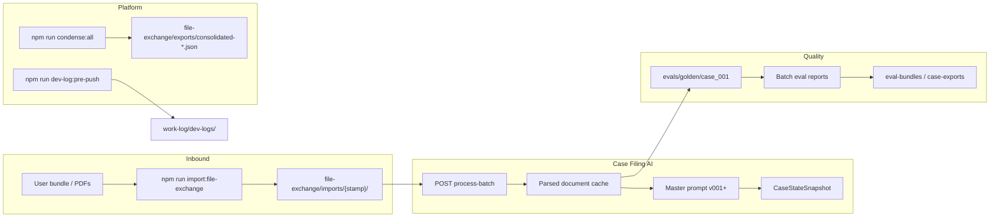

# Litigation Prompt Engineering

**A reference platform for building, testing, and operating litigation document AI pipelines** — modular monolith architecture, versioned prompts, golden evals, and tooling built for **human + Cursor agent** workflows at scale.

| | |
|---|---|
| **This repo** | Full product: Case Filing AI + platform contracts, file-exchange, dev logs |
| **Architecture starter** | [`@pukujan/create-modular-monolith`](https://github.com/Pukujan/create-modular-monolith) — domain-agnostic scaffold (`npm create @pukujan/modular-monolith@2.2.0`) |

[](package.json)

---

## What this is

This repository is the **canonical implementation** of a litigation prompt-engineering stack:

- Ingest court filings and part rules in **batches**
- Run a **versioned master prompt** per document with **case state** carried forward
- Cache **parsed artifacts**, compare against **golden expected JSON**, and ship **eval bundles**
- Enforce **architecture contracts** so agents and CI never guess where files or APIs live

It is not a minimal demo. It is a working system you can extend module-by-module without breaking boundaries.

---

## Why it exists

| Problem | How this repo addresses it |
|---------|---------------------------|
| Prompt drift across batches | `promptVersions.js`, env `MASTER_PROMPT_VERSION`, eval regression |
| Agents reading random folders | `file-exchange/imports/{stamp}/` + [AGENTS.md](AGENTS.md) |
| Undocumented HTTP surface | [docs/API.md](docs/API.md) + `npm run lint:api-docs` |
| Silent repo layout changes | [docs/architecture/contracts/manifest.json](docs/architecture/contracts/manifest.json) + `lint:contracts` |
| Lost context between sessions | Paired pre-push dev logs: human MD + agent JSON under `work-log/dev-logs/` |

---

## How it works



**Core rule** (domain): prior case context may guide interpretation; only the current source document confirms new facts. See [docs/case-filing-ai/README.md](docs/case-filing-ai/README.md).

---

## Platform vs domain

| Layer | Location | Responsibility |
|-------|----------|----------------|
| **Platform** | `file-exchange/`, `work-log/`, `docs/architecture/contracts/`, `scripts/condense-*`, `model-condenser` | Imports/exports, dev logs, consolidated snapshots, contract lint |
| **Domain** | `backend/src/modules/case-filing-ai/`, `court-rules/`, `filing-pipeline/`, … | Filing extraction, rules, workflow, human review (stubs where noted) |
| **Reference** | `_reference/` | Module layout example (not loaded at runtime) |

Modules communicate via **HTTP** and the **event bus** — never cross-import feature code. Details: [ARCHITECTURE_GUARDRAILS.md](docs/architecture/ARCHITECTURE_GUARDRAILS.md).

---

## Features

- **Modular monolith** — auto-loaded backend modules + frontend route registry
- **Case Filing AI** — batch upload, parsed cache, ranked rules, `documentFacts` / `ruleBasedTasks`
- **Golden evals** — `evals/golden/`, `npm run test:evals`, eval bundle export APIs
- **Prompt registry** — colocated `prompts/` per module; `npm run condense:all` → `file-exchange/exports/`
- **Agent-scale governance** — contract manifest, pre-push dev logs, `AGENTS.md`, Cursor rules/commands
- **Lint suite** — boundaries, layers, API docs, contracts, repo artifacts

---

## Quick start

**Requirements:** Node.js 20+

```bash
git clone https://github.com/Pukujan/litigation-prompt-engineering.git
cd litigation-prompt-engineering

cp backend/.env.example backend/.env   # add API keys as needed
cp frontend/.env.example frontend/.env

cd backend && npm install && npm run dev
# new terminal:
cd frontend && npm install && npm run dev
```

- API: `http://localhost:3001` — see [docs/API.md](docs/API.md)
- UI: Vite dev server (see `frontend/package.json`)

---

## Typical domain workflow

```bash
# 1. Move inbound files into the repo inbox (required before processing)
npm run import:file-exchange -- "/path/to/your/bundle"

# 2. Optional: ingest golden fixtures from the latest import stamp
npm run ingest:golden-parsed
npm run ingest:golden-expected

# 3. Process via API (see docs/API.md) — files must live under file-exchange/imports/

# 4. Refresh consolidated snapshots for agents
npm run condense:all

# 5. Before git push: paired dev log
npm run dev-log:pre-push -- --slug your-topic --program 005
```

Full domain guide: [docs/case-filing-ai/README.md](docs/case-filing-ai/README.md)

---

## Repository map

```text
litigation-prompt-engineering/
├── backend/src/modules/     # case-filing-ai, filing-pipeline, court-rules, …
├── frontend/src/modules/
├── data/case-filing-ai/     # batches (gitignored in production clones)
├── evals/golden/            # expected outputs + eval runners
├── file-exchange/           # imports/{stamp}/ exports/consolidated-*.json
├── work-log/                # handoffs, human + agent dev logs
├── docs/                    # API, architecture, domain READMEs
└── scripts/                 # import, condense, lint, dev-log, new-module
```

Canonical layout contract: [REPO_ARTIFACT_LAYOUT.md](docs/architecture/REPO_ARTIFACT_LAYOUT.md)

---

## Documentation

| Document | Purpose |
|----------|---------|
| [docs/README.md](docs/README.md) | Documentation index |
| [docs/API.md](docs/API.md) | HTTP endpoint registry |
| [docs/case-filing-ai/README.md](docs/case-filing-ai/README.md) | Domain pipeline, modules, review policy |
| [docs/architecture/CONTRACTS_OVERVIEW.md](docs/architecture/CONTRACTS_OVERVIEW.md) | Contract manifest and enforcement |
| [AGENTS.md](AGENTS.md) | **Required reading for Cursor / automation** |
| [work-log/README.md](work-log/README.md) | Handoffs and dev-log conventions |

---

## Architecture checks

```bash
npm run test:ci             # all gates: lint + unit tests + golden regression
npm run lint:architecture   # boundaries + layers + api-docs
npm run lint:contracts
npm test
npm run test:evals          # offline golden regression (no API key)
```

**What is a CI gate / eval regression?** See [docs/architecture/EVAL_AND_CI.md](docs/architecture/EVAL_AND_CI.md).

---

## For AI agents

1. Read [AGENTS.md](AGENTS.md) — especially **file-exchange before processing**.
2. On resume, read the latest `work-log/dev-logs/agent/*_dev-log-agent_*.json`.
3. Run `npm run condense:all` when you need models, prompts, or repo tree snapshots.

---

## Related projects

| Project | Role |
|---------|------|
| [litigation-prompt-engineering](https://github.com/Pukujan/litigation-prompt-engineering) | **This repo** — full product + evals |
| [create-modular-monolith](https://github.com/Pukujan/create-modular-monolith) | Architecture-only npm scaffold |

Start a **new** greenfield app from the starter; fork or clone **this** repo to work on litigation pipelines.

---

## License

MIT — see [LICENSE](LICENSE).
