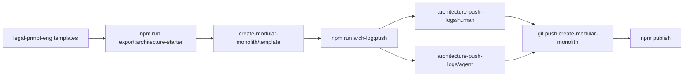

# Architecture push log (human): planning gate starter

| Field | Value |
|-------|--------|
| **Entry** | 001 |
| **When (UTC)** | Sunday, 24 May 2026 at 14:58 UTC |
| **Folder stamp** | `2026-05-24_14-58-35Z` |
| **Filename date / time** | 2026-05-24 · 14:58 UTC |
| **Human log** | `001_2026-05-24_14-58_arch-push_planning-gate-starter.md` |
| **Agent audit** | `001_2026-05-24_14-58_arch-push-agent_planning-gate-starter.json` |
| **Product git** | `main` @ `1cd9a6e` |

## Table of contents

- [I. Export summary](#i-export-summary)
- [II. Starter / contract changes](#ii-starter--contract-changes)
- [III. Architecture gates](#iii-architecture-gates)
- [IV. Narrative (fill)](#iv-narrative-fill)
- [V. Git snapshot](#v-git-snapshot)

---

## I. Export summary {#i-export-summary}

| Item | Value |
|------|--------|
| Product repo | `legal-prmpt-eng` |
| Target repo | [create-modular-monolith](https://github.com/Pukujan/create-modular-monolith) |
| npm package | `@pukujan/create-modular-monolith` |
| npm version (this push) | 2.2.5 |
| Export script | `scripts/export-architecture-starter.mjs` |
| Export target | _local default or FILL_ |
| Publish | `cd packages/create-modular-monolith && npm publish --access public` |



---

## II. Starter / contract changes {#ii-starter--contract-changes}

**Templates / export paths touched (git):**

- `backend/src/shared/contracts/architecturePushDevLog.contract.js`
- `docs/architecture/contracts/architecturePushDevLog.contract.md`
- `docs/architecture/contracts/manifest.json`

---

## III. Architecture gates {#iii-architecture-gates}

| Gate | Ran | Exit |
|------|-----|-----:|
| lint:contracts | false | — |
| lint:repo-artifacts | false | — |

---

## IV. Narrative (fill) {#iv-narrative-fill}

### What changed in the platform layer

- Planning gate exported to starter (`plan:finalize`, `plan:gate`, `planningPhase` contract).
- New **architecture push log** contract (`arch-log:push`) for [create-modular-monolith](https://github.com/Pukujan/create-modular-monolith) sync only.
- `formatHumanReadableUtc` for long-form headers (e.g. Sunday, 24 May 2026 at 14:58 UTC).

### Why separate from product dev-log

Product `dev-log:pre-push` captures domain APIs, full test suite, and case-filing modules. Architecture/npm pushes only touch `file-exchange/exports/templates/` and export scripts — a lighter, export-focused audit avoids noise and keeps npm handoffs grep-friendly.

### Risks / rollback

Consumers on npm `@2` get a larger template; rollback = republish prior semver from git tag.

### Follow-ups

- [ ] `npm publish @pukujan/create-modular-monolith@2.2.5` (OTP)
- [ ] Push template to create-modular-monolith `main`
- [ ] Update create-modular-monolith README version pin

---

## V. Git snapshot {#v-git-snapshot}

**Recent commits**

```
1cd9a6e chore(starter): export planning gate to architecture npm template
f9953c0 feat(planning): require study log before plan gate and finalize
d9bf1cb docs(work-log): add 008 study log and plan packages for planning audit
6ea2100 feat(artifacts): v002 checkpoint log, external artifact root resolver
83cabca fix(case-filing-ai): rule authority v002 runtime stabilization
```

**Diff stat (working tree vs HEAD)**

```
AGENTS.md                                          |   6 +-
 .../src/shared/utils/formatExchangeTimestamp.js    |  19 +
 .../shared/utils/formatExchangeTimestamp.test.js   |   8 +
 consolidated-files/consolidated-models.json        | 765 ++++++++++++++++++++-
 docs/architecture/contracts/changelog.jsonl        |   1 +
 docs/architecture/contracts/manifest.json          |  11 +
 file-exchange/exports/consolidated-models.json     | 765 ++++++++++++++++++++-
 package.json                                       |   2 +
 work-log/INDEX.md                                  |   6 +
 work-log/README.md                                 |   6 +-
 10 files changed, 1576 insertions(+), 13 deletions(-)
```

**Changed files (porcelain)**

| Code | Path |
|------|------|
| M  | `GENTS.md` |
|  M | `backend/src/shared/utils/formatExchangeTimestamp.js` |
|  M | `backend/src/shared/utils/formatExchangeTimestamp.test.js` |
|  M | `consolidated-files/consolidated-models.json` |
|  M | `docs/architecture/contracts/changelog.jsonl` |
|  M | `docs/architecture/contracts/manifest.json` |
|  M | `file-exchange/exports/consolidated-models.json` |
|  M | `package.json` |
|  M | `work-log/INDEX.md` |
|  M | `work-log/README.md` |
| ?? | `.cursor/commands/architecture-push-log.md` |
| ?? | `backend/src/shared/contracts/architecturePushDevLog.contract.js` |
| ?? | `docs/architecture/contracts/architecturePushDevLog.contract.md` |
| ?? | `file-exchange/imports/synthetic_case_001_rule_authority_v002_golden_dataset.json` |
| ?? | `scripts/lib/arch-push-human-format.mjs` |
| ?? | `scripts/lib/collect-starter-export-changes.mjs` |
| ?? | `scripts/verify-architecture-push-log.mjs` |
| ?? | `scripts/write-architecture-push-log.mjs` |
| ?? | `work-log/architecture-push-logs/` |
