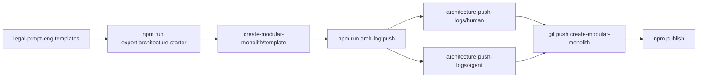

# Architecture push log (human): planning gate v225

| Field | Value |
|-------|--------|
| **Entry** | 002 |
| **When (UTC)** | Sunday, 24 May 2026 at 15:04 UTC |
| **Folder stamp** | `2026-05-24_15-04-48Z` |
| **Filename date / time** | 2026-05-24 · 15:04 UTC |
| **Human log** | `002_2026-05-24_15-04_arch-push_planning-gate-v225.md` |
| **Agent audit** | `002_2026-05-24_15-04_arch-push-agent_planning-gate-v225.json` |
| **Product git** | `main` @ `d696d6e` |

## Table of contents

- [I. Export summary](#i-export-summary)
- [II. Starter / contract changes](#ii-starter--contract-changes)
- [III. Architecture gates](#iii-architecture-gates)
- [IV. Narrative (fill)](#iv-narrative-fill)
- [V. Git snapshot](#v-git-snapshot)

---

## I. Export summary {#i-export-summary}

| Item | Value |
|------|--------|
| Product repo | `legal-prmpt-eng` |
| Target repo | [create-modular-monolith](https://github.com/Pukujan/create-modular-monolith) |
| npm package | `@pukujan/create-modular-monolith` |
| npm version (this push) | 2.2.5 |
| Export script | `scripts/export-architecture-starter.mjs` |
| Export target | `/Users/teresaguajardo/Documents/coding/create-modular-monolith/template` |
| Publish | `cd packages/create-modular-monolith && npm publish --access public` |



---

## II. Starter / contract changes {#ii-starter--contract-changes}

**Templates / export paths touched (git):**

- _(none in git diff — fill if export-only)_

---

## III. Architecture gates {#iii-architecture-gates}

| Gate | Ran | Exit |
|------|-----|-----:|
| lint:contracts | true | 0 |
| lint:repo-artifacts | true | 0 |

---

## IV. Narrative (fill) {#iv-narrative-fill}

### What changed in the platform layer

- Exported planning gate (`plan:finalize`, `plan:gate`, `plan-artifacts.mjs`, `work-log/planning/`, `planningPhase` contract).
- Study-log–first planning audit documented in starter `AGENTS.md` and work-log README.
- Platform utils: `formatHumanReadableUtc`, file-exchange cleanup, zip helper (no domain modules).

### Why separate from product dev-log

Product dev-logs capture case-filing APIs and full test runs; this push only syncs `file-exchange/exports/templates/` → npm template.

### Risks / rollback

Larger template; consumers pin `@2.2.4` or earlier if needed.

### Follow-ups

- [x] Push create-modular-monolith `main`
- [x] `npm publish @pukujan/create-modular-monolith@2.2.5`

---

## V. Git snapshot {#v-git-snapshot}

**Recent commits**

```
d696d6e feat(work-log): architecture push logs for create-modular-monolith sync
1cd9a6e chore(starter): export planning gate to architecture npm template
f9953c0 feat(planning): require study log before plan gate and finalize
d9bf1cb docs(work-log): add 008 study log and plan packages for planning audit
6ea2100 feat(artifacts): v002 checkpoint log, external artifact root resolver
```

**Diff stat (working tree vs HEAD)**

```
consolidated-files/consolidated-models.json    | 765 ++++++++++++++++++++++++-
 file-exchange/exports/consolidated-models.json | 765 ++++++++++++++++++++++++-
 2 files changed, 1520 insertions(+), 10 deletions(-)
```

**Changed files (porcelain)**

| Code | Path |
|------|------|
| M  | `onsolidated-files/consolidated-models.json` |
|  M | `file-exchange/exports/consolidated-models.json` |
| ?? | `file-exchange/imports/synthetic_case_001_rule_authority_v002_golden_dataset.json` |
