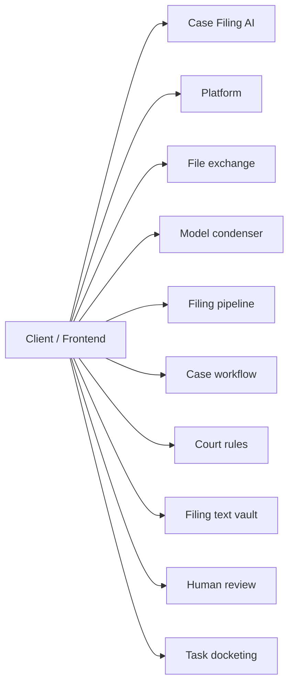
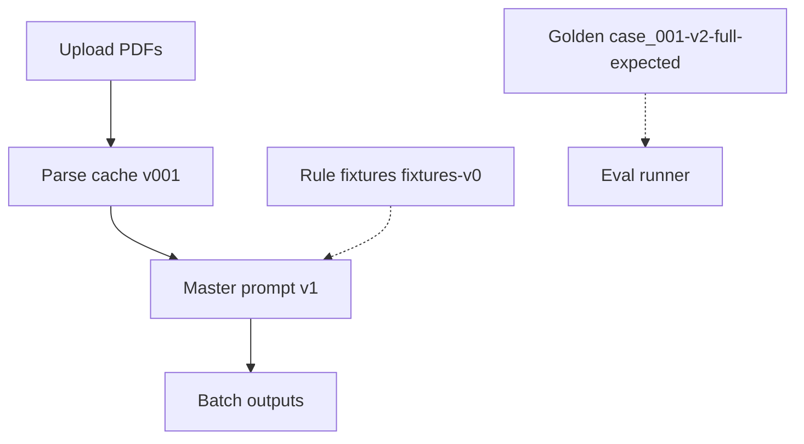
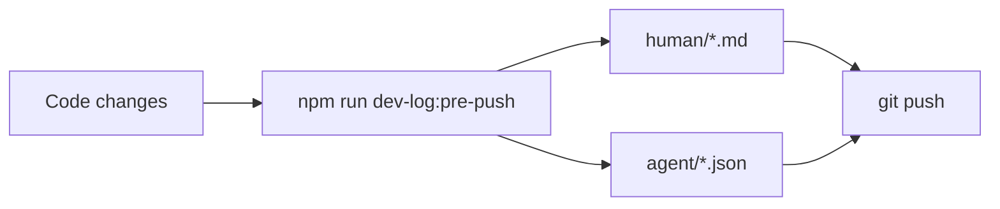

# Dev log (human): Planning gate in architecture npm starter

| Field | Value |
|-------|--------|
| **Entry** | 005 |
| **Date** | 2026-05-24 |
| **Time** | 14-53 |
| **Filename** | `005_2026-05-24_14-53_dev-log_planning-starter-export.md` |
| **Agent audit** | [005_2026-05-24_14-53_dev-log-agent_planning-starter-export.json](../agent/005_2026-05-24_14-53_dev-log-agent_planning-starter-export.json) |
| **Git** | `main` @ `f9953c0` |

## Table of contents

### [Part I — Summary](#part-i-summary) _(read first)_
- [I.1 At a glance](#i1-at-a-glance)
- [I.2 Diagrams](#i2-diagrams)
- [I.3 API surface (summary)](#i3-api-surface-summary)
- [I.4 Version & prompt audit](#i4-version-prompt-audit)
- [I.5 Test audit](#i5-test-audit)
- [I.6 Git audit](#i6-git-audit)
- [I.7 Repository shape](#i7-repository-shape)

### [Part II — Detailed](#part-ii-detailed) _(full audit trail)_
- [II.1 Goals and scope](#ii1-goals-and-scope)
- [II.2 Decisions](#ii2-decisions)
- [II.3 Changes by area](#ii3-changes-by-area)
- [II.4 Iterations](#ii4-iterations)
- [II.5 Tests (detail)](#ii5-tests-detail)
- [II.6 What got better / trade-offs / risks](#ii6-outcomes)
- [II.7 Follow-ups](#ii7-follow-ups)
- [II.8 APIs (full registry)](#ii8-apis-full-registry)
- [II.9 Git snapshot (full)](#ii9-git-snapshot-full)
- [II.10 Repository tree (full)](#repository-tree-full)

---

## Part I — Summary {#part-i-summary}

> **Purpose:** One-screen picture for reviewers — APIs, versions, tests, git, repo shape.  
> **Detail:** [Part II](#part-ii-detailed) below.

### I.1 At a glance {#i1-at-a-glance}

Shipped planning gate scripts and starter templates into the architecture npm export (`export-architecture-starter`), alongside the existing pre-push dev-log flow. New scaffolds get `plan:finalize` / `plan:gate`, `work-log/planning/`, and AGENTS guidance for study logs before implementation. Exported to `boiler-plate` CLI template; bump and publish `@pukujan/create-modular-monolith@2.1.0` on v2 next.

### I.2 Diagrams {#i2-diagrams}

**HTTP modules (active + stub)**



**Pipeline versions (defaults at push)**



**Pre-push dev log flow**



### I.3 API surface (summary) {#i3-api-surface-summary}

| Kind | Count | Notes |
|------|------:|-------|
| Active HTTP routes | 32 | Case-filing-ai + condenser + pipeline |
| Stub modules (health only) | 5 | Workflow, court-rules, vault, review, docketing |
| Deprecated HTTP | 0 | From docs/API.md descriptions |
| Deprecated CLI | 1 | See version audit |

**Key routes this program:**

| Method | Path |
|--------|------|
| POST | `/api/case-filing-ai/process-batch` |
| GET | `/api/case-filing-ai/batches/:batchId/parsed-documents` |
| GET | `/api/case-filing-ai/batches/:batchId/parsed-documents/:documentId` |
| PATCH | `/api/case-filing-ai/batches/:batchId/parsed-documents/:documentId/review-status` |
| GET | `/api/model-condenser/health` |
| POST | `/api/model-condenser/condense` |

_Session API changes not in docs/API.md — FILL in [II.8](#ii8-apis-full-registry)._

### I.4 Version & prompt audit {#i4-version-prompt-audit}

| Contract | Version | Status |
|----------|---------|--------|
| App (package.json) | 2.0.0 | current |
| Storage layout | v001 | current |
| Parsed artifacts | v001 | current |
| Master prompt (default) | v1 | env `MASTER_PROMPT_VERSION` |
| Rule prompt | v1 | current |
| Golden dataset | case_001-v2-full-expected | current |
| Parser | pdf-embedded-v1 | current |
| OCR | openrouter-vision-v1 | current |

**Master prompt keys:**

| Key | Template | Notes |
|-----|----------|-------|
| v1 | `master-case-filing.prompt.md` | default |
| compact | `master-case-filing.compact.prompt.md` | available |
| v2 | `master-case-filing.compact.prompt.md` | alias → compact |
| v001 | `v001_master-case-filing.prompt.md` | opt-in |

**Deprecated surfaces:**

- `scripts/export-consolidated-models.mjs` → npm run condense-models (backend/) or POST /api/model-condenser/condense

### I.5 Test audit {#i5-test-audit}

| Status | Value |
|--------|-------|
| Ran | yes |
| Exit code | 0 |
| Summary | tests=92 pass=92 fail=0 exit=0 |
| Passed (sample) | 80 lines captured |
| Failed (sample) | 2 lines captured |

### I.6 Git audit {#i6-git-audit}

| Field | Value |
|-------|-------|
| Branch | `main` |
| Commit | `f9953c0` (`f9953c060e078fc7a5bcb9cca84eb01d4e99c2c9`) |
| Changed paths (porcelain) | 7 |
| Recent commits | 5 listed below |

### I.7 Repository shape {#i7-repository-shape}

| Metric | Value |
|--------|------:|
| Files | 744 |
| Directories | 374 |
| Tree ignores | node_modules, .git, dist, build |
| Top extensions | .js (269), .json (188), .md (153), .mjs (46), .jsx (41) |

_Condensed tree (full tree in [II.10](#repository-tree-full)):_

```text
legal-prmpt-eng/
├── .gitignore
├── AGENTS.md
├── LICENSE
├── local-artifacts.example.json
├── NOTICE
├── package.json
├── README.md
├── .cursor/
│   ├── commands/
│   │   ├── planning-study-log.md
│   │   └── pre-push-dev-log.md
│   └── rules/
│       ├── api-documentation.mdc
│       └── file-exchange-inbox.mdc
├── .github/
│   └── workflows/
│       └── ci.yml
├── backend/
│   ├── .env
│   ├── .env.example
│   ├── package-lock.json
│   ├── package.json
│   ├── db/
│   │   └── migrations/
│   │       └── 001_case_filing_ai_schema.sql
│   ├── scripts/
│   │   ├── check-module-boundaries.mjs
│   │   └── check-module-layers.mjs
│   └── src/
│       ├── core/
│       │   ├── module-loader.js
│       │   └── server.js
│       ├── modules/
│       │   ├── .gitkeep
│       │   ├── _reference/
│       │   │   ├── index.js
│       │   │   ├── README.md
│       │   │   ├── adapters/
│       │   │   │   └── README.md
│       │   │   ├── config/
│       │   │   │   └── index.js
│       │   │   ├── domain/
│       │   │   │   └── README.md
│       │   │   ├── evals/
│       │   │   │   ├── README.md
│       │   │   │   ├── datasets/
│       │   │   │   │   └── example.cases.json
│   └── … (1071 more lines — [full tree](#repository-tree-full))
```

---

## Part II — Detailed {#part-ii-detailed}

> **Purpose:** Decisions, iterations, narrative, and full machine-captured snapshots.

### II.1 Goals and scope {#ii1-goals-and-scope}

- **In scope:** Starter export templates, export script, dev logs for this push
- **Out of scope:** Platform planning API, resolveArtifactPaths in starter, npm publish (boiler-plate repo)

### II.2 Decisions {#ii2-decisions}

| ID | Decision | Rationale | Alternatives rejected |
|----|----------|-----------|------------------------|
| D1 | Planning gate in architecture starter | Same package as dev-log hygiene | Separate planning npm package |

### II.3 Changes by area {#ii3-changes-by-area}

#### Backend / API
- No API changes

#### Frontend
- No UI changes

#### Data / contracts / prompts
- `manifest.starter.json` adds `planningPhase` contract entry

#### Tooling / CI / docs
- `export-architecture-starter.mjs`, `package.starter.json`, `AGENTS.starter.md`; export to boiler-plate template

### II.4 Iterations {#ii4-iterations}

1. **Attempt 1** — architecture export to boiler-plate → pass (plan scripts present)

### II.5 Tests (detail) {#ii5-tests-detail}

#### Passed
- 92 backend + 12 frontend (auto at dev-log generation)

#### Failed
- none

#### Raw tail (auto)

```
dule metadata (1.612833ms)
✔ GET /api/filing-text-vault/health (37.0845ms)
✔ getHealth returns module metadata (2.055ms)
✔ GET /api/human-review/health (32.579375ms)
✔ getHealth returns module metadata (1.983083ms)
✔ POST /api/model-condenser/condense regenerates consolidated file (61.468542ms)
✔ condenseModels writes consolidated-models.json (31.746334ms)
✔ GET /api/platform/modules returns registry (37.694208ms)
✔ GET /api/platform/onboarding/pipeline-guide returns json (6.566542ms)
✔ GET /api/task-docketing/health (31.011333ms)
✔ getHealth returns module metadata (2.633333ms)
✔ resolveArtifactPaths uses in-repo defaults without config (0.610041ms)
✔ resolveArtifactPaths reads local-artifacts.json (3.666417ms)
✔ ENV overrides artifactRoot paths (2.87425ms)
✔ writeConsolidatedExport writes dated folder and latest copy (15.381042ms)
✔ clearFileExchange dryRun previews removable paths (7.614541ms)
✔ clearFileExchange confirm removes dated folders (9.145333ms)
✔ formatExchangeTimestamp (1.434667ms)
✔ normalizeExchangeStamp converts legacy compact stamps (0.182417ms)
✔ formatWorkLogTimestamp (0.106625ms)
ℹ tests 92
ℹ suites 0
ℹ pass 92
ℹ fail 0
ℹ cancelled 0
ℹ skipped 0
ℹ todo 0
ℹ duration_ms 2722.825708

> legal-prmpt-eng-frontend@1.0.0 test
> node --test

✔ isHealthResponse validates shape (0.408416ms)
✔ isSupportedUploadFile accepts PDF and text files (0.699333ms)
✔ isSupportedUploadFile rejects empty and executable files (0.087917ms)
✔ mergeUploadFiles accumulates unique files (0.108417ms)
✔ supported upload hint is documented (0.10075ms)
✔ isHealthResponse validates shape (1.4995ms)
✔ isHealthResponse validates shape (0.395375ms)
✔ isHealthResponse validates shape (0.411666ms)
✔ isHealthResponse validates shape (1.196834ms)
✔ isHealthResponse validates shape (0.386292ms)
✔ isHealthResponse validates shape (0.378208ms)
✔ isHealthResponse validates shape (0.377625ms)
ℹ tests 12
ℹ suites 0
ℹ pass 12
ℹ fail 0
ℹ cancelled 0
ℹ skipped 0
ℹ todo 0
ℹ duration_ms 191.1595


```

### II.6 What got better / trade-offs / risks {#ii6-outcomes}

**Better**
- Scaffold projects get study-log-first planning gate

**Trade-offs**
- Larger starter template vs legacy minimal shell

**Regressions / risks**
- npm @2 consumers see expanded work-log surface

### II.7 Follow-ups {#ii7-follow-ups}

- [ ] Publish `@pukujan/create-modular-monolith@2.1.0` from boiler-plate v2

### II.8 APIs (full registry) {#ii8-apis-full-registry}

### HTTP — active

| Method | Path | Module | Description |
|--------|------|--------|-------------|
| GET | `/api/case-filing-ai/health` | Case Filing AI | Module health and config summary |
| POST | `/api/case-filing-ai/extract-rule-text` | Case Filing AI | Extract text from uploaded part-rule file |
| POST | `/api/case-filing-ai/process-batch` | Case Filing AI | Upload filings; returns **202** and processes batch in background |
| GET | `/api/case-filing-ai/batches/:batchId/status` | Case Filing AI | Batch status with module rail and document queue |
| GET | `/api/case-filing-ai/batches/:batchId/processing-log` | Case Filing AI | Parsed `processing-log.jsonl` entries |
| POST | `/api/case-filing-ai/batches/:batchId/package` | Case Filing AI | Build downloadable batch package folder |
| GET | `/api/case-filing-ai/batches/:batchId/package/download` | Case Filing AI | Download batch package as zip |
| GET | `/api/case-filing-ai/batches/:batchId/results` | Case Filing AI | Aggregated batch results |
| GET | `/api/case-filing-ai/batches/:batchId/parsed-documents` | Case Filing AI | List parsed-document cache keys |
| GET | `/api/case-filing-ai/batches/:batchId/parsed-documents/:documentId` | Case Filing AI | Parsed cache detail for one document |
| PATCH | `/api/case-filing-ai/batches/:batchId/parsed-documents/:documentId/review-status` | Case Filing AI | Update parsed-document review status |
| GET | `/api/case-filing-ai/batches/:batchId/evals` | Case Filing AI | Golden eval reports for batch |
| POST | `/api/case-filing-ai/batches/:batchId/evals/bundle` | Case Filing AI | Copy one batch eval reports to eval-bundles |
| POST | `/api/case-filing-ai/evals/bundle` | Case Filing AI | Copy multiple batch eval reports to eval-bundles |
| POST | `/api/case-filing-ai/evals/cases/:goldenCaseId/bundle` | Case Filing AI | Copy golden fixtures plus case eval runs |
| GET | `/api/case-filing-ai/cases/:goldenCaseId` | Case Filing AI | Inventory batches for a golden case |
| POST | `/api/case-filing-ai/cases/:goldenCaseId/export` | Case Filing AI | Export full batch folders to case-exports |
| GET | `/api/case-filing-ai/cases/:goldenCaseId/export/:exportId/download` | Case Filing AI | Download case export as zip |
| DELETE | `/api/case-filing-ai/cases/:goldenCaseId` | Case Filing AI | Delete batch folders for a case (requires confirm) |
| GET | `/api/platform/modules` | Platform | Runtime module registry (icons, labels) |
| GET | `/api/platform/onboarding/pipeline-guide` | Platform | Pipeline onboarding (`?format=md` or `json`) |
| GET | `/api/platform/planning` | Platform | List planning manifests |
| GET | `/api/platform/planning/:planId` | Platform | Read planning manifest JSON |
| GET | `/api/platform/planning/:planId/download` | Platform | Download planning package markdown |
| POST | `/api/platform/planning/:planId/finalize` | Platform | Finalize planning manifest for a slug |
| GET | `/api/file-exchange/health` | File exchange | Module health |
| POST | `/api/file-exchange/clear` | File exchange | Clear dated import/export session folders |
| GET | `/api/model-condenser/health` | Model condenser | Module health |
| POST | `/api/model-condenser/condense` | Model condenser | Regenerate consolidated-models.json |
| GET | `/api/model-condenser/consolidated` | Model condenser | Read consolidated schema inventory |
| GET | `/api/filing-pipeline/health` | Filing pipeline | Module health |
| GET | `/api/filing-pipeline/steps` | Filing pipeline | List planned pipeline steps |

### HTTP — stub (health only)

| Method | Path | Module | Description |
|--------|------|--------|-------------|
| GET | `/api/case-workflow/health` | Case workflow | Module health (stub) |
| GET | `/api/court-rules/health` | Court rules | Module health (stub) |
| GET | `/api/filing-text-vault/health` | Filing text vault | Module health (stub) |
| GET | `/api/human-review/health` | Human review | Module health (stub) |
| GET | `/api/task-docketing/health` | Task docketing | Module health (stub) |

### HTTP — deprecated

_none registered in docs/API.md_

### Versioned contracts (current defaults)

```json
{
  "app": "2.0.0",
  "storageLayout": "v001",
  "parsedArtifacts": "v001",
  "parser": "pdf-embedded-v1",
  "ocr": "openrouter-vision-v1",
  "masterPrompt": "v1",
  "rulePrompt": "v1",
  "snapshotPrompt": "v1",
  "ruleSet": "fixtures-v0",
  "goldenDataset": "case_001-v2-full-expected"
}
```

### Master prompt versions

- **v1** — Original master prompt. (`master-case-filing.prompt.md`)
- **compact** — Bounded snapshot + strict JSON output (recommended for 6+ documents). (`master-case-filing.compact.prompt.md`)
- **v2** — Alias for compact. (`master-case-filing.compact.prompt.md`)
- **v001** — Ranked rule sources + documentFacts / ruleBasedTasks output shape. (`v001_master-case-filing.prompt.md`)

_Env: `MASTER_PROMPT_VERSION` default `v1`; allowed: v1, compact, v2, v001_

### Deprecated CLI

- `scripts/export-consolidated-models.mjs` → use npm run condense-models (backend/) or POST /api/model-condenser/condense

### II.9 Git snapshot (full) {#ii9-git-snapshot-full}

**Changed files (porcelain)**

```
M consolidated-files/consolidated-models.json
 M file-exchange/exports/consolidated-models.json
 M file-exchange/exports/templates/AGENTS.starter.md
 M file-exchange/exports/templates/manifest.starter.json
 M file-exchange/exports/templates/package.starter.json
 M scripts/export-architecture-starter.mjs
?? file-exchange/imports/synthetic_case_001_rule_authority_v002_golden_dataset.json
```

**Diff stat vs HEAD**

```
consolidated-files/consolidated-models.json        | 765 ++++++++++++++++++++-
 file-exchange/exports/consolidated-models.json     | 765 ++++++++++++++++++++-
 file-exchange/exports/templates/AGENTS.starter.md  |  17 +-
 .../exports/templates/manifest.starter.json        |  10 +
 .../exports/templates/package.starter.json         |   2 +
 scripts/export-architecture-starter.mjs            |  10 +-
 6 files changed, 1556 insertions(+), 13 deletions(-)
```

**Recent commits**

```
f9953c0 feat(planning): require study log before plan gate and finalize
d9bf1cb docs(work-log): add 008 study log and plan packages for planning audit
6ea2100 feat(artifacts): v002 checkpoint log, external artifact root resolver
83cabca fix(case-filing-ai): rule authority v002 runtime stabilization
1748344 chore(work-log): pre-push dev log for pipeline UI onboarding (007)
```

### II.10 Repository tree (full) {#repository-tree-full}

_Ignores: `node_modules`, `.git`, `dist`, `build` — equivalent to `tree -I "node_modules|.git|dist|build"`._

```text
legal-prmpt-eng/
├── .gitignore
├── AGENTS.md
├── LICENSE
├── local-artifacts.example.json
├── NOTICE
├── package.json
├── README.md
├── .cursor/
│   ├── commands/
│   │   ├── planning-study-log.md
│   │   └── pre-push-dev-log.md
│   └── rules/
│       ├── api-documentation.mdc
│       └── file-exchange-inbox.mdc
├── .github/
│   └── workflows/
│       └── ci.yml
├── backend/
│   ├── .env
│   ├── .env.example
│   ├── package-lock.json
│   ├── package.json
│   ├── db/
│   │   └── migrations/
│   │       └── 001_case_filing_ai_schema.sql
│   ├── scripts/
│   │   ├── check-module-boundaries.mjs
│   │   └── check-module-layers.mjs
│   └── src/
│       ├── core/
│       │   ├── module-loader.js
│       │   └── server.js
│       ├── modules/
│       │   ├── .gitkeep
│       │   ├── _reference/
│       │   │   ├── index.js
│       │   │   ├── README.md
│       │   │   ├── adapters/
│       │   │   │   └── README.md
│       │   │   ├── config/
│       │   │   │   └── index.js
│       │   │   ├── domain/
│       │   │   │   └── README.md
│       │   │   ├── evals/
│       │   │   │   ├── README.md
│       │   │   │   ├── datasets/
│       │   │   │   │   └── example.cases.json
│       │   │   │   └── runners/
│       │   │   │       └── example.eval.mjs
│       │   │   ├── events/
│       │   │   │   └── index.js
│       │   │   ├── prompts/
│       │   │   │   ├── manifest.json
│       │   │   │   └── templates/
│       │   │   │       └── example.prompt.js
│       │   │   ├── repositories/
│       │   │   │   └── .gitkeep
│       │   │   ├── routes/
│       │   │   │   ├── health.routes.js
│       │   │   │   └── index.js
│       │   │   ├── schemas/
│       │   │   │   └── health.schema.js
│       │   │   ├── services/
│       │   │   │   └── health.service.js
│       │   │   ├── tests/
│       │   │   │   ├── integration/
│       │   │   │   │   └── health.routes.test.js
│       │   │   │   └── unit/
│       │   │   │       └── health.service.test.js
│       │   │   └── utils/
│       │   │       └── index.js
│       │   ├── case-filing-ai/
│       │   │   ├── index.js
│       │   │   ├── README.md
│       │   │   ├── adapters/
│       │   │   │   ├── batchStorage.adapter.js
│       │   │   │   ├── openrouter.client.js
│       │   │   │   └── README.md
│       │   │   ├── config/
│       │   │   │   └── index.js
│       │   │   ├── contracts/
│       │   │   │   ├── parsedDocumentArtifacts.contract.js
│       │   │   │   ├── pipelineVersions.js
│       │   │   │   └── storageLayout.contract.js
│       │   │   ├── domain/
│       │   │   │   └── README.md
│       │   │   ├── evals/
│       │   │   │   ├── README.md
│       │   │   │   ├── datasets/
│       │   │   │   │   └── example.cases.json
│       │   │   │   └── runners/
│       │   │   │       ├── example.eval.mjs
│       │   │   │       └── golden-regression.eval.mjs
│       │   │   ├── events/
│       │   │   │   └── index.js
│       │   │   ├── prompts/
│       │   │   │   ├── manifest.json
│       │   │   │   ├── master-case-filing.compact.prompt.md
│       │   │   │   ├── master-case-filing.prompt.md
│       │   │   │   ├── promptVersions.js
│       │   │   │   ├── rule-parse.prompt.md
│       │   │   │   ├── v001_master-case-filing.prompt.md
│       │   │   │   └── templates/
│       │   │   ├── repositories/
│       │   │   │   └── .gitkeep
│       │   │   ├── routes/
│       │   │   │   ├── caseFiling.routes.js
│       │   │   │   ├── health.routes.js
│       │   │   │   └── index.js
│       │   │   ├── schemas/
│       │   │   │   ├── health.schema.js
│       │   │   │   ├── master-output.v001.schema.json
│       │   │   │   ├── master-output.v1.schema.json
│       │   │   │   └── parsed-document.schema.js
│       │   │   ├── services/
│       │   │   │   ├── batchPackage.service.js
│       │   │   │   ├── caseData.service.js
│       │   │   │   ├── caseSnapshot.service.js
│       │   │   │   ├── documentText.service.js
│       │   │   │   ├── evalBundle.service.js
│       │   │   │   ├── evalRunner.service.js
│       │   │   │   ├── goldenDataset.service.js
│       │   │   │   ├── health.service.js
│       │   │   │   ├── localJsonStore.service.js
│       │   │   │   ├── masterPrompt.service.js
│       │   │   │   ├── ocr.service.js
│       │   │   │   ├── officeText.service.js
│       │   │   │   ├── parsedDocumentCache.service.js
│       │   │   │   ├── pdfText.service.js
│       │   │   │   ├── ruleText.service.js
│       │   │   │   ├── runMetadata.service.js
│       │   │   │   └── uploadBatch.service.js
│       │   │   ├── tests/
│       │   │   │   ├── fixtures/
│       │   │   │   │   ├── batch-002/
│       │   │   │   │   │   ├── case-snapshot.json
│       │   │   │   │   │   └── outputs/
│       │   │   │   │   │       └── doc-001.json
│       │   │   │   │   └── rule-authority-v002/
│       │   │   │   │       ├── case-snapshot.json
│       │   │   │   │       └── outputs/
│       │   │   │   │           ├── doc-001.json
│       │   │   │   │           ├── doc-002.json
│       │   │   │   │           ├── doc-003.json
│       │   │   │   │           ├── doc-004.json
│       │   │   │   │           ├── doc-005.json
│       │   │   │   │           ├── doc-006.json
│       │   │   │   │           ├── doc-007.json
│       │   │   │   │           ├── doc-008.json
│       │   │   │   │           ├── doc-009.json
│       │   │   │   │           ├── doc-010.json
│       │   │   │   │           ├── doc-011.json
│       │   │   │   │           ├── doc-012.json
│       │   │   │   │           ├── doc-013.json
│       │   │   │   │           └── doc-014.json
│       │   │   │   ├── helpers/
│       │   │   │   │   └── minimalDocx.js
│       │   │   │   ├── integration/
│       │   │   │   │   ├── batch-async.routes.test.js
│       │   │   │   │   ├── batch-package.routes.test.js
│       │   │   │   │   ├── batch.routes.test.js
│       │   │   │   │   ├── case-data.routes.test.js
│       │   │   │   │   ├── eval-bundle.routes.test.js
│       │   │   │   │   ├── eval.routes.test.js
│       │   │   │   │   ├── health.routes.test.js
│       │   │   │   │   └── rule-text.routes.test.js
│       │   │   │   └── unit/
│       │   │   │       ├── auditNotes.test.js
│       │   │   │       ├── document-upload.test.js
│       │   │   │       ├── documentText.service.test.js
│       │   │   │       ├── evalRunner.provenance.test.js
│       │   │   │       ├── evalRunner.service.test.js
│       │   │   │       ├── health.service.test.js
│       │   │   │       ├── masterPrompt.service.test.js
│       │   │   │       ├── normalizeMasterOutput.test.js
│       │   │   │       ├── ocr.service.test.js
│       │   │   │       ├── officeText.service.test.js
│       │   │   │       ├── pdfText.service.test.js
│       │   │   │       ├── resolveCaseFilingProfile.test.js
│       │   │   │       ├── ruleText.service.test.js
│       │   │   │       ├── runMetadata.test.js
│       │   │   │       ├── runParsedDocumentChecks.test.js
│       │   │   │       ├── runRuleAuthorityChecks.test.js
│       │   │   │       ├── snapshotContext.test.js
│       │   │   │       ├── snapshotMerge.test.js
│       │   │   │       ├── storagePaths.test.js
│       │   │   │       ├── uploadBatch.continue.test.js
│       │   │   │       ├── uploadBatch.service.test.js
│       │   │   │       └── validateMasterOutput.test.js
│       │   │   └── utils/
│       │   │       ├── auditNotes.js
│       │   │       ├── caseBatchDiscovery.js
│       │   │       ├── compareGoldenRuleFields.js
│       │   │       ├── document-upload.js
│       │   │       ├── evalNormalize.js
│       │   │       ├── evalProvenance.js
│       │   │       ├── extractionErrors.js
│       │   │       ├── goldenCaseBootstrap.js
│       │   │       ├── index.js
│       │   │       ├── normalizeMasterOutput.js
│       │   │       ├── pipelineStatus.js
│       │   │       ├── resolveCaseFilingProfile.js
│       │   │       ├── runParsedDocumentChecks.js
│       │   │       ├── runRuleAuthorityChecks.js
│       │   │       ├── snapshotContext.js
│       │   │       ├── snapshotMerge.js
│       │   │       ├── storagePaths.js
│       │   │       └── validateMasterOutput.js
│       │   ├── case-workflow/
│       │   │   ├── index.js
│       │   │   ├── README.md
│       │   │   ├── adapters/
│       │   │   │   └── README.md
│       │   │   ├── config/
│       │   │   │   └── index.js
│       │   │   ├── domain/
│       │   │   │   └── README.md
│       │   │   ├── evals/
│       │   │   │   ├── README.md
│       │   │   │   ├── datasets/
│       │   │   │   │   └── example.cases.json
│       │   │   │   └── runners/
│       │   │   │       └── example.eval.mjs
│       │   │   ├── events/
│       │   │   │   └── index.js
│       │   │   ├── prompts/
│       │   │   │   ├── manifest.json
│       │   │   │   └── templates/
│       │   │   │       └── case-state-update.prompt.js
│       │   │   ├── repositories/
│       │   │   │   └── .gitkeep
│       │   │   ├── routes/
│       │   │   │   ├── health.routes.js
│       │   │   │   └── index.js
│       │   │   ├── schemas/
│       │   │   │   └── health.schema.js
│       │   │   ├── services/
│       │   │   │   └── health.service.js
│       │   │   ├── tests/
│       │   │   │   ├── integration/
│       │   │   │   │   └── health.routes.test.js
│       │   │   │   └── unit/
│       │   │   │       └── health.service.test.js
│       │   │   └── utils/
│       │   │       └── index.js
│       │   ├── court-rules/
│       │   │   ├── index.js
│       │   │   ├── README.md
│       │   │   ├── adapters/
│       │   │   │   └── README.md
│       │   │   ├── config/
│       │   │   │   └── index.js
│       │   │   ├── contracts/
│       │   │   │   └── ruleAuthority.contract.js
│       │   │   ├── domain/
│       │   │   │   └── README.md
│       │   │   ├── evals/
│       │   │   │   ├── README.md
│       │   │   │   ├── datasets/
│       │   │   │   │   └── example.cases.json
│       │   │   │   └── runners/
│       │   │   │       └── example.eval.mjs
│       │   │   ├── events/
│       │   │   │   └── index.js
│       │   │   ├── prompts/
│       │   │   │   ├── manifest.json
│       │   │   │   └── templates/
│       │   │   │       └── rule-context.prompt.js
│       │   │   ├── repositories/
│       │   │   │   └── .gitkeep
│       │   │   ├── routes/
│       │   │   │   ├── health.routes.js
│       │   │   │   └── index.js
│       │   │   ├── schemas/
│       │   │   │   └── health.schema.js
│       │   │   ├── services/
│       │   │   │   ├── health.service.js
│       │   │   │   ├── ruleAuthority.service.js
│       │   │   │   ├── ruleMatch.service.js
│       │   │   │   └── ruleStore.service.js
│       │   │   ├── tests/
│       │   │   │   ├── integration/
│       │   │   │   │   └── health.routes.test.js
│       │   │   │   └── unit/
│       │   │   │       ├── catalogToRuleFixtures.test.js
│       │   │   │       ├── health.service.test.js
│       │   │   │       └── ruleAuthority.test.js
│       │   │   └── utils/
│       │   │       ├── catalogToRuleFixtures.js
│       │   │       └── index.js
│       │   ├── file-exchange/
│       │   │   ├── index.js
│       │   │   ├── README.md
│       │   │   ├── config/
│       │   │   │   └── index.js
│       │   │   ├── events/
│       │   │   │   └── index.js
│       │   │   ├── routes/
│       │   │   │   ├── fileExchange.routes.js
│       │   │   │   ├── health.routes.js
│       │   │   │   └── index.js
│       │   │   ├── services/
│       │   │   │   ├── fileExchange.facade.js
│       │   │   │   └── health.service.js
│       │   │   └── tests/
│       │   │       └── integration/
│       │   │           └── fileExchange.routes.test.js
│       │   ├── filing-pipeline/
│       │   │   ├── index.js
│       │   │   ├── README.md
│       │   │   ├── adapters/
│       │   │   │   └── README.md
│       │   │   ├── config/
│       │   │   │   └── index.js
│       │   │   ├── domain/
│       │   │   │   ├── pipeline-steps.js
│       │   │   │   └── README.md
│       │   │   ├── evals/
│       │   │   │   ├── README.md
│       │   │   │   ├── datasets/
│       │   │   │   │   └── example.cases.json
│       │   │   │   └── runners/
│       │   │   │       └── example.eval.mjs
│       │   │   ├── events/
│       │   │   │   └── index.js
│       │   │   ├── prompts/
│       │   │   │   ├── manifest.json
│       │   │   │   └── templates/
│       │   │   │       └── orchestrator.prompt.js
│       │   │   ├── repositories/
│       │   │   │   └── .gitkeep
│       │   │   ├── routes/
│       │   │   │   ├── health.routes.js
│       │   │   │   ├── index.js
│       │   │   │   └── pipeline.routes.js
│       │   │   ├── schemas/
│       │   │   │   └── health.schema.js
│       │   │   ├── services/
│       │   │   │   ├── health.service.js
│       │   │   │   └── pipeline-steps.service.js
│       │   │   ├── tests/
│       │   │   │   ├── integration/
│       │   │   │   │   ├── health.routes.test.js
│       │   │   │   │   └── pipeline.routes.test.js
│       │   │   │   └── unit/
│       │   │   │       └── health.service.test.js
│       │   │   └── utils/
│       │   │       └── index.js
│       │   ├── filing-text-vault/
│       │   │   ├── index.js
│       │   │   ├── README.md
│       │   │   ├── adapters/
│       │   │   │   └── README.md
│       │   │   ├── config/
│       │   │   │   └── index.js
│       │   │   ├── domain/
│       │   │   │   └── README.md
│       │   │   ├── evals/
│       │   │   │   ├── README.md
│       │   │   │   ├── datasets/
│       │   │   │   │   └── example.cases.json
│       │   │   │   └── runners/
│       │   │   │       └── example.eval.mjs
│       │   │   ├── events/
│       │   │   │   └── index.js
│       │   │   ├── prompts/
│       │   │   │   ├── manifest.json
│       │   │   │   └── templates/
│       │   │   │       └── filing-text-vault.prompt.js
│       │   │   ├── repositories/
│       │   │   │   └── .gitkeep
│       │   │   ├── routes/
│       │   │   │   ├── health.routes.js
│       │   │   │   └── index.js
│       │   │   ├── schemas/
│       │   │   │   └── health.schema.js
│       │   │   ├── services/
│       │   │   │   └── health.service.js
│       │   │   ├── tests/
│       │   │   │   ├── integration/
│       │   │   │   │   └── health.routes.test.js
│       │   │   │   └── unit/
│       │   │   │       └── health.service.test.js
│       │   │   └── utils/
│       │   │       └── index.js
│       │   ├── human-review/
│       │   │   ├── index.js
│       │   │   ├── README.md
│       │   │   ├── adapters/
│       │   │   │   └── README.md
│       │   │   ├── config/
│       │   │   │   └── index.js
│       │   │   ├── domain/
│       │   │   │   └── README.md
│       │   │   ├── evals/
│       │   │   │   ├── README.md
│       │   │   │   ├── datasets/
│       │   │   │   │   └── example.cases.json
│       │   │   │   └── runners/
│       │   │   │       └── example.eval.mjs
│       │   │   ├── events/
│       │   │   │   └── index.js
│       │   │   ├── prompts/
│       │   │   │   ├── manifest.json
│       │   │   │   └── templates/
│       │   │   │       └── human-review.prompt.js
│       │   │   ├── repositories/
│       │   │   │   └── .gitkeep
│       │   │   ├── routes/
│       │   │   │   ├── health.routes.js
│       │   │   │   └── index.js
│       │   │   ├── schemas/
│       │   │   │   └── health.schema.js
│       │   │   ├── services/
│       │   │   │   └── health.service.js
│       │   │   ├── tests/
│       │   │   │   ├── integration/
│       │   │   │   │   └── health.routes.test.js
│       │   │   │   └── unit/
│       │   │   │       └── health.service.test.js
│       │   │   └── utils/
│       │   │       └── index.js
│       │   ├── model-condenser/
│       │   │   ├── index.js
│       │   │   ├── README.md
│       │   │   ├── config/
│       │   │   │   └── index.js
│       │   │   ├── events/
│       │   │   │   └── index.js
│       │   │   ├── routes/
│       │   │   │   ├── health.routes.js
│       │   │   │   ├── index.js
│       │   │   │   └── modelCondenser.routes.js
│       │   │   ├── services/
│       │   │   │   ├── health.service.js
│       │   │   │   ├── modelCondenser.facade.js
│       │   │   │   └── modelCondenser.service.js
│       │   │   ├── tests/
│       │   │   │   ├── integration/
│       │   │   │   │   └── modelCondenser.routes.test.js
│       │   │   │   └── unit/
│       │   │   │       └── modelCondenser.service.test.js
│       │   │   └── utils/
│       │   │       └── index.js
│       │   ├── platform/
│       │   │   ├── index.js
│       │   │   ├── domain/
│       │   │   │   └── modules.registry.js
│       │   │   ├── routes/
│       │   │   │   └── platform.routes.js
│       │   │   ├── services/
│       │   │   │   ├── onboarding.service.js
│       │   │   │   ├── planning.service.js
│       │   │   │   └── platform.service.js
│       │   │   └── tests/
│       │   │       └── integration/
│       │   │           └── platform.routes.test.js
│       │   └── task-docketing/
│       │       ├── index.js
│       │       ├── README.md
│       │       ├── adapters/
│       │       │   └── README.md
│       │       ├── config/
│       │       │   └── index.js
│       │       ├── domain/
│       │       │   └── README.md
│       │       ├── evals/
│       │       │   ├── README.md
│       │       │   ├── datasets/
│       │       │   │   └── example.cases.json
│       │       │   └── runners/
│       │       │       └── example.eval.mjs
│       │       ├── events/
│       │       │   └── index.js
│       │       ├── prompts/
│       │       │   ├── manifest.json
│       │       │   └── templates/
│       │       │       └── task-deadline.prompt.js
│       │       ├── repositories/
│       │       │   └── .gitkeep
│       │       ├── routes/
│       │       │   ├── health.routes.js
│       │       │   └── index.js
│       │       ├── schemas/
│       │       │   └── health.schema.js
│       │       ├── services/
│       │       │   └── health.service.js
│       │       ├── tests/
│       │       │   ├── integration/
│       │       │   │   └── health.routes.test.js
│       │       │   └── unit/
│       │       │       └── health.service.test.js
│       │       └── utils/
│       │           └── index.js
│       └── shared/
│           ├── ai/
│           │   └── prompt-registry.js
│           ├── config/
│           │   ├── resolveArtifactPaths.js
│           │   ├── resolveArtifactPaths.test.js
│           │   └── resolveArtifactPaths.types.js
│           ├── contracts/
│           │   ├── consolidatedExports.contract.js
│           │   ├── planningPhase.contract.js
│           │   └── prePushDevLog.contract.js
│           ├── domain/
│           │   └── case-filing/
│           │       └── core-models.js
│           ├── events/
│           │   └── index.js
│           ├── http/
│           │   └── errors.js
│           ├── testing/
│           │   └── create-test-app.js
│           └── utils/
│               ├── consolidatedExport.js
│               ├── consolidatedExport.test.js
│               ├── fileExchangeCleanup.js
│               ├── fileExchangeCleanup.test.js
│               ├── formatExchangeTimestamp.js
│               ├── formatExchangeTimestamp.test.js
│               ├── traceId.js
│               └── zipDirectory.js
├── consolidated-files/
│   ├── consolidated-file-structure.json
│   ├── consolidated-models.json
│   ├── consolidated-prompts.json
│   └── README.md
├── data/
│   ├── case-filing-ai/
│   │   └── examples/
│   │       ├── case-snapshot.json
│   │       └── case.json
│   └── court-rules/
│       └── fixtures/
│           ├── case_001/
│           │   ├── cplr-3212-summary.json
│           │   ├── queens-county-practice.json
│           │   └── queens-part-10-general.json
│           └── case_001_rule_authority_v002/
│               ├── cplr_general_civil_practice.json
│               ├── doc_012_pc_order.json
│               ├── doc_013_014_cc_order.json
│               ├── queens_compliance_part_rules.json
│               ├── queens_medmal_cc_form.json
│               ├── queens_medmal_part_rules.json
│               ├── queens_medmal_pc_form.json
│               ├── queens_part_10_kerrigan_rules.json
│               └── uniform_rule_202_56_medmal.json
├── docs/
│   ├── API.md
│   ├── DEVLOG_V2.md
│   ├── PUBLISHING.md
│   ├── README.md
│   ├── STARTER_PACK.md
│   ├── architecture/
│   │   ├── API_DOCUMENTATION_CONTRACT.md
│   │   ├── ARCHITECTURE_GUARDRAILS.md
│   │   ├── CONTRACTS_OVERVIEW.md
│   │   ├── EVAL_AND_CI.md
│   │   ├── MODULE_INTERNAL_CONTRACT.md
│   │   ├── REPO_ARTIFACT_LAYOUT.md
│   │   └── contracts/
│   │       ├── apiDocumentationRegistry.contract.md
│   │       ├── changelog.jsonl
│   │       ├── consolidatedExports.contract.md
│   │       ├── fileExchange.contract.md
│   │       ├── manifest.json
│   │       ├── planningPhase.contract.md
│   │       └── prePushDevLog.contract.md
│   ├── case-filing-ai/
│   │   ├── API.md
│   │   ├── guardrails.md
│   │   ├── INTEGRATION.md
│   │   ├── module-boundaries.md
│   │   ├── one-document-pipeline.md
│   │   ├── README.md
│   │   ├── STORAGE.md
│   │   └── suggested-work-tree.md
│   ├── case-workflow/
│   │   └── API.md
│   ├── court-rules/
│   │   └── API.md
│   ├── design/
│   │   └── README.md
│   ├── file-exchange/
│   │   └── API.md
│   ├── filing-pipeline/
│   │   └── API.md
│   ├── filing-text-vault/
│   │   └── API.md
│   ├── follow-ons/
│   │   └── compact-snapshot-v001.md
│   ├── human-review/
│   │   └── API.md
│   ├── model-condenser/
│   │   └── API.md
│   ├── onboarding/
│   │   └── pipeline-guide.md
│   ├── platform/
│   │   └── API.md
│   └── task-docketing/
│       └── API.md
├── evals/
│   └── golden/
│       ├── case_001/
│       │   ├── after_doc_001.expected.json
│       │   ├── case_001.golden-dataset.json
│       │   ├── doc_001.expected.json
│       │   ├── eval_comparison_config.json
│       │   └── negative_guardrails.expected.json
│       └── case_001_rule_authority_v002/
│           ├── after_doc_001.expected.json
│           ├── after_doc_002.expected.json
│           ├── after_doc_004.expected.json
│           ├── after_doc_008.expected.json
│           ├── after_doc_012.expected.json
│           ├── after_doc_014.expected.json
│           ├── case_001_rule_authority_v002.golden-dataset.json
│           ├── current_repo_context.json
│           ├── doc_001.expected.json
│           ├── doc_002.expected.json
│           ├── doc_003.expected.json
│           ├── doc_004.expected.json
│           ├── doc_005.expected.json
│           ├── doc_006.expected.json
│           ├── doc_007.expected.json
│           ├── doc_008.expected.json
│           ├── doc_009.expected.json
│           ├── doc_010.expected.json
│           ├── doc_011.expected.json
│           ├── doc_012.expected.json
│           ├── doc_013.expected.json
│           ├── doc_014.expected.json
│           ├── eval_comparison_config.json
│           ├── negative_guardrails.expected.json
│           ├── pipeline_versions.expected.json
│           ├── README.md
│           ├── rule_sources_catalog.json
│           └── SYNTHETIC_DATA_NOTICE.md
├── file-exchange/
│   ├── README.md
│   ├── exports/
│   │   ├── .gitkeep
│   │   ├── consolidated-file-structure.json
│   │   ├── consolidated-models.json
│   │   ├── consolidated-prompts.json
│   │   ├── 2026-05-23_15-59-43Z_live-batch-run/
│   │   │   ├── curl.log
│   │   │   └── response.json
│   │   ├── 2026-05-23_16-11-33Z_live-batch-run-v2/
│   │   │   ├── curl.log
│   │   │   └── response.json
│   │   ├── 2026-05-23_17-48-16Z_consolidated/
│   │   │   ├── consolidated-models.json
│   │   │   └── manifest.json
│   │   ├── 2026-05-23_17-49-08Z_consolidated/
│   │   ├── 2026-05-23_17-51-13Z_consolidated/
│   │   │   ├── consolidated-models.json
│   │   │   └── manifest.json
│   │   ├── 2026-05-24_01-14-03Z_consolidated/
│   │   │   ├── consolidated-prompts.json
│   │   │   └── manifest.json
│   │   ├── 2026-05-24_01-20-12Z_consolidated/
│   │   │   ├── consolidated-models.json
│   │   │   └── manifest.json
│   │   ├── 2026-05-24_01-21-05Z_consolidated/
│   │   │   ├── consolidated-file-structure.json
│   │   │   ├── consolidated-models.json
│   │   │   ├── consolidated-prompts.json
│   │   │   └── manifest.json
│   │   ├── 2026-05-24_01-21-44Z_consolidated/
│   │   │   ├── consolidated-file-structure.json
│   │   │   ├── consolidated-models.json
│   │   │   ├── consolidated-prompts.json
│   │   │   └── manifest.json
│   │   ├── 2026-05-24_01-21-50Z_consolidated/
│   │   │   ├── consolidated-models.json
│   │   │   └── manifest.json
│   │   ├── 2026-05-24_01-40-52Z_consolidated/
│   │   │   ├── consolidated-models.json
│   │   │   └── manifest.json
│   │   ├── 2026-05-24_02-24-51Z_consolidated/
│   │   │   ├── consolidated-models.json
│   │   │   └── manifest.json
│   │   ├── 2026-05-24_11-34-38Z_consolidated/
│   │   │   ├── consolidated-models.json
│   │   │   └── manifest.json
│   │   ├── 2026-05-24_12-25-40Z_consolidated/
│   │   │   ├── consolidated-models.json
│   │   │   └── manifest.json
│   │   ├── 2026-05-24_12-26-17Z_consolidated/
│   │   │   ├── consolidated-models.json
│   │   │   └── manifest.json
│   │   ├── 2026-05-24_12-26-36Z_consolidated/
│   │   │   ├── consolidated-models.json
│   │   │   └── manifest.json
│   │   ├── 2026-05-24_12-26-46Z_consolidated/
│   │   │   ├── consolidated-models.json
│   │   │   └── manifest.json
│   │   ├── 2026-05-24_12-26-47Z_consolidated/
│   │   │   ├── consolidated-models.json
│   │   │   └── manifest.json
│   │   ├── 2026-05-24_12-51-24Z_consolidated/
│   │   │   ├── consolidated-models.json
│   │   │   └── manifest.json
│   │   ├── 2026-05-24_12-51-25Z_consolidated/
│   │   │   ├── consolidated-models.json
│   │   │   └── manifest.json
│   │   ├── 2026-05-24_12-54-52Z_consolidated/
│   │   │   ├── consolidated-models.json
│   │   │   └── manifest.json
│   │   ├── 2026-05-24_12-55-27Z_consolidated/
│   │   │   ├── consolidated-models.json
│   │   │   └── manifest.json
│   │   ├── 2026-05-24_13-28-53Z_consolidated/
│   │   │   ├── consolidated-models.json
│   │   │   └── manifest.json
│   │   ├── 2026-05-24_14-09-54Z_consolidated/
│   │   │   ├── consolidated-models.json
│   │   │   └── manifest.json
│   │   ├── 2026-05-24_14-15-13Z_consolidated/
│   │   │   ├── consolidated-models.json
│   │   │   └── manifest.json
│   │   ├── 2026-05-24_14-50-55Z_consolidated/
│   │   │   ├── consolidated-models.json
│   │   │   └── manifest.json
│   │   └── templates/
│   │       ├── AGENTS.starter.md
│   │       ├── api-inventory.starter.mjs
│   │       ├── condense-prompts.starter.mjs
│   │       ├── LICENSE.starter
│   │       ├── manifest.starter.json
│   │       ├── modelCondenser.service.starter.js
│   │       ├── modelCondenser.service.test.starter.js
│   │       ├── NOTICE.starter
│   │       ├── package.starter.json
│   │       ├── README.md
│   │       ├── README.starter.md
│   │       └── docs/
│   │           └── API.starter.md
│   └── imports/
│       ├── .gitkeep
│       ├── synthetic_case_001_rule_authority_v002_golden_dataset.json
│       ├── 2026-05-23_15-59-43Z/
│       │   ├── synthetic_case_001_golden_dataset_ground_truth.json
│       │   ├── synthetic_case_001_golden_dataset_ground_truth.zip
│       │   └── synthetic_case_001_pdf_files/
│       │       ├── doc_001_SUMMONS_AND_VERIFIED_COMPLAINT.pdf
│       │       ├── doc_002_CERTIFICATE_OF_MERIT.pdf
│       │       ├── doc_003_EXHIBITS_SUPPORTING_SUMMONS_AND_COMPLAINT.pdf
│       │       ├── doc_004_NOTICE_OF_COMMENCEMENT_OF_ACTION_FOR_PERSONAL_INJURIES.pdf
│       │       ├── doc_005_AFFIRMATION_AFFIDAVIT_OF_SERVICE.pdf
│       │       ├── doc_006_ANSWER.pdf
│       │       ├── doc_007_DEMAND_FOR_BILL_OF_PARTICULARS.pdf
│       │       ├── doc_008_NOTICE_TO_TAKE_DEPOSITION.pdf
│       │       ├── doc_009_BILL_OF_PARTICULARS.pdf
│       │       ├── doc_010_NOTICE_OF_MEDICAL_MALPRACTICE_ACTION.pdf
│       │       ├── doc_011_RJI_MEDICAL_MALPRACTICE.pdf
│       │       ├── doc_012_PRELIMINARY_CONFERENCE_ORDER.pdf
│       │       ├── doc_013_COMPLIANCE_CONFERENCE_ORDER.pdf
│       │       ├── doc_014_COMPLIANCE_CONFERENCE_ORDER_DUPLICATE_OR_REFILED_WITH_CPLR_3.pdf
│       │       ├── manifest.json
│       │       └── SYNTHETIC_DATA_NOTICE.md
│       └── evals/
│           └── golden/
│               └── synthetic_case_001_rule_authority_v002/
│                   ├── after_doc_001.expected.json
│                   ├── after_doc_002.expected.json
│                   ├── after_doc_004.expected.json
│                   ├── after_doc_008.expected.json
│                   ├── after_doc_012.expected.json
│                   ├── after_doc_014.expected.json
│                   ├── case_001_rule_authority_v002.golden-dataset.json
│                   ├── current_repo_context.json
│                   ├── doc_001.expected.json
│                   ├── doc_002.expected.json
│                   ├── doc_003.expected.json
│                   ├── doc_004.expected.json
│                   ├── doc_005.expected.json
│                   ├── doc_006.expected.json
│                   ├── doc_007.expected.json
│                   ├── doc_008.expected.json
│                   ├── doc_009.expected.json
│                   ├── doc_010.expected.json
│                   ├── doc_011.expected.json
│                   ├── doc_012.expected.json
│                   ├── doc_013.expected.json
│                   ├── doc_014.expected.json
│                   ├── eval_comparison_config.json
│                   ├── negative_guardrails.expected.json
│                   ├── pipeline_versions.expected.json
│                   ├── README.md
│                   ├── rule_sources_catalog.json
│                   └── SYNTHETIC_DATA_NOTICE.md
├── frontend/
│   ├── .env.example
│   ├── index.html
│   ├── package-lock.json
│   ├── package.json
│   ├── vite.config.js
│   └── src/
│       ├── index.css
│       ├── main.jsx
│       ├── core/
│       │   ├── App.jsx
│       │   └── moduleRegistry.jsx
│       ├── modules/
│       │   ├── .gitkeep
│       │   ├── _reference/
│       │   │   ├── index.jsx
│       │   │   ├── README.md
│       │   │   ├── components/
│       │   │   │   └── ModuleHealthCard.jsx
│       │   │   ├── hooks/
│       │   │   │   └── use-module-health.js
│       │   │   ├── pages/
│       │   │   │   └── _referencePage.jsx
│       │   │   ├── prompts/
│       │   │   │   └── README.md
│       │   │   ├── schemas/
│       │   │   │   └── health.schema.js
│       │   │   ├── services/
│       │   │   │   └── health-api.js
│       │   │   ├── tests/
│       │   │   │   └── unit/
│       │   │   │       └── health.schema.test.js
│       │   │   └── utils/
│       │   │       └── index.js
│       │   ├── case-filing-ai/
│       │   │   ├── index.jsx
│       │   │   ├── README.md
│       │   │   ├── api/
│       │   │   │   └── caseFilingApi.js
│       │   │   ├── components/
│       │   │   │   ├── BatchRunSummary.jsx
│       │   │   │   ├── DocumentQueuePanel.jsx
│       │   │   │   ├── DocumentRunCard.jsx
│       │   │   │   ├── EvalPanel.jsx
│       │   │   │   ├── FilingUploadPicker.jsx
│       │   │   │   ├── ModuleHealthCard.jsx
│       │   │   │   ├── PdfFilingsDropZone.jsx
│       │   │   │   ├── PipelineModuleRail.jsx
│       │   │   │   ├── ProcessingStatus.jsx
│       │   │   │   ├── ResultsPanel.jsx
│       │   │   │   ├── RuleInputPanel.jsx
│       │   │   │   └── UploadedFileList.jsx
│       │   │   ├── hooks/
│       │   │   │   ├── use-document-file-accumulator.js
│       │   │   │   ├── use-module-health.js
│       │   │   │   └── useBatchSession.js
│       │   │   ├── pages/
│       │   │   │   └── CaseFilingUpload.jsx
│       │   │   ├── prompts/
│       │   │   │   └── README.md
│       │   │   ├── schemas/
│       │   │   │   └── health.schema.js
│       │   │   ├── services/
│       │   │   │   └── health-api.js
│       │   │   ├── tests/
│       │   │   │   └── unit/
│       │   │   │       ├── document-files.test.js
│       │   │   │       └── health.schema.test.js
│       │   │   ├── types/
│       │   │   │   └── caseFiling.types.js
│       │   │   └── utils/
│       │   │       ├── document-files.js
│       │   │       └── index.js
│       │   ├── case-workflow/
│       │   │   ├── index.jsx
│       │   │   ├── README.md
│       │   │   ├── components/
│       │   │   │   └── ModuleHealthCard.jsx
│       │   │   ├── hooks/
│       │   │   │   └── use-module-health.js
│       │   │   ├── pages/
│       │   │   │   └── CaseWorkflowPage.jsx
│       │   │   ├── prompts/
│       │   │   │   └── README.md
│       │   │   ├── schemas/
│       │   │   │   └── health.schema.js
│       │   │   ├── services/
│       │   │   │   └── health-api.js
│       │   │   ├── tests/
│       │   │   │   └── unit/
│       │   │   │       └── health.schema.test.js
│       │   │   └── utils/
│       │   │       └── index.js
│       │   ├── court-rules/
│       │   │   ├── index.jsx
│       │   │   ├── README.md
│       │   │   ├── components/
│       │   │   │   └── ModuleHealthCard.jsx
│       │   │   ├── hooks/
│       │   │   │   └── use-module-health.js
│       │   │   ├── pages/
│       │   │   │   └── CourtRulesPage.jsx
│       │   │   ├── prompts/
│       │   │   │   └── README.md
│       │   │   ├── schemas/
│       │   │   │   └── health.schema.js
│       │   │   ├── services/
│       │   │   │   └── health-api.js
│       │   │   ├── tests/
│       │   │   │   └── unit/
│       │   │   │       └── health.schema.test.js
│       │   │   └── utils/
│       │   │       └── index.js
│       │   ├── filing-pipeline/
│       │   │   ├── index.jsx
│       │   │   ├── README.md
│       │   │   ├── components/
│       │   │   │   ├── ModuleHealthCard.jsx
│       │   │   │   └── PipelineStepsCard.jsx
│       │   │   ├── hooks/
│       │   │   │   ├── use-module-health.js
│       │   │   │   └── use-pipeline-steps.js
│       │   │   ├── pages/
│       │   │   │   └── FilingPipelinePage.jsx
│       │   │   ├── prompts/
│       │   │   │   └── README.md
│       │   │   ├── schemas/
│       │   │   │   └── health.schema.js
│       │   │   ├── services/
│       │   │   │   ├── health-api.js
│       │   │   │   └── pipeline-api.js
│       │   │   ├── tests/
│       │   │   │   └── unit/
│       │   │   │       └── health.schema.test.js
│       │   │   └── utils/
│       │   │       └── index.js
│       │   ├── filing-text-vault/
│       │   │   ├── index.jsx
│       │   │   ├── README.md
│       │   │   ├── components/
│       │   │   │   └── ModuleHealthCard.jsx
│       │   │   ├── hooks/
│       │   │   │   └── use-module-health.js
│       │   │   ├── pages/
│       │   │   │   └── FilingTextVaultPage.jsx
│       │   │   ├── prompts/
│       │   │   │   └── README.md
│       │   │   ├── schemas/
│       │   │   │   └── health.schema.js
│       │   │   ├── services/
│       │   │   │   └── health-api.js
│       │   │   ├── tests/
│       │   │   │   └── unit/
│       │   │   │       └── health.schema.test.js
│       │   │   └── utils/
│       │   │       └── index.js
│       │   ├── human-review/
│       │   │   ├── index.jsx
│       │   │   ├── README.md
│       │   │   ├── components/
│       │   │   │   └── ModuleHealthCard.jsx
│       │   │   ├── hooks/
│       │   │   │   └── use-module-health.js
│       │   │   ├── pages/
│       │   │   │   └── HumanReviewPage.jsx
│       │   │   ├── prompts/
│       │   │   │   └── README.md
│       │   │   ├── schemas/
│       │   │   │   └── health.schema.js
│       │   │   ├── services/
│       │   │   │   └── health-api.js
│       │   │   ├── tests/
│       │   │   │   └── unit/
│       │   │   │       └── health.schema.test.js
│       │   │   └── utils/
│       │   │       └── index.js
│       │   ├── platform/
│       │   │   ├── index.jsx
│       │   │   └── pages/
│       │   │       └── OnboardingPage.jsx
│       │   └── task-docketing/
│       │       ├── index.jsx
│       │       ├── README.md
│       │       ├── components/
│       │       │   └── ModuleHealthCard.jsx
│       │       ├── hooks/
│       │       │   └── use-module-health.js
│       │       ├── pages/
│       │       │   └── TaskDocketingPage.jsx
│       │       ├── prompts/
│       │       │   └── README.md
│       │       ├── schemas/
│       │       │   └── health.schema.js
│       │       ├── services/
│       │       │   └── health-api.js
│       │       ├── tests/
│       │       │   └── unit/
│       │       │       └── health.schema.test.js
│       │       └── utils/
│       │           └── index.js
│       └── shared/
│           └── api/
│               └── client.js
├── scripts/
│   ├── check-api-docs.mjs
│   ├── clear-file-exchange.mjs
│   ├── condense-all.mjs
│   ├── condense-file-structure.mjs
│   ├── condense-models.mjs
│   ├── condense-prompts.mjs
│   ├── consolidated-output.mjs
│   ├── eval-golden.mjs
│   ├── export-architecture-starter.mjs
│   ├── export-consolidated-models.mjs
│   ├── import-to-file-exchange.mjs
│   ├── ingest-golden-expected.mjs
│   ├── ingest-golden-parsed.mjs
│   ├── ingest-golden-rule-authority-v002.mjs
│   ├── lint-contracts.mjs
│   ├── lint-repo-artifacts.mjs
│   ├── new-module.mjs
│   ├── plan-finalize.mjs
│   ├── plan-gate.mjs
│   ├── rerun-batch-evals.mjs
│   ├── resolve-import-stamp.mjs
│   ├── run-module-evals.mjs
│   ├── sync-cli-template.mjs
│   ├── sync-court-rules-fixtures.mjs
│   ├── verify-dev-log.mjs
│   ├── write-pre-push-dev-log.mjs
│   ├── git-hooks/
│   │   └── pre-push.sample
│   └── lib/
│       ├── api-inventory.mjs
│       ├── dev-log-human-format.mjs
│       ├── git-snapshot.mjs
│       ├── module-scaffold.mjs
│       ├── plan-artifacts.mjs
│       ├── repo-tree.mjs
│       └── run-tests.mjs
└── work-log/
    ├── INDEX.md
    ├── README.md
    ├── checkpoints/
    │   └── 008_2026-05-24_rule-authority-v002_runtime-checkpoint.md
    ├── dev-logs/
    │   ├── 005_2026-05-23_15-45_dev-log_preflight-and-v3-v2-foundation.md
    │   ├── 005_2026-05-23_16-30_dev-log_v2-phases-3-7-complete.md
    │   ├── 005_2026-05-23_17-05_dev-log_golden-parsed-and-handoff-closeout.md
    │   ├── README.md
    │   ├── agent/
    │   │   ├── 005_2026-05-23_16-54_dev-log-agent_pre-push-dual-dev-log-system.json
    │   │   ├── 005_2026-05-23_16-57_dev-log-agent_api-inventory-and-tree-ignores.json
    │   │   ├── 005_2026-05-23_16-59_dev-log-agent_two-part-human-dev-log.json
    │   │   ├── 005_2026-05-23_17-00_dev-log-agent_e2e-test.json
    │   │   ├── 005_2026-05-23_17-36_dev-log-agent_architecture-ci-npm-readme.json
    │   │   └── 007_2026-05-24_12-55_dev-log-agent_pipeline-ui-onboarding.json
    │   ├── human/
    │   │   ├── 005_2026-05-23_16-54_dev-log_pre-push-dual-dev-log-system.md
    │   │   ├── 005_2026-05-23_16-57_dev-log_api-inventory-and-tree-ignores.md
    │   │   ├── 005_2026-05-23_16-59_dev-log_two-part-human-dev-log.md
    │   │   ├── 005_2026-05-23_17-00_dev-log_e2e-test.md
    │   │   ├── 005_2026-05-23_17-36_dev-log_architecture-ci-npm-readme.md
    │   │   └── 007_2026-05-24_12-55_dev-log_pipeline-ui-onboarding.md
    │   ├── schemas/
    │   │   └── dev-log-agent.v1.schema.json
    │   └── templates/
    │       └── dev-log-human.template.md
    ├── handoffs/
    │   ├── 002_2026-05-23_00-42_handoff_second.md
    │   ├── 005_2026-05-23_10-49_handoff-original_parsed-cache-rule-authority.md
    │   ├── 005_2026-05-23_11-14_handoff-v2_planned-review-in-cursor.md
    │   ├── 005_2026-05-23_11-20_handoff-v3_filing-structure-architecture.md
    │   ├── INDEX.md
    │   ├── README.md
    │   └── 001_2026-05-23_starter_case-filing-ai-updated/
    │       ├── README.md
    │       ├── db/
    │       │   └── migrations/
    │       │       └── 001_case_filing_ai_schema.sql
    │       ├── docs/
    │       │   ├── module-boundaries.md
    │       │   ├── one-document-pipeline.md
    │       │   └── suggested-work-tree.md
    │       ├── examples/
    │       │   └── local-json/
    │       │       ├── case-snapshot.json
    │       │       └── case.json
    │       ├── guardrails/
    │       │   └── all-guardrails.md
    │       ├── models/
    │       │   └── typescript/
    │       │       └── core-models.ts
    │       └── prompts/
    │           ├── case-state-update.prompt.md
    │           ├── fact-extraction.prompt.md
    │           ├── filing-text-vault.prompt.md
    │           ├── human-review.prompt.md
    │           ├── orchestrator.prompt.md
    │           ├── rule-context.prompt.md
    │           └── task-deadline.prompt.md
    ├── planning/
    │   ├── 007-pipeline-ui-onboarding.json
    │   ├── 008-external-artifact-root.json
    │   └── 008-repo-roadmap-v002-and-artifacts.json
    └── study-docs/
        ├── 002_2026-05-23_study-log_follow-up-before-handoff.md
        ├── 003_2026-05-23_study-log_case-filing-ai-planning.md
        ├── 004_2026-05-23_study-log_golden-dataset-eval-runner.md
        ├── 005_2026-05-23_10-50_study-log_parsed-cache-rule-authority.md
        ├── 006_2026-05-23_11-21_study-log_cursor-planning-phase.md
        ├── 007_2026-05-23_feature-blog_modular-monolith-architecture-package.md
        ├── 007_2026-05-24_design_pipeline-ui-onboarding.md
        ├── 007_2026-05-24_plan_pipeline-ui-onboarding-package.md
        ├── 007_2026-05-24_study-log_pipeline-ui-onboarding.md
        ├── 008_2026-05-24_plan_external-artifact-root-package.md
        ├── 008_2026-05-24_plan_repo-roadmap-v002-and-artifacts-package.md
        ├── 008_2026-05-24_study-log_external-artifact-and-v002-checkpoint.md
        ├── README.md
        └── 001_2026-05-23_00-07_blog_source-grounded-docketing/
            ├── part-1_docketing-is-not-summarization.md
            ├── part-2_prompt-engineering-as-design-method.md
            └── part-3_final-source-grounded-agent-pattern.md
```