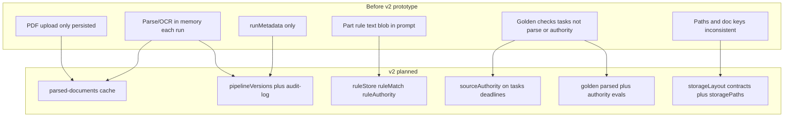
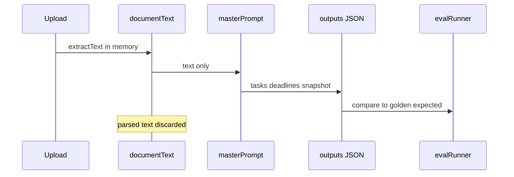
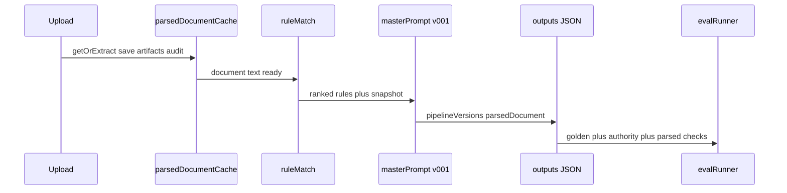
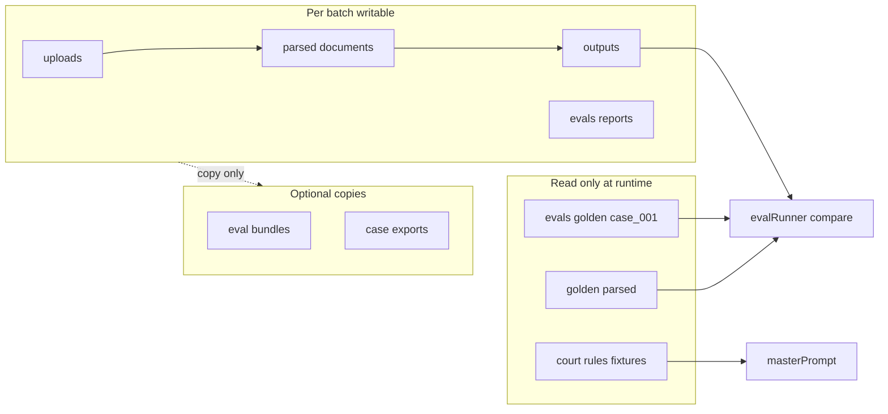
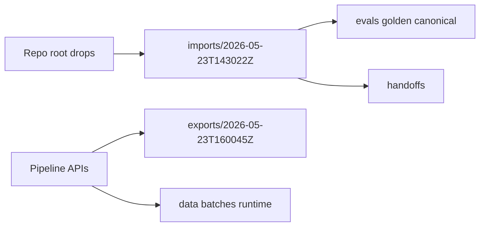
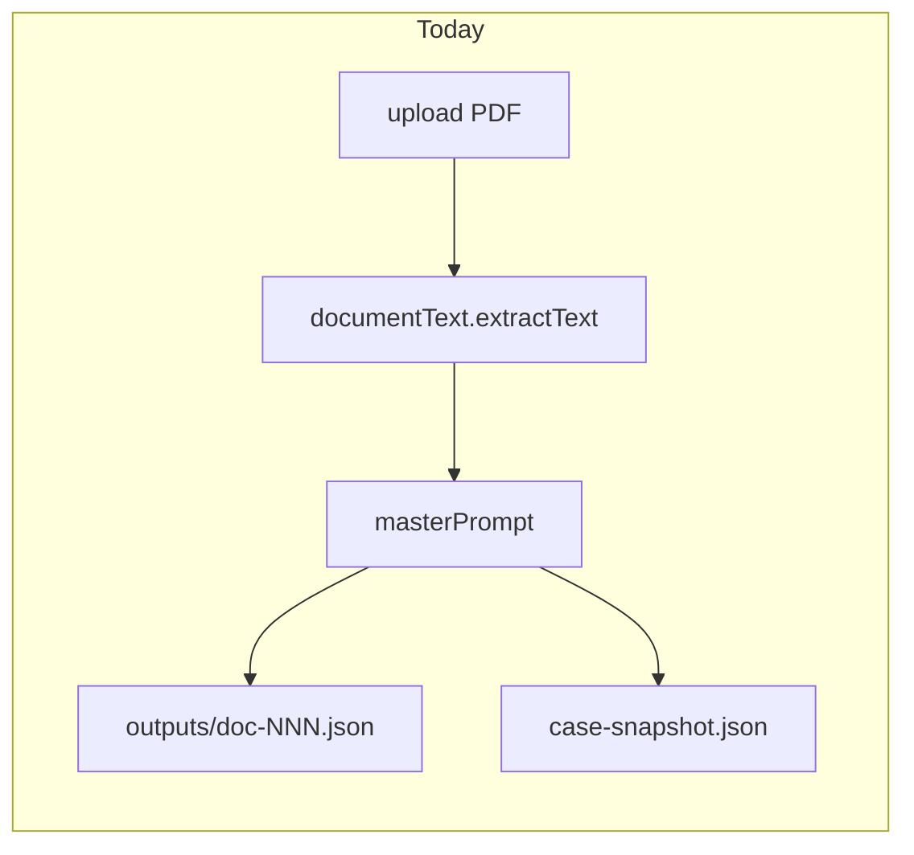
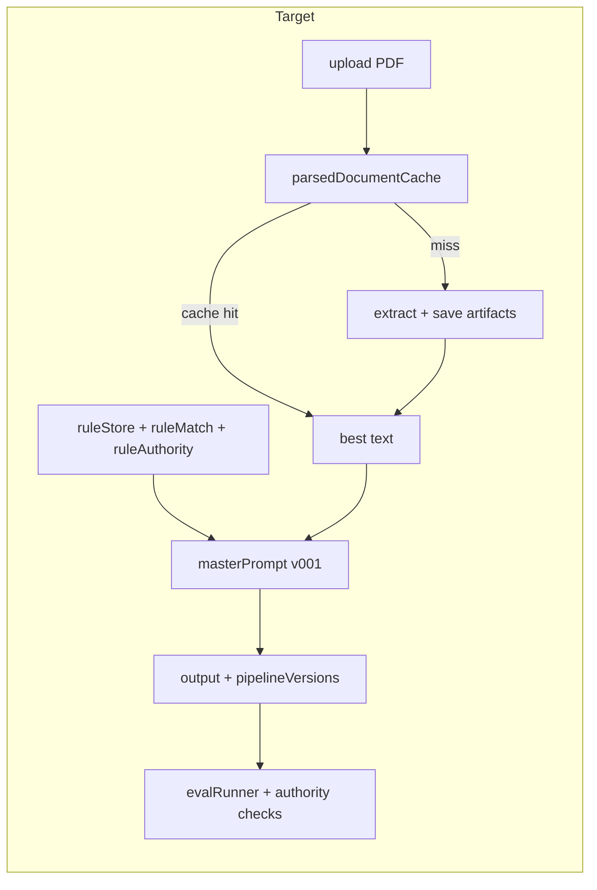

# 005 v2 — Case Filing: Parsed Cache, Rule Authority (Planned Review in Cursor)

| Field | Value |
|-------|--------|
| **Status** | **Implemented** (2026-05-23) |
| **Supersedes planning for** | [005 case_filing_ai_parsed_cache_rule_authority_handoff.md](./005_2026-05-23_10-49_handoff-original_parsed-cache-rule-authority.md) (original implementation spec) |
| **Architecture plan** | [005 v3 filing structure audit plan for architecture](./005_2026-05-23_11-20_handoff-v3_filing-structure-architecture.md) — repo layout, contracts manifest, audit, backlog |
| **Cursor plan source** | `case_filing_pipeline_v2` (Cursor Plans) |
| **Created (UTC)** | 2026-05-23T11:14:33Z |
| **Filename** | `005_2026-05-23_11-14_handoff-v2_planned-review-in-cursor.md` |
| **Repo** | `legal-prmpt-eng` |

## Purpose

Consolidated **implementation plan** for the next Case Filing AI pipeline update, refined during Cursor planning sessions. Use this document for review and execution; the original `005` handoff remains the detailed feature spec.

**Three goals:**

1. Parsed document cache / text vault (with review status + per-doc audit log)
2. Rule-source authority handling (court-rules layer)
3. Lightweight version contracts (`pipelineVersions`, prompts, parser, OCR, golden)

**Non-goals:** database, auth, Neo4j, vector DB, full court-rules UI, full human-review UI, LLM-as-judge eval, prompt version registry DB.

---

## Diagrams in this doc

Plans and handoffs use **[Mermaid](https://mermaid.js.org/)** embedded in Markdown (renders in Cursor, GitHub, and many MD viewers):

| Diagram type | When we use it |
|--------------|----------------|
| `flowchart` / `flowchart LR` | Pipelines, data flow, before/after |
| `sequenceDiagram` | Request/step order across services (optional) |
| Tables | Tradeoffs, issue ↔ mitigation matrices |

ASCII diagrams are avoided when Mermaid is available. For complex storage layout, a flowchart plus a folder tree in a fenced code block is usually enough.

---

## Prior gaps and how this reviewed plan addresses them

This section records problems with the **pre-v2 prototype** (working batch pipeline + original [005 handoff](./005_2026-05-23_10-49_handoff-original_parsed-cache-rule-authority.md) spec) and how the **Cursor-reviewed plan** closes or narrows each gap. See also the [005 study log](.../study-docs/005_2026-05-23_10-50_study-log_parsed-cache-rule-authority.md).

### At a glance



### Issue matrix

| # | Issue (before v2) | What went wrong | How v2 plan addresses it | Residual / out of scope |
|---|-------------------|-----------------|---------------------------|-------------------------|
| 1 | **No parsed text artifact** | `documentText.extractText` ran in memory; only `extractionQuality` saved on output | `parsed-documents/{docKey}/` with layered `.txt` files + metadata; `parsedDocumentCache.service.js` | Cross-batch shared cache not planned (each `batch-NNN` has its own tree) |
| 2 | **Prompt reruns repeat OCR** | Same PDF in `batch-003` vs `batch-004` re-parsed and re-OCR’d | Cache reuse when `sourceFileHash + parserVersion + ocrVersion` match **within a batch**; skip OCR on hit | New batch folder still re-parses unless we add a shared vault later |
| 3 | **No human review on parsed text** | Could not mark text verified or prefer human baseline | `review-status.json` + PATCH API; priority: human-reviewed → final-parsed → re-extract | Full human-review **UI** not in scope |
| 4 | **No parse history** | Could not see when text was created or cache reused | Per-doc `audit-log.jsonl` (`parsed_text_created`, `cache_reused`, `document_processed`, …) | No single audit across all batches |
| 5 | **Weak provenance** | `runMetadata` only (template, model, merge mode) | `pipelineVersions` on outputs, evals, and `document_processed` audit; keep `runMetadata` | Not a full prompt registry DB |
| 6 | **Rules = one part-rule blob** | `partRuleText` in master prompt; no ranked multi-source rules | `court-rules`: fixtures + `ruleStore` / `ruleMatch` / `ruleAuthority`; compact `{{rankedRules}}` block | Not a full statewide rules corpus UI |
| 7 | **No authority in schema** | Deadlines/tasks without `sourceAuthority`, `supersedes`, etc. | Optional fields on tasks/deadlines; v001 prompt separates rule-based vs case-order tasks | Perfect extraction not required in v1 |
| 8 | **Evals ignore rule hierarchy** | Golden has `mustNotCreate` (e.g. doc 13 NOI) but no structural authority checks | `runRuleAuthorityChecks()` + `ruleAuthorityFailures[]` on reports | Not every golden doc gets `expectedAuthority` blocks immediately |
| 9 | **Golden has no parsed baseline** | `expectedExtractionQuality` only; no golden `.txt` for parse quality | `evals/golden/case_001/parsed/` + `runParsedDocumentChecks()` (**pending your files**) | Anchored checks if full text diff too heavy |
| 10 | **File placement drift** | `doc-001` vs `doc_001`; paths built in multiple places | `storageLayout.contract.js`, `parsedDocumentArtifacts.contract.js`, `storagePaths.js`, `STORAGE.md` | CI grep guard optional |
| 11 | **court-rules module empty** | Health stub only; logic lived in case-filing-ai | Minimal services under `court-rules/`; pipeline injects before prompt | No court-rules HTTP UI |
| 12 | **Multi-run experiments hard to compare** | Each run = new batch; no version stamp on parse step | `pipelineVersions` + eval provenance fields; per-doc audit | No `experimentLabel` / global run registry yet |
| 13 | **Stale batch data** | Old `batch-001`…`004` and `eval-bundles/` clutter disk | Documented pre-step: `DELETE /cases/case_001`; manual bundle delete | No delete API for `eval-bundles/` |
| 14 | **v001 output breaks golden** | New master JSON shape vs existing `doc_NNN.expected.json` | `normalizeMasterOutput()` maps to legacy fields for eval/snapshot | Golden may still need gradual authority fields |
| 15 | **Master prompt limits** (earlier hardening) | Partial batches, invalid JSON on long runs | Separate work: JSON retry, compact prompt, per-doc try/catch (already shipped) | v2 does not replace that; it stacks on top |

### Pipeline comparison

**Before (prototype):**



**After (v2 planned):**



### Storage zones (why files stay in the right place)



**Rule:** golden and fixtures are never written by the API; batch pipeline only writes under `data/case-filing-ai/batches/{batchId}/` via `localJsonStore` / `parsedDocumentCache`.

### What v2 deliberately does *not* fix yet

| Topic | Why deferred |
|-------|----------------|
| Full `filing-text-vault` module | Same artifacts, but owned under case-filing-ai until vault module is wired |
| Shared parse cache across batches | Simpler invalidation; can add `data/case-filing-ai/parsed-vault/` later |
| Cross-batch experiment registry | Use batch id + `pipelineVersions` on eval reports for now |
| `eval-bundles` delete API | Manual cleanup or small follow-up |
| LLM-as-judge eval | Explicit non-goal |

---

## Why old batch data is still on disk

The delete API **was never called** in this repo session — nothing is wiped automatically.

| Batch | Evals folder? | Default `DELETE …/cases/case_001` |
|-------|----------------|-----------------------------------|
| `batch-001` | **No** | **Skipped** (no `caseId` in eval reports) — “unclassified” outlier |
| `batch-002` | **No** | **Skipped** — same |
| `batch-003` | Yes | Would delete if API run without `batchIds` |
| `batch-004` | Yes | Would delete if API run without `batchIds` |

So it is **not** that the API failed — it is **unused**, and **half your batches are outliers** for the default matcher. To remove **all four**:

```bash
curl -X DELETE http://localhost:3001/api/case-filing-ai/cases/case_001 \
  -H "Content-Type: application/json" \
  -d '{"confirm":true,"batchIds":["batch-001","batch-002","batch-003","batch-004"]}'
```

`eval-bundles/` and root stray files are **outside** that API (see file-exchange below).

---

## Root `case_001_golden_dataset_ground_truth.json`

| Question | Answer |
|----------|--------|
| Same as canonical golden? | **Yes** — byte-identical to `evals/golden/case_001/case_001.golden-dataset.json` (from the [004 golden dataset study log](./study%20docs/004_case_filing_ai_golden_dataset_eval_runner_study_log.md) handoff bundle). |
| Should it live at repo root? | **No** — canonical home is `evals/golden/case_001/`. Root copy is a duplicate from import/exchange. |
| Action before v2 work | Move to `file-exchange/imports/archive/` (or delete root copy after confirming golden tree). **Do not** treat repo root as a drop zone. |

---

## `file-exchange/` — agent ↔ you (dated imports + exports)

Agreed layout (repo root). **Each drop or export run gets its own timestamp folder** so nothing overwrites a prior handoff and you can see when files arrived or were generated.

```text
file-exchange/
  README.md
  imports/
    2026-05-23T143022Z/          # one folder per inbound session
      case_001_golden_dataset_ground_truth.json
      parsed-golden-doc-001.zip
    2026-05-24T091500Z/
      ...
  exports/
    2026-05-23T160045Z/          # one folder per export/bundle run
      eval-bundles-case_001-review/
      consolidated-models-snapshot.json
    ...
```

### Timestamp format

| Field | Convention |
|-------|----------------|
| Folder name | `YYYY-MM-DDTHHMMSSZ` (UTC, no colons — safe on all OSes) e.g. `2026-05-23T143022Z` |
| Created by | Agent on triage (imports) or on API export/bundle (exports) |
| Optional label | README or `manifest.json` inside the folder: `{ "label": "golden-parsed-drop", "source": "user" }` |

### Workflow

| Step | Imports | Exports |
|------|---------|---------|
| 1 | User drops at root **or** in `imports/` | Pipeline/API produces artifact |
| 2 | Agent creates `imports/{timestamp}/`, moves strays there | Agent writes `exports/{timestamp}/` with copies or manifest |
| 3 | Triage from **that** folder → canonical paths (`evals/golden/`, etc.) | User reviews; old export folders can be deleted when done |
| 4 | Leave folder as archive **or** add `imports/{timestamp}/.triaged` marker | Keep for audit trail of “what we sent you when” |

| Subfolder | Purpose |
|-----------|---------|
| `imports/{timestamp}/` | Single inbound batch — golden parsed, zips, ad-hoc JSON |
| `exports/{timestamp}/` | Single outbound batch — eval bundle copy, case export, model snapshot |
| Flat `imports/archive/` | **Deprecated** — use dated folders instead; only for legacy one-off moves |

**Not replaced (runtime vs exchange):**

| Path | Role |
|------|------|
| `evals/golden/` | Canonical golden expecteds (CI / evalRunner) |
| `data/case-filing-ai/batches/` | Runtime pipeline output |
| `eval-bundles/` | API output today — **future:** prefer symlinks or copies under `file-exchange/exports/` |
| `case-exports/` | API output today — **future:** same |

### Agent rule (before any implementation or cleanup)

1. Scan **repo root** for stray files (`*.json`, `*.zip`, etc.).
2. Create **`file-exchange/imports/{UTC-timestamp}/`** and move all strays into **that** folder (one session = one folder).
3. **Triage** from that timestamp folder → canonical paths; add `.triaged` or `manifest.json` with `triagedAt` when done.
4. On export/bundle: write under **`file-exchange/exports/{UTC-timestamp}/`** (mirror or copy from `eval-bundles/`, `case-exports/`, etc.).
5. Then run cleanup (delete API, etc.) — do not delete dated folders unless user asks.

Document in `.cursor/rules/file-exchange-inbox.mdc` and `docs/architecture/REPO_ARTIFACT_LAYOUT.md` (Phase −1).



---

## Pre-implementation cleanup (optional)

Before greenfield re-runs:

| Target | How |
|--------|-----|
| All batch folders | `DELETE /api/case-filing-ai/cases/case_001` with `confirm: true` and **explicit** `batchIds: ["batch-001","batch-002","batch-003","batch-004"]` |
| Eval bundle copy | `rm -rf eval-bundles/case_001-bermeo-review` or move to `file-exchange/exports/archive/` |
| Root golden duplicate | Move → `file-exchange/imports/{timestamp}/` then triage (duplicate of `evals/golden/case_001/`) |
| Golden expected fixtures | **Keep** `evals/golden/case_001/` |

---

## Implementation checklist (Cursor todos)

- [x] **file-management-contract** — `storageLayout.contract.js`, `parsedDocumentArtifacts.contract.js`, `storagePaths.js`, `STORAGE.md`; enforce writes via store/cache only
- [x] **contracts-versions** — `pipelineVersions.js`, `ruleAuthority.contract.js`, extend `core-models` JSDoc
- [x] **parsed-cache** — `parsedDocumentCache.service.js`, localJsonStore parsed-doc helpers, `documentText.extractLayers`
- [x] **upload-integration** — Wire cache into `uploadBatch`; `pipelineVersions` + `parsedDocument` on outputs
- [x] **golden-parsed** — Ingested synthetic parsed under `evals/golden/case_001/parsed/` (14 docs) + `runParsedDocumentChecks()`
- [x] **parsed-api** — GET list/detail, PATCH review-status; API docs + frontend helpers
- [x] **court-rules-services** — Rule fixtures + `ruleStore`, `ruleMatch`, `ruleAuthority`
- [x] **prompt-v001** — v001 prompts, `normalizeMasterOutput`, ranked rules in master prompt
- [x] **eval-authority** — `runRuleAuthorityChecks`, parsed golden checks, eval report provenance fields
- [x] **tests-acceptance** — Unit + integration tests; regression on `process-batch`

---

## Suggested implementation order

0. **Pre-step (optional):** wipe old batches/eval-bundles via case delete API  
1. **Filesystem contract** (`storageLayout`, `parsedDocumentArtifacts`, `storagePaths`, `STORAGE.md`)  
2. **Version contracts** (`pipelineVersions`, `ruleAuthority`) + store helpers  
3. **`parsedDocumentCache`** + `documentText` refactor + `uploadBatch` hook  
4. **Ingest golden parsed files** (when provided)  
5. Parsed-document API + cache tests  
6. Court-rules fixtures + services  
7. `v001` master prompt + `normalizeMasterOutput` + snapshot supersession  
8. Eval: parsed golden + authority checks + docs + full test pass  

---

## Planning decisions (Cursor review notes)

### Multi-run testing (same files, batch-003 vs batch-004)

- Each `process-batch` creates a **new** `batch-NNN` folder; runs are isolated.
- **Per-doc** `audit-log.jsonl` + `document_processed` events record `pipelineVersions` for that run.
- **Not planned:** global cross-batch audit or shared parse cache across batches (cache is under `batches/{batchId}/parsed-documents/`).

### Golden parsed documents

- Runtime: `data/case-filing-ai/batches/{batchId}/parsed-documents/doc-NNN/`
- Golden baseline (user to supply): `evals/golden/case_001/parsed/doc-NNN/`
- Eval compares runtime → golden; APIs do not write into golden.

### File management

- **Contracts** (no I/O): `storageLayout.contract.js`, `parsedDocumentArtifacts.contract.js`, `pipelineVersions.js`, `ruleAuthority.contract.js`
- **Resolver:** `utils/storagePaths.js` — only module that `join()`s case-filing paths
- **Naming bridge:** `doc-001` (batch/parsed) ↔ `doc_001` (eval/golden)
- **Write policy:** see Phase 0 table below; no stray `writeFile` in routes

### Provenance

- **`pipelineVersions`** on outputs, evals, and `document_processed` audit events
- **`runMetadata`** kept (model id, template path) alongside `pipelineVersions`

---

## Current state (baseline)

- Text extraction is **ephemeral** — only `extractionQuality` on `outputs/doc-NNN.json`
- Provenance is **`runMetadata`** only (not parser/OCR/rule-set versions)
- **Court-rules** module is health-only; part rules are batch-local
- Golden evals encode authority scenarios but not `sourceAuthority` on outputs





---

## Phase 0 — Filesystem layout contract (file management)

**Gap today:** paths spread across `localJsonStore`, config env vars, and ad-hoc `join()` calls.

**Fix:** explicit **contracts** + one **path resolver** + one write policy.

### 0.1 Storage & artifact contracts

| Contract file | New or update | Purpose |
|---------------|---------------|---------|
| `contracts/storageLayout.contract.js` | **New** | Subfolder names, root keys, read-only zones, `toDocKey` / `toEvalId` |
| `contracts/parsedDocumentArtifacts.contract.js` | **New** | Parsed filenames, `PARSED_AUDIT_EVENTS`, default `review-status` shape |
| `contracts/pipelineVersions.js` | **New** (Phase 1) | Version strings |
| `court-rules/contracts/ruleAuthority.contract.js` | **New** (Phase 1) | Authority rank enum |
| `utils/storagePaths.js` | **New** | Absolute paths from layout + config |
| `schemas/parsed-document.schema.js` | **New optional** | API validation |
| `shared/domain/case-filing/core-models.js` | **Update** | JSDoc typedefs |
| `docs/case-filing-ai/STORAGE.md` | **New** | Human-readable layout doc |

### 0.2 Config roots

| Root | Default | Writable by |
|------|---------|-------------|
| `batchRoot` | `data/case-filing-ai/batches/` | `localJsonStore`, `parsedDocumentCache` |
| `goldenRoot` | `evals/golden/case_001/` | read-only at runtime |
| `goldenParsedRoot` | `evals/golden/case_001/parsed/` | read-only at runtime |
| `ruleFixturesRoot` | `data/court-rules/fixtures/case_001/` | read-only at runtime |
| `evalBundleRoot` | `eval-bundles/` | `evalBundle.service` only |
| `caseExportRoot` | `case-exports/` | `caseData.service` only |

### 0.3 Batch folder layout

```text
batches/batch-NNN/
  uploads/
  parsed-documents/doc-001/
    embedded-text.txt | ocr-text.txt | final-parsed-text.txt | human-reviewed-text.txt
    extraction-quality.json | page-map.json | parse-metadata.json
    review-status.json | audit-log.jsonl
  outputs/doc-NNN.json
  evals/doc_NNN.eval-report.json
  rule/
  case-snapshot.json
  processing-log.jsonl
```

### 0.4 Write policy

| Data | Writer |
|------|--------|
| `uploads/` | `localJsonStore.saveUpload` |
| `parsed-documents/` | `parsedDocumentCache` via store helpers |
| `outputs/` | `localJsonStore.saveDocumentOutput` |
| `evals/` | `localJsonStore.saveEvalReport` |
| Golden / rule fixtures | read-only at runtime |

---

## Phase 1 — Contracts and version surface

- `pipelineVersions.js` — parser, OCR, master/rule/task/snapshot prompts, rule set, golden dataset
- `buildPipelineVersions()` on outputs + evals + `document_processed` audit
- `ruleAuthority.contract.js` — `RULE_AUTHORITY_RANK`, `RULE_AUTHORITY_VALUES`
- Task/deadline optional fields: `sourceAuthority`, `sourceName`, `sourceDocNo`, `ruleSourceApplied`, `authorityRank`, `supersedes`, `sourceText`, `sourcePage`

---

## Phase 2 — Parsed document cache

- `parsedDocumentCache.service.js` — hash + version cache reuse; text priority: human-reviewed → final-parsed → re-extract
- Per-doc `audit-log.jsonl` events: `parsed_text_created`, `ocr_text_created`, `cache_reused`, `review_status_updated`, `document_processed` (with full `pipelineVersions`)
- `documentText.extractLayers()` for embedded/OCR/final layers
- `uploadBatch` calls `getOrExtract` instead of raw `extractText`

### Golden parsed (pending user files)

```text
evals/golden/case_001/parsed/doc-001/
  final-parsed-text.txt
  human-reviewed-text.txt
  extraction-quality.expected.json
  parse-metadata.expected.json
  review-status.expected.json
```

`runParsedDocumentChecks()` in evalRunner; `parsedGoldenFailures[]` on reports.

---

## Phase 3 — Court rules (minimal)

- Fixtures: `data/court-rules/fixtures/case_001/*.json`
- Services: `ruleStore`, `ruleMatch`, `ruleAuthority`
- Pre-prompt: ranked rules block (top N) → `{{rankedRules}}` in master prompt
- Authority hierarchy: cplr → uniform → county → judge/part → case order → later case order

---

## Phase 4 — Prompts v001

- `v001_master-case-filing.prompt.md` — new output shape (`documentFacts`, `ruleSourcesApplied`, `ruleBasedTasks`, `caseOrderTasks`, …)
- `normalizeMasterOutput()` for backward compatibility with existing evals
- Keep `v1`/`compact` aliases until cutover is green

---

## Phase 5 — Eval extensions

- `runRuleAuthorityChecks()` — deadline authority, supersession (doc 13 NOI), Part 10 over general Queens rules
- Eval report fields: `parsedDocumentCacheUsed`, `textSourceUsed`, `reviewStatusAtEvalTime`, `pipelineVersions`, `ruleSourcesChecked`, `ruleAuthorityFailures`, `parsedGoldenFailures`

---

## Phase 6 — Parsed document API

| Method | Path |
|--------|------|
| GET | `/batches/:batchId/parsed-documents` |
| GET | `/batches/:batchId/parsed-documents/:documentId` |
| PATCH | `/batches/:batchId/parsed-documents/:documentId/review-status` |

Update `docs/case-filing-ai/API.md` + `docs/API.md` registry; `npm run lint:api-docs`.

---

## Phase 7 — Tests and acceptance

| # | Criterion |
|---|-----------|
| 1 | Parsed text saved every document |
| 2 | Rerun reuses cache / skips OCR when hash+versions match |
| 3–4 | `review-status.json` + `audit-log.jsonl` per parsed doc |
| 5 | Outputs include `pipelineVersions` |
| 6 | Tasks/deadlines support authority fields |
| 7 | `ruleAuthority` contract exists |
| 8 | Rules loaded/ranked before prompt |
| 9 | Eval reports include provenance + authority failures |
| 10 | `process-batch` / results flow works via `normalizeMasterOutput` |
| 11 | Golden parsed drives parse eval checks (when files supplied) |
| 12 | All writes via `storagePaths` + designated services; `STORAGE.md` |
| 13 | Contracts under `contracts/`; no duplicated magic strings |

---

## Risk notes

- **Output schema change** — requires `normalizeMasterOutput` so golden `doc_NNN.expected.json` need not all be rewritten at once
- **Prompt cutover** — default `MASTER_PROMPT_VERSION=v001` only after evals pass; keep `v1` in `.env.example` until then
- **Rule fixtures** — start minimal (6–10 JSON files); expand from eval failures

---

## Related docs

- **Architecture (layout, contracts, audit, backlog):** [005 v3 filing structure audit plan for architecture](./005_2026-05-23_11-20_handoff-v3_filing-structure-architecture.md)
- Original spec: [005 case_filing_ai_parsed_cache_rule_authority_handoff.md](./005_2026-05-23_10-49_handoff-original_parsed-cache-rule-authority.md)
- Study log: [005 study log](.../study-docs/005_2026-05-23_10-50_study-log_parsed-cache-rule-authority.md)
- Module API: [docs/case-filing-ai/API.md](../docs/case-filing-ai/API.md)
- Module boundaries: [docs/case-filing-ai/module-boundaries.md](../docs/case-filing-ai/module-boundaries.md)

---

## Full Cursor plan appendix

The complete phase-by-phase plan (including code path links) is maintained in Cursor Plans as **Case Filing Pipeline v2**. This handoff is the repo-local review copy; update this file when the Cursor plan changes materially.
