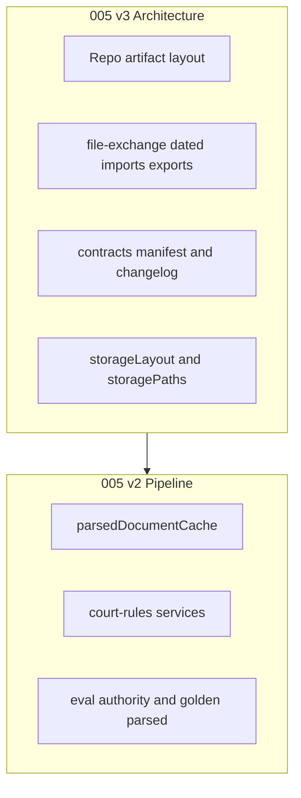
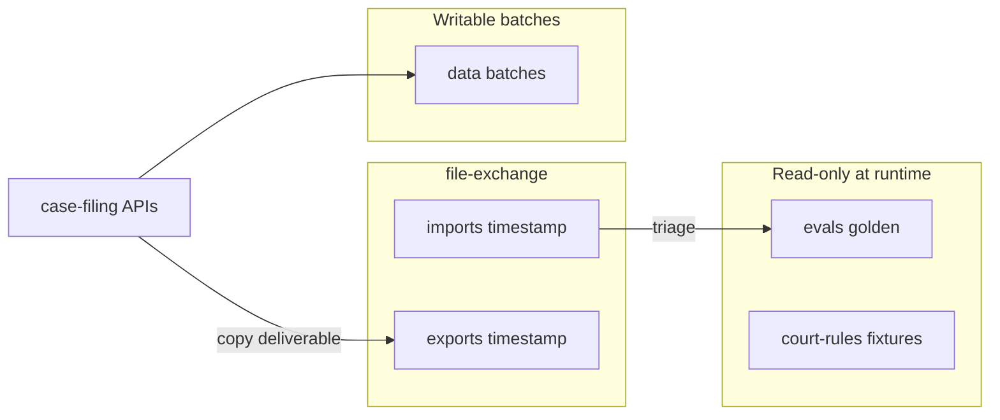
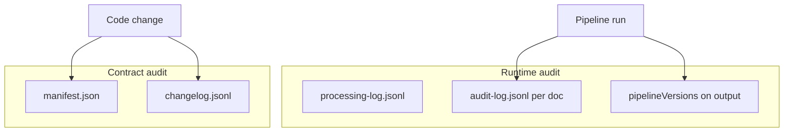

# 005 v3 — Filing Structure, Contracts & Audit Plan (Architecture)

| Field | Value |
|-------|--------|
| **Status** | **Implemented** (2026-05-23) |
| **Scope** | Filing paths, contracts, auditing, exchange folders, starter repeatability |
| **Related** | [005 original](./005_2026-05-23_10-49_handoff-original_parsed-cache-rule-authority.md) · [005 v2 pipeline](./005_2026-05-23_11-14_handoff-v2_planned-review-in-cursor.md) · [006 Cursor planning study log](.../study-docs/006_2026-05-23_11-21_study-log_cursor-planning-phase.md) |
| **Created (UTC)** | 2026-05-23T11:20:20Z |
| **Filename** | `005_2026-05-23_11-20_handoff-v3_filing-structure-architecture.md` |
| **Repo** | `legal-prmpt-eng` |

## Purpose

Single **architecture plan** for everything about **where filing artifacts live**, **what contracts govern them**, and **how we audit** changes and runs.  

**005 v2** remains the **pipeline feature plan** (parsed cache, rule authority, v001 prompts).  
**005 v3** is the **platform/filing structure layer** that v2 plugs into—and what we port to the **modular monolith starter** for other projects.



---

## Three layers (do not merge into one “filing contract”)

| Layer | Owns | Examples |
|-------|------|----------|
| **1. Repo / starter** | Human↔agent exchange, golden trees, export copies | `file-exchange/`, `evals/golden/`, `docs/architecture/` |
| **2. Module contracts** | Runtime paths & shapes for one feature | `case-filing-ai/contracts/storageLayout.contract.js` |
| **3. Runtime audit** | Append-only logs per run/document | `audit-log.jsonl`, `processing-log.jsonl`, `runMetadata` |

Layer 1 is **repeatable across projects**. Layer 2 is **per product module**. Layer 3 is **per batch/document**.

---

## What exists today (enforced vs convention)

### Enforced today (repeatable in starter)

| Mechanism | Contract doc | Lint / tool |
|-----------|--------------|-------------|
| Inter-module boundaries | [ARCHITECTURE_GUARDRAILS.md](../docs/architecture/ARCHITECTURE_GUARDRAILS.md) | `npm run lint:boundaries` |
| Intra-module MVC + prompts + evals | [MODULE_INTERNAL_CONTRACT.md](../docs/architecture/MODULE_INTERNAL_CONTRACT.md) | `npm run lint:layers` |
| HTTP API registry | [API_DOCUMENTATION_CONTRACT.md](../docs/architecture/API_DOCUMENTATION_CONTRACT.md) | `npm run lint:api-docs` |
| New module skeleton | `scripts/new-module.mjs` | Scaffolds routes, services, `prompts/`, `evals/` |

This is the **modern standard** beyond classic MVC: **prompts** and **evals** are first-class next to services—not bolted on later.

### Convention only (this repo, not linted)

| Area | Current state | Risk |
|------|---------------|------|
| `data/case-filing-ai/batches/` | Implicit layout in `localJsonStore` | Wrong folder, `doc-001` vs `doc_001` drift |
| `evals/golden/case_001/` | Product golden; not in starter scaffold | Other clones won’t know the pattern |
| `eval-bundles/`, root JSON drops | Ad hoc | Clutter, duplicate canonical files |
| `runMetadata` | JS helper, no schema file | Drift vs `pipelineVersions` (planned) |
| Batch `processing-log.jsonl` | Informal event names | No validation |

### Not implemented (no code `contracts/` yet)

- `storageLayout.contract.js`
- `parsedDocumentArtifacts.contract.js`
- `pipelineVersions.js`
- `ruleAuthority.contract.js`
- `file-exchange/`
- `REPO_ARTIFACT_LAYOUT.md`
- Contract manifest / changelog

---

## Target repo layout

```text
legal-prmpt-eng/
  docs/architecture/
    ARCHITECTURE_GUARDRAILS.md      # existing
    MODULE_INTERNAL_CONTRACT.md     # existing
    API_DOCUMENTATION_CONTRACT.md   # existing
    REPO_ARTIFACT_LAYOUT.md         # NEW v3
    contracts/
      manifest.json                 # NEW — version of each contract file
      changelog.jsonl               # NEW — append-only contract changes
  file-exchange/
    README.md
    imports/2026-05-23T143022Z/     # NEW — dated inbound
    exports/2026-05-23T160045Z/     # NEW — dated outbound
  evals/golden/case_001/            # canonical expecteds (read-only at runtime)
    parsed/doc-001/                 # golden parsed (user supply)
  data/case-filing-ai/batches/      # runtime pipeline
  data/court-rules/fixtures/        # rule corpus read-only
  eval-bundles/                     # legacy API root; optional → copy to file-exchange/exports/
  models/consolidated-models.json   # schema inventory (not runtime filing)
```



---

## Contract inventory (planned)

| Contract file | Layer | Status | In v2 pipeline plan? |
|---------------|-------|--------|----------------------|
| `docs/architecture/contracts/manifest.json` | Repo | Planned v3 | No (v3) |
| `docs/architecture/contracts/changelog.jsonl` | Repo | Planned v3 | No (v3) |
| `REPO_ARTIFACT_LAYOUT.md` | Repo | Planned v3 | Phase −1 in v2 |
| `file-exchange` + inbox cursor rule | Repo | Planned v3 | Phase −1 in v2 |
| `case-filing-ai/contracts/storageLayout.contract.js` | Module | Planned v3+v2 | Phase 0 in v2 |
| `case-filing-ai/contracts/parsedDocumentArtifacts.contract.js` | Module | Planned v3+v2 | Phase 0 in v2 |
| `case-filing-ai/contracts/pipelineVersions.js` | Module | Planned v2 | Phase 1 in v2 |
| `court-rules/contracts/ruleAuthority.contract.js` | Module | Planned v2 | Phase 1 in v2 |
| `case-filing-ai/utils/storagePaths.js` | Module | Planned v3+v2 | Phase 0 in v2 |
| `docs/case-filing-ai/STORAGE.md` | Doc mirror | Planned v3+v2 | Phase 0 in v2 |
| `schemas/parsed-document.schema.js` | Optional validation | Planned v2 | Optional |
| `shared/utils/formatExchangeTimestamp.js` | Repo helper | Planned v3 | Phase −1 |

### Contract manifest (example)

```json
{
  "repoArtifactLayout": { "version": "v001", "doc": "docs/architecture/REPO_ARTIFACT_LAYOUT.md" },
  "fileExchange": { "version": "v001", "timestampFormat": "YYYY-MM-DDTHHMMSSZ" },
  "caseFilingStorageLayout": { "version": "v001", "file": "backend/.../storageLayout.contract.js" },
  "pipelineVersions": { "version": "v001", "file": "backend/.../pipelineVersions.js" },
  "ruleAuthority": { "version": "v001", "file": "backend/.../ruleAuthority.contract.js" }
}
```

### Contract changelog (example line)

```jsonl
{"time":"2026-05-23T18:00:00Z","contract":"storageLayout","from":null,"to":"v001","reason":"Initial batch and parsed-documents layout","author":"agent"}
```

**Rule:** editing any `contracts/*.js` or `REPO_ARTIFACT_LAYOUT.md` → append one line to `changelog.jsonl` and bump `manifest.json`.

---

## Auditing: two kinds

### A. Runtime audit (events on disk)

| Log | Scope | Contract today | Planned |
|-----|-------|----------------|---------|
| `processing-log.jsonl` | Per batch | Informal | Event enum in v3 backlog optional |
| `parsed-documents/.../audit-log.jsonl` | Per doc | Not built | `PARSED_AUDIT_EVENTS` in parsedDocumentArtifacts |
| `runMetadata` on output/eval | Per doc run | Ad hoc JS | Supplemented by `pipelineVersions` |
| `document_processed` audit event | Per doc | Not built | Full `pipelineVersions` snapshot |

Runtime audit is **append-only JSONL** — not a DB. Evals remain **deterministic** comparators against golden JSON; audit logs explain **how** a run happened.

### B. Contract audit (design changes)

| Artifact | Purpose |
|----------|---------|
| `contracts/manifest.json` | Current version of each contract |
| `contracts/changelog.jsonl` | Who changed which contract, when, why |
| `prompts/manifest.json` (per module) | Prompt template versions (already exists) |

Optional later: `npm run lint:contracts` — manifest paths exist, version strings match exported constants in `contracts/*.js`.



---

## Eval structure (this project vs starter)

| Path | Role | Starter scaffold? |
|------|------|-------------------|
| `backend/src/modules/*/evals/` | Module smoke evals | **Yes** |
| `evals/golden/<case>/` | E2E golden expecteds | **No** — document in REPO_ARTIFACT_LAYOUT |
| `data/.../batches/*/evals/` | Runtime eval reports | **No** — case-filing specific |
| `eval-bundles/` | Review copies | **No** — prefer `file-exchange/exports/{timestamp}/` |

v3 does **not** replace golden eval logic—that stays in v2 `evalRunner`—but v3 **defines where golden and exports live**.

---

## Implementation phases (v3 architecture)

Execute **before or in parallel with** v2 pipeline work.

| Phase | Work | Delivers |
|-------|------|----------|
| **v3-A** | `file-exchange/`, README, `formatExchangeTimestamp`, cursor rule | Dated imports/exports, root triage |
| **v3-B** | `REPO_ARTIFACT_LAYOUT.md`, update `STARTER_PACK.md` | Repeatable repo map |
| **v3-C** | `contracts/manifest.json` + `changelog.jsonl` | Contract audit trail |
| **v3-D** | `storageLayout` + `parsedDocumentArtifacts` + `storagePaths` + `STORAGE.md` | Module filing contract |
| **v3-E** | Optional `lint:contracts`, optional `lint:repo-artifacts` | CI guardrails |

Then **v2** implements parsed cache, rules, prompts, eval extensions on top of v3-D paths.

---

## Backlog — not implemented, keep in plan

Items **not in v2 pipeline todos** but **should stay tracked** here so nothing is lost.

| ID | Item | Why backlog | Suggested phase |
|----|------|-------------|-----------------|
| B1 | **`filing-text-vault` module** (real storage, not stub) | Boundaries say it owns text versions; v2 keeps cache under case-filing-ai | Post-v2 |
| B2 | **Shared parse vault** across batches (`data/.../parsed-vault/` by hash) | Skip OCR across batch-003/004 reruns | Post-v2 |
| B3 | **`DELETE /eval-bundles`** or export cleanup API | Only manual rm today | v3 or small API PR |
| B4 | **Batch run manifest** (`batch-run-metadata.json`: experiment label, prior batch ids) | Multi-run comparison | Post-v2 |
| B5 | **Shared audit event bus** ([DEVLOG_V2](../docs/DEVLOG_V2.md) vision) | Cross-module audit stream in `shared/` | Platform later |
| B6 | **`npm run lint:contracts`** | Manifest ↔ contract files | v3-E |
| B7 | **Default export roots → `file-exchange/exports/`** | Env: `EVAL_BUNDLE_ROOT`, `CASE_EXPORT_ROOT` | v3-A follow-up |
| B8 | **PostgreSQL + repositories** ([INTEGRATION](../docs/case-filing-ai/INTEGRATION.md) migration) | Still filesystem prototype | Product decision |
| B9 | **`filing-pipeline` step orchestration** (wire 16 steps) | Catalog only today | Separate epic |
| B10 | **Human-review module UI** | Parsed review PATCH API only in v2 | Separate epic |
| B11 | **Sync `scripts/sync-cli-template.mjs`** with v3 layout | npm starter parity | v3-B |
| B12 | **Runtime audit event schema** (validate `processing-log` / audit lines) | Optional zod/ajv | v3-E |
| B13 | **Cross-project golden template** (`evals/golden/_template/`) | New cases | v3-B |
| B14 | **Cursor command `/planning-study-log`** + per-turn UTC in study logs | Portfolio / repeatable planning audit | v3-A |

**Yes — keep this backlog in the plan.** v2 is intentionally scoped; v3 architecture + backlog is the parking lot for platform work.

---

## Relationship to other handoffs

See [work-log INDEX](../INDEX.md) for all docs and execution order.

| Doc | Role |
|-----|------|
| [005](./005_2026-05-23_10-49_handoff-original_parsed-cache-rule-authority.md) | Original feature spec (parsed cache, rules, versions) |
| [005 v2](./005_2026-05-23_11-14_handoff-v2_planned-review-in-cursor.md) | Pipeline implementation + gap analysis + file-exchange detail |
| **005 v3 (this doc)** | Architecture: layout, contracts, audit, starter, backlog |
| [005 study log](.../study-docs/005_2026-05-23_10-50_study-log_parsed-cache-rule-authority.md) | Why decisions were made |

---

## Acceptance (v3 architecture)

1. `file-exchange/imports|exports/{UTC-timestamp}/` exists with README.  
2. `REPO_ARTIFACT_LAYOUT.md` documents all roots (golden, data, exchange, eval-bundles).  
3. `contracts/manifest.json` + `changelog.jsonl` exist; updates append changelog.  
4. `storageLayout` + `storagePaths` are the only path builders for case-filing batch I/O.  
5. `STORAGE.md` mirrors module contracts.  
6. Cursor rule: triage repo root → dated import folder before work.  
7. Starter docs mention `file-exchange` + artifact layout.  
8. Backlog table above remains in this doc until each item is scheduled or dropped.  

---

## Suggested order (full 005 program)

```text
1. v3-A  file-exchange + cleanup (move root golden duplicate, optional batch delete)
2. v3-B  REPO_ARTIFACT_LAYOUT + starter doc
3. v3-C  contract manifest + changelog
4. v3-D  storage contracts + STORAGE.md
5. v2    parsed cache, rules, prompts, evals (uses v3-D paths)
6. v3-E  optional lint + backlog items as needed
```
