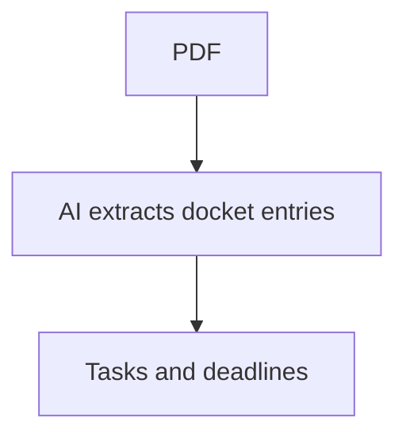
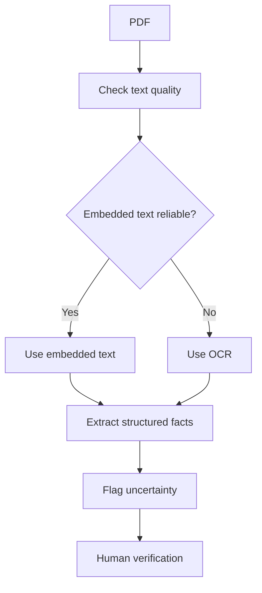

# Part 1: Why Docketing Extraction Is Harder Than Document Summarization

## Note on the documents used

This study used **synthetic NYSCEF-style documents**, not real NYSCEF filings.

All names, dates, index numbers, counsel names, party names, witness names, court details, and identifying facts are fictionalized, altered, or anonymized.

Example fake names used in this study:

| Fake field | Example |
|---|---|
| Plaintiff | Jane Doe, as Parent and Natural Guardian of Baby D. |
| Infant plaintiff | Baby D. |
| Defendant | ABC Hospital |
| Defense counsel | Smith & Rogers LLP |
| Plaintiff counsel | Example Injury Law PLLC |
| Judge | Hon. Mary Fiction |
| Index number | 999999/2025 |

The goal was not to process a real case. The goal was to study how prompt engineering, legal workflow experience, and source-grounded verification can work together.

---

## The task I started with

The initial task looked simple:

> Process NYSCEF-style filing documents and extract every docket entry.

That sounds like a document extraction problem.

A basic version might produce something like this:

| Doc No. | Document | Basic event |
|---:|---|---|
| 1 | Summons and Complaint | Case commenced |
| 2 | Certificate of Merit | Med-mal certificate filed |
| 3 | Affidavit of Service | Service filed |
| 4 | Answer | Defendant appeared |
| 5 | Preliminary Conference Order | Discovery schedule entered |

But docketing is not the same as summarization.

A summary tells you what a document says.

A docketing workflow has to decide what the document changes.

---

## The difference between summary and docketing

In a fake case like:

```text
Jane Doe, as Parent and Natural Guardian of Baby D.
v.
ABC Hospital
Index No. 999999/2025
```

a filing can affect:

- case posture
- deadlines
- attorney follow-ups
- discovery obligations
- deposition scheduling
- conference handling
- note of issue risk
- judge/part-specific procedure
- human review needs

That means the AI cannot only extract text.

It has to produce structured operational meaning.

| Filing | Summary view | Docketing view |
|---|---|---|
| Summons and Complaint | Complaint filed against ABC Hospital | Case commenced; service and answer tracking may be needed |
| Affidavit of Service | Service affidavit filed | Service date/method may trigger answer deadline, but only if reliable |
| Answer | ABC Hospital answered | Pleadings joined; discovery phase may begin |
| Demand for Bill of Particulars | Demand served | Response task exists; deadline may need calculation |
| Notice to Take Deposition | Deposition noticed | Is there a real date or only a general demand to schedule? |
| Preliminary Conference Order | Court entered order | Court deadlines now control the case |
| Compliance Conference Order | Updated order entered | Some tasks may be complete, extended, or newly risky |

This is why I treated the project as a workflow extraction problem, not just a text extraction problem.

---

## How I approached the problem

This was intentional.

I approached the problem the same way I usually approach complex operational systems:

1. Start with the real task.
2. Test the AI against messy source documents.
3. Watch where the output becomes unsafe, vague, or overconfident.
4. Add a prompt constraint.
5. Convert that constraint into a model, guardrail, or pipeline step.
6. Repeat until the output becomes reviewable and source-grounded.

The discovery was not that AI can extract docket entries.

The discovery was that prompt engineering can be used as a structured workflow design method when combined with legal operations experience.

---

## Accuracy starts with the source document

The most important rule was:

```text
The source document is the ground truth.
```

The AI output is not truth by itself.

The OCR output is not truth by itself.

A generated deadline is not truth unless the source supports it.

That forced the prompt to separate:

```text
source document
  → extracted fact
  → confidence level
  → task or deadline
  → human verification if needed
```

For example:

| Output candidate | What must be checked |
|---|---|
| “Service completed” | Which document proves service? What was served? On whom? |
| “Answer deadline due” | What service date and method support the calculation? |
| “Judge assigned” | Is the judge assigned to the main case or only a related matter? |
| “Plaintiff EBT complete” | Which order or transcript proves completion? |
| “NOI due date” | Is the date printed, handwritten, OCR-garbled, or court-ordered? |

This made the prompt stricter.

It could not just ask for an answer. It had to ask for a source-grounded answer.

---

## The OCR and handwriting problem

Court-style filings often contain mixed-quality information.

Even synthetic documents can model the same problems:

- embedded PDF text
- scanned pages
- court forms
- handwritten dates
- checkboxes
- signatures
- stamps
- postal receipts
- rotated pages
- OCR-garbled text

So the first core prompt rule became:

```text
Before extracting legal information, check whether embedded PDF text is usable.
Use embedded text if reliable.
Use OCR only if needed.
If handwriting, stamps, checkboxes, or unclear dates control meaning, send it to human review.
```

Before the rule, the flow looked like this:



After the rule, the flow became this:



That change matters.

If Doc 3 says:

```text
Service made on May __, 2025
```

and the date is handwritten or unclear, the AI should not guess.

It should create a review item.

```text
Doc 3
Page 1
Location: middle-left service date line
Issue: handwritten service date unclear
Reason: deadline calculation may depend on this date
Suggested action: human reviewer must verify before docketing answer deadline
```

That is a safer output than a confident but unsupported date.

---

## Where my legal workflow experience fits

This is the layer that matters most.

The AI can extract text.

The prompt can structure the output.

OCR can help recover scanned text.

But my legal workflow experience lets me see whether the output makes operational sense.

For example:

| AI output | Legal workflow verification question |
|---|---|
| “Answer filed” | Does this complete pleadings, or are there counterclaims/crossclaims? |
| “Demand served” | Does it create a response task? Is service date clear? |
| “Notice to take deposition” | Is the EBT actually scheduled or just demanded? |
| “Order entered” | Did it change previous deadlines? |
| “Conference date listed” | Does the part require appearance or submission only? |
| “NOI deadline set” | Is it explicit, calculated, or OCR-uncertain? |

Human verification is not just proofreading.

It is the final layer that decides whether the detail is accurate enough to enter the docketing file.

---

## Part 1 takeaway

The first lesson was:

```text
Legal docketing extraction is not document summarization.
It is source-grounded workflow interpretation.
```

The prompt needs to protect against overconfidence.

The model should not guess.

The source document must remain the ground truth.

Human legal workflow review is the final verification layer.
