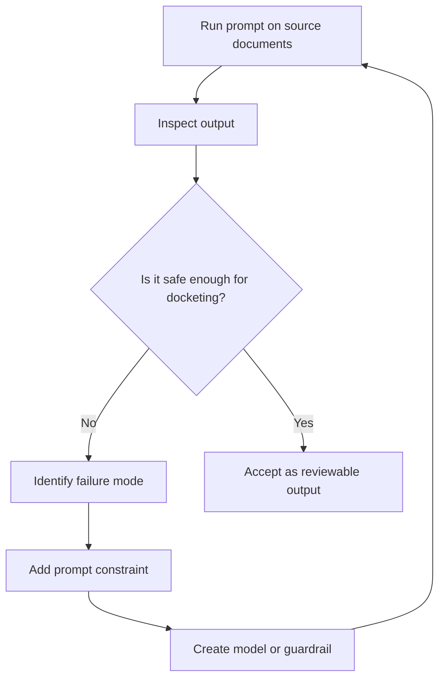
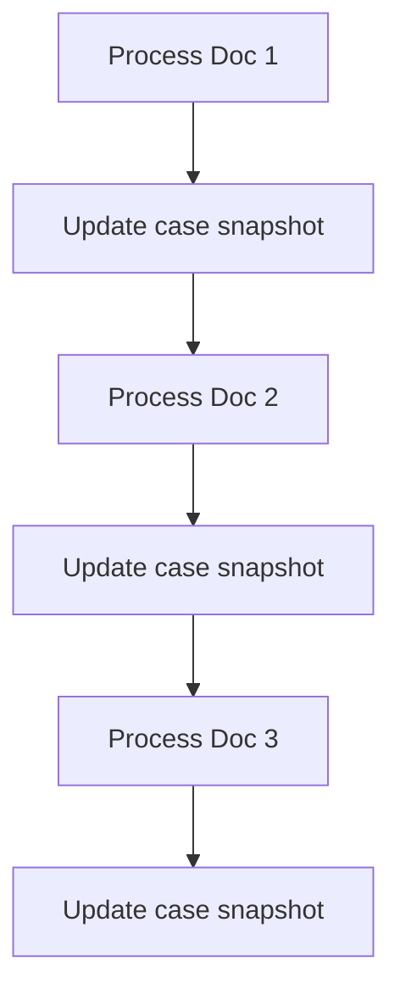

# Part 2: How Prompt Engineering Became the Design Method

## Note on the documents used

This study used **synthetic NYSCEF-style documents**, not real NYSCEF filings.

All names, dates, index numbers, counsel names, party names, witness names, court details, and identifying facts are fictionalized, altered, or anonymized.

Fake examples include Jane Doe, Baby D., ABC Hospital, Smith & Rogers LLP, Example Injury Law PLLC, and Hon. Mary Fiction.

---

## The main discovery

I used prompt engineering as a design method.

This was not random trial and error.

I was intentionally testing how the AI behaved against messy legal workflow documents, then turning each weak point into a stronger instruction, model, or guardrail.

The loop looked like this:



This is where the project became more interesting.

Prompt engineering was not only producing outputs. It was revealing the structure of the system.

---

## Prompt failures exposed hidden models

Every time the prompt was too broad, the output exposed a missing piece.

| Prompt iteration | What went wrong | What the system needed |
|---|---|---|
| “Extract docket entries” | Output was too flat | DocketEntryModel |
| “Check OCR first” | Needed a way to store text quality | ExtractionQualityModel |
| “Do not guess handwriting” | Needed a review queue | HumanVerificationModel |
| “Send cropped snippets” | Needed review artifacts | Crop/review workflow |
| “Fill the case models” | One giant model was too messy | Case, Document, Party, Task, Deadline models |
| “Track the case phase” | Docket entries did not show posture | Phase and MiniPhase model |
| “Apply part rules” | Generic extraction missed local procedure | RuleContextModel |
| “Do one document at a time” | Bundle state was hard to control | CaseStateSnapshotModel |
| “Use stricter guardrails” | AI still sounded too confident | Source/confidence/review separation |

The important part is that each prompt improvement became a product decision.

---

## Before and after prompt style

### Before

```text
Read these NYSCEF-style PDFs and extract the docket entries.
```

This prompt is too open.

It lets the model summarize, infer, and smooth over uncertainty.

### After

```text
Process this document through a docketing pipeline.

First check whether embedded text is reliable.
Use OCR only when needed.
Do not guess handwriting, checkboxes, stamps, postal receipts, or unclear dates.
Extract facts separately from calculated deadlines.
Create tasks only when supported by source text, court order, supplied rule, or approved calculation.
Mark uncertain items for human review.
Update case state without silently overwriting confirmed facts.
```

This prompt is not just asking for output.

It is defining behavior.

---

## The prompt became a legal-ops contract

The strongest improvement came from writing the prompt like a contract.

It had to say what the AI is allowed to do and what it is not allowed to do.

```text
Do not infer deadlines unless a source document, court rule, or supplied rule directly supports them.

Do not treat a filed document as accepted, granted, so-ordered, waived, or completed unless the court document confirms it.

Do not treat related-case information as main-case truth unless the document explicitly links them.

Do not mark a task complete unless a document proves completion.

If unsure, create a human-verification item instead of guessing.
```

This is where legal workflow experience shaped the prompt.

A generic AI summarizer may say:

```text
The filing appears to complete service.
```

A docketing prompt should say:

```text
Service document filed.
Service completion requires human verification because the handwritten date is unclear.
Do not calculate answer deadline yet.
```

That difference is the whole point.

---

## Why source grounding mattered

The workflow had to preserve source support.

Every output should be traceable.

| Output | Required support |
|---|---|
| Case identity | Caption page, index number, court header |
| Judge assignment | Court order, RJI, assignment notice, or rule-specific source |
| Service event | Affidavit of service or confirmation document |
| Answer filed | Filed answer document |
| BP deadline | Demand plus service date or explicit rule |
| EBT deadline | Court order or deposition notice |
| NOI deadline | Court order, conference order, or rule |
| Human review item | Page number, location, issue, reason |

This creates a safer chain:

```text
document page
  → extracted fact
  → confidence
  → task/deadline candidate
  → verification status
```

---

## Models that came out of the prompt work

### CaseModel

```ts
type CaseModel = {
  indexNumber: string | null;
  county: string | null;
  court: string | null;
  caseType: string | null;
  caption: string | null;
  plaintiffNames: string[];
  infantPlaintiffs: string[];
  defendantNames: string[];
  judge: string | null;
  part: string | null;
  relatedCases: RelatedCaseModel[];
  confidence: "high" | "medium" | "low";
};
```

### DocumentModel

```ts
type DocumentModel = {
  nyscefDocNo: number;
  title: string;
  filedDateTime: string | null;
  filedBy: string | null;
  pageCount: number | null;
  documentType: string;
  sourceFileName: string;
  extractionStatus:
    | "text_parsed"
    | "ocr_needed"
    | "ocr_used"
    | "text_parsed_with_handwriting_review"
    | "ocr_used_with_human_review"
    | "partial"
    | "unreadable";
};
```

### DocketEntryModel

```ts
type DocketEntryModel = {
  nyscefDocNo: number;
  filedDateTime: string | null;
  documentTitle: string;
  filedBy: string | null;
  eventSummary: string;
  phase: string;
  miniPhase: string;
  sourcePages: number[];
  confidence: "high" | "medium" | "low";
};
```

### TaskModel

```ts
type TaskModel = {
  taskId: string;
  taskDescription: string;
  responsibleParty: string | null;
  dueDate: string | null;
  triggerDocNo: number;
  triggerText?: string;
  taskType:
    | "answer_deadline"
    | "service_followup"
    | "discovery_response"
    | "deposition"
    | "authorization"
    | "conference"
    | "motion"
    | "note_of_issue"
    | "pretrial_conference"
    | "human_review"
    | "risk_alert";
  status: "open" | "completed" | "future" | "conditional" | "needs_review";
  docketingNote: string;
  confidence: "high" | "medium" | "low";
};
```

### HumanVerificationModel

```ts
type HumanVerificationModel = {
  itemId: string;
  nyscefDocNo: number;
  page: number;
  location: string;
  issue: string;
  reason: string;
  suggestedAction: string;
  cropFile?: string | null;
  status: "pending" | "reviewed" | "resolved";
};
```

---

## One document at a time became safer

Bundle processing was useful for testing.

But one-document-at-a-time processing is safer for state updates.



This prevents the system from mixing facts across documents too easily.

It also makes it easier to see exactly which document changed the case state.

That created the need for a snapshot model.

```ts
type CaseStateSnapshotModel = {
  afterDocNo: number;
  currentPhase: string;
  currentMiniPhase: string;
  confirmedFacts: string[];
  openTasks: TaskModel[];
  completedTasks: TaskModel[];
  futureDeadlines: DeadlineModel[];
  unresolvedHumanReviewItems: HumanVerificationModel[];
  assumptionsToRecheck: string[];
};
```

---

## Part 2 takeaway

The second lesson was:

```text
Strong prompt engineering can expose the hidden architecture of a workflow system.
```

Each prompt constraint became something concrete:

- a model
- a pipeline step
- a guardrail
- a review queue
- a state update rule

That is why this was not just “using AI to extract documents.”

It was using AI engineering and legal workflow knowledge together to design a safer extraction system.
