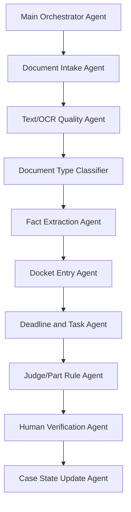
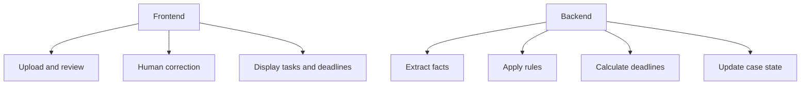
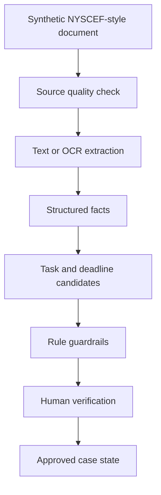

# Part 3: The Final Prompting Pattern for a Source-Grounded Docketing Agent

## Note on the documents used

This study used **synthetic NYSCEF-style documents**, not real NYSCEF filings.

All names, dates, index numbers, counsel names, party names, witness names, court details, and identifying facts are fictionalized, altered, or anonymized.

Fake examples include:

```text
Jane Doe, as Parent and Natural Guardian of Baby D.
v.
ABC Hospital
Index No. 999999/2025
```

The point is the workflow pattern, not the fictional facts.

---

## Why one giant prompt was not enough

A single prompt can work for a demo.

But for docketing, different tasks need different levels of caution.

OCR quality checking is not the same as deadline calculation.

Deadline calculation is not the same as judge/part rule application.

Judge/part rule application is not the same as human verification.

So the final pattern became:

```text
Main orchestrator prompt
+ task-specific mini-agent prompts
+ strict guardrails
+ source document grounding
+ human legal workflow verification
```

---

## Final agent structure



Each mini-agent has a narrow job.

| Agent | Job |
|---|---|
| Document Intake Agent | Identify file, doc number, title, page count |
| Text/OCR Quality Agent | Decide whether embedded text is usable |
| Document Type Classifier | Classify filing type |
| Fact Extraction Agent | Extract only source-supported facts |
| Docket Entry Agent | Create procedural event |
| Deadline and Task Agent | Create tasks only from supported triggers |
| Judge/Part Rule Agent | Apply supplied rules only when applicable |
| Human Verification Agent | Flag uncertain visual/document issues |
| Case State Update Agent | Update posture without silent overwrites |

---

## Main orchestrator prompt

```text
You are the orchestration agent for a NYSCEF-style docketing pipeline.

Your job is to route the document through the correct processing stages.

Do not extract legal facts yourself unless a downstream agent has returned them.
Do not create deadlines yourself unless the Deadline Agent returns them.
Do not mark facts as confirmed unless the Fact Extraction Agent or Human Review confirms them.

Pipeline:
1. Run document intake.
2. Run text/OCR quality check.
3. If embedded text is reliable, use text extraction.
4. If embedded text is unreliable, run OCR.
5. Classify document type.
6. Extract facts.
7. Extract docket event.
8. Extract tasks and deadlines.
9. Apply judge/part/county rules.
10. Detect conflicts.
11. Create human-verification items.
12. Update case state snapshot.

Always separate:
- extracted facts
- calculated deadlines
- rule-based tasks
- assumptions
- human-review items

If any stage is uncertain, preserve uncertainty and send it to human review.
```

---

## Task-specific prompts

### Text/OCR Quality Agent

```text
You are the OCR quality agent.

Decide whether embedded PDF text is reliable enough to parse.

Check for:
- missing text
- garbled text
- broken dates
- missing checkboxes
- scanned pages
- handwriting
- stamps
- rotated pages
- postal receipts
- court order forms with handwritten fields

Return:
- embeddedTextUsable: true/false
- ocrNeeded: true/false
- ocrPages: page numbers
- humanReviewAreas
- extractionConfidence

Do not extract legal tasks or deadlines.
```

### Fact Extraction Agent

```text
You are the fact extraction agent.

Extract only facts directly supported by the document.

Extract:
- index number
- county
- court
- caption
- plaintiffs
- infant plaintiffs
- defendants
- judge
- part
- counsel
- filed date
- service date
- related case references
- case type

Do not infer.
Do not calculate deadlines.
Do not apply judge rules.
If unclear, mark needs_human_review.
```

### Deadline and Task Agent

```text
You are the deadline and task extraction agent.

Create tasks only when supported by:
- explicit document text
- court order
- notice
- demand
- judge/part rule supplied to you
- approved deterministic calculation

Every task must include:
- task description
- responsible party
- due date or "no fixed due date"
- trigger document
- source page
- calculation method
- confidence

Do not guess deadlines.
If service date is unclear, mark deadline as needs_review.
```

### Human Verification Agent

```text
You are the human verification agent.

Identify anything that should not be trusted without review.

Flag:
- handwriting
- signatures
- checkboxes
- unclear dates
- stamps
- faint text
- postal receipts
- rotated pages
- OCR-garbled court order fields
- conflicting facts

Return:
- document number
- page number
- location
- issue
- reason
- suggested human action
- crop file if available

Do not guess what the unclear text says.
```

---

## Final guardrails

These are the guardrails that made the prompt safer.

```text
1. Do not infer deadlines unless a source document, court rule, or supplied rule directly supports them.

2. Separate:
   - extracted facts
   - calculated deadlines
   - rule-based tasks
   - assumptions
   - human-review items

3. Never overwrite a previously confirmed fact without marking a conflict.

4. Do not treat related-case information as main-case information unless the document explicitly links them.

5. Do not mark a task complete unless the document proves completion.

6. Do not treat a filed document as accepted, granted, so-ordered, waived, or completed unless the court document confirms it.

7. Every task must have:
   - trigger document
   - source page
   - responsible party
   - due date or “no fixed due date”
   - confidence level

8. Every deadline must say how it was calculated:
   - explicit document date
   - court order date
   - service date
   - rule-based calculation
   - unknown / needs review

9. OCR output cannot be treated as final truth if:
   - handwriting is involved
   - checkboxes control the meaning
   - dates are handwritten
   - stamps are faint
   - postal receipts are involved
   - page is rotated or low-quality

10. If unsure, create a human-verification item instead of guessing.
```

---

## Frontend and backend boundary

The frontend should not calculate legal deadlines.

The frontend should handle:

- upload
- review
- correction
- document display
- human verification queue
- task board
- deadline display
- conflict review

The backend should handle:

- extraction
- OCR decision
- OCR
- crop generation
- classification
- rule application
- task generation
- deadline calculation
- conflict detection
- case state updates
- persistence



Boundary rule:

```text
Frontend = review, display, correction
Backend = extraction, reasoning, persistence
```

---

## Why human verification is still central

The goal is not to let AI become the authority.

The goal is to make the AI produce reviewable work.

My legal workflow experience is the final check before anything goes into the file.

That means asking:

| Review question | Why it matters |
|---|---|
| Does the source document actually support this fact? | Prevents hallucinated facts |
| Is the deadline explicit or calculated? | Prevents unsafe docketing |
| Is OCR involved? | Lowers confidence if visual text is unclear |
| Is this related-case data or main-case data? | Prevents wrong judge/case assumptions |
| Did a later order supersede this task? | Prevents stale deadlines |
| Should this be entered now or held for review? | Protects the working file |

This is the final pattern:

```text
AI extracts.
Prompt guardrails constrain.
Source documents ground the output.
Human legal workflow review verifies the details.
Only verified results enter the file.
```

---

## Tools needed

Prompt engineering alone is not enough.

The workflow needs tools.

| Tool type | Purpose |
|---|---|
| PDF text extraction | Check whether embedded text is usable |
| PDF-to-image rendering | Inspect page layout visually |
| OCR | Read scanned or image-only sections |
| Image cropping | Create snippets for human verification |
| Structured LLM extraction | Convert text into models |
| Rule engine | Apply deterministic court/part logic |
| Database | Store case state, tasks, deadlines, review items |

The AI agent should orchestrate the tools, not replace them.

---

## Final pattern



---

## Final takeaway

This was not a random prompt trick.

It was a planned way to combine AI engineering, prompt engineering, and legal workflow experience.

The prompt helped shape the system.

The source documents kept the system grounded.

My legal workflow review became the final accuracy layer.

```text
Prompt engineering gave the system structure.
Source documents gave it grounding.
Legal workflow verification made it safe enough to use.
```

I am still exploring this pattern, but the direction is clear: the strongest legal AI workflows are not just model outputs. They are source-grounded, human-verified systems.
