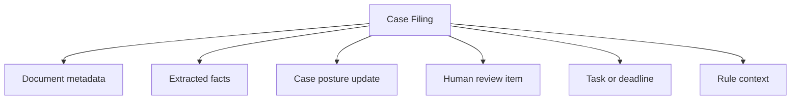
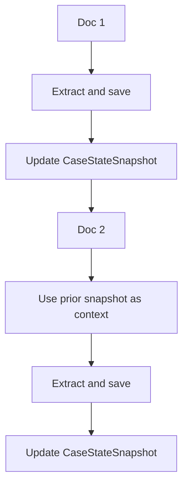
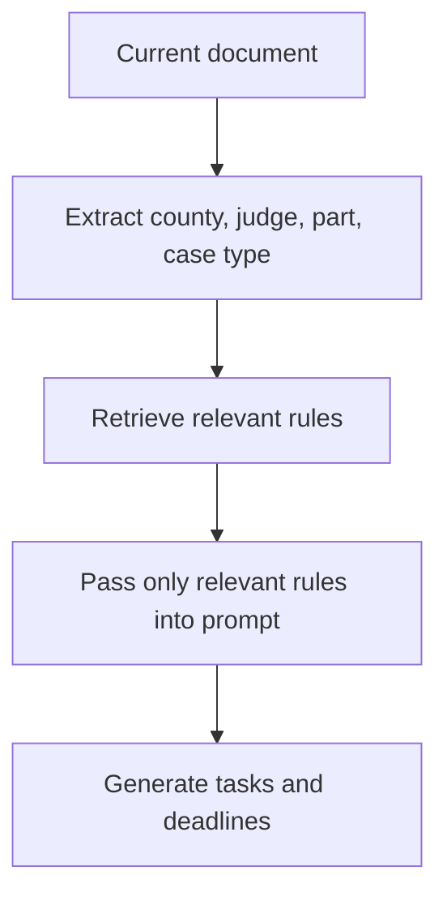
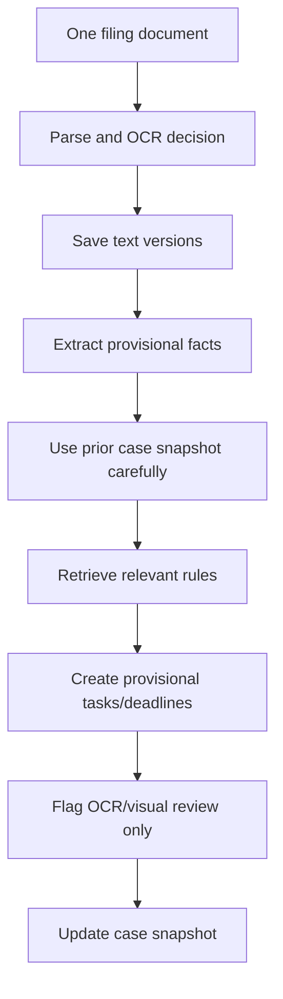

# Follow-Up Study Blog: Tightening the Case Filing AI Before the Handoff

## Note on the documents used

This follow-up is based on a synthetic NYSCEF-style workflow study.

No real NYSCEF filings are discussed here. Any names, index numbers, case names, counsel names, judges, parties, witnesses, or court details used as examples are fictional or altered.

Example fake case:

```text
Jane Doe, as Parent and Natural Guardian of Baby D.
v.
ABC Hospital
Index No. 999999/2025
County: Queens
```

This write-up documents the design tweaks made after the first starter package, before turning the work into a cleaner handoff.

---

# Table of Contents

- [Why the first package was not enough](#why-the-first-package-was-not-enough)
- [Tweak 1: Renaming docketing-ai to case-filing-ai](#tweak-1-renaming-docketing-ai-to-case-filing-ai)
- [Tweak 2: Processing one document at a time](#tweak-2-processing-one-document-at-a-time)
- [Tweak 3: Letting later documents enrich earlier models](#tweak-3-letting-later-documents-enrich-earlier-models)
- [Tweak 4: Adding a filing text vault](#tweak-4-adding-a-filing-text-vault)
- [Tweak 5: Reducing human review to OCR and visual uncertainty](#tweak-5-reducing-human-review-to-ocr-and-visual-uncertainty)
- [Tweak 6: Separating rules from prompts](#tweak-6-separating-rules-from-prompts)
- [Tweak 7: Making the pipeline its own module](#tweak-7-making-the-pipeline-its-own-module)
- [Final module shape](#final-module-shape)
- [What changed in the prompts](#what-changed-in-the-prompts)
- [Takeaway before handoff](#takeaway-before-handoff)

---

# Why the first package was not enough

The first package gave me a strong base:

- models
- prompts
- guardrails
- OCR review logic
- task and deadline extraction
- case phase tracking
- human verification queue

But once I started thinking about how this would actually sit inside my modular MVC system, the boundaries needed tightening.

The first version was still too close to this idea:

```text
AI reads filings
  → extracts docketing info
  → creates tasks
```

That is not wrong, but it hides important steps.

The better version became:

```text
AI reads one filing
  → saves parsed text
  → extracts provisional structure
  → uses prior case context carefully
  → flags only visual uncertainty for human review
  → updates case state
  → lets later filings enrich or correct earlier models
```

That is more realistic for a legal workflow app.

---

# Tweak 1: Renaming docketing-ai to case-filing-ai

The first name was `docketing-ai`.

That sounded logical because the output includes docketing tasks and deadlines.

But the module was actually doing more than docketing.

It was doing:

- filing intake
- PDF parsing
- OCR decisioning
- document classification
- fact extraction
- source grounding
- human review detection
- case structure creation

Docketing is only one downstream output.

So the better name became:

```text
case-filing-ai
```

## Why this matters

A filing can create many outputs:



If everything is called docketing, the module becomes too broad and confusing.

The cleaner split is:

| Module | Owns |
|---|---|
| `case-filing-ai` | Parses filings and creates structured extraction |
| `task-docketing` | Turns supported events into tasks and deadlines |
| `case-workflow` | Maintains phase, mini-phase, and case state |
| `court-rules` | Supplies applicable rules |
| `human-review` | Handles OCR/visual review |
| `filing-text-vault` | Stores text versions and audit history |

This naming change made the architecture clearer.

---

# Tweak 2: Processing one document at a time

At first, I was thinking in bundles of four documents.

That made sense because I was sending files in small batches.

But for the actual pipeline, one-document-at-a-time processing is safer.

## Why one document at a time is better

| Reason | Why it matters |
|---|---|
| Auditability | I know exactly which file created which fact, task, or deadline |
| Conflict detection | If Doc 8 conflicts with Doc 3, the system can isolate it |
| Human review | OCR issues are tied to one document, page, and crop |
| State management | The case snapshot updates step by step |
| Debugging | If a model is wrong, I can trace the exact document that caused it |

The internal pipeline should look like this:



The bundle can still exist, but only as a user-facing convenience.

```text
Upload 4 documents
  → split into individual files
  → process each one separately
  → show one bundle summary
```

## The key rule

```text
Prior case context can guide interpretation.
Only the current document can confirm new facts.
```

That rule became central.

Example:

```text
Doc 1 confirms plaintiff = Jane Doe.
Doc 2 has weak OCR and does not clearly show the plaintiff.
```

The system may carry Jane Doe forward as case context, but it should not say Doc 2 independently confirmed Jane Doe.

That distinction matters for auditability.

---

# Tweak 3: Letting later documents enrich earlier models

One-document processing does not mean the model is frozen after each file.

A case model should improve as more filings arrive.

For example:

| Document | What it may add |
|---|---|
| Doc 1 | Case name, plaintiff, defendant, basic case type |
| Doc 4 | Service information |
| Doc 6 | Defense counsel and answer status |
| Doc 8 | Deposition notice |
| Doc 12 | Court-ordered deposition deadlines |
| Doc 13 | Specific witness names and updated deadlines |

Early documents often create partial models.

Later documents enrich them.

## Example

Doc 1 may not identify a witness:

```json
{
  "witnesses": [],
  "status": "partial"
}
```

Doc 13 may identify one:

```json
{
  "witnesses": [
    {
      "name": "Dr. John Smith",
      "role": "witness_role_unknown",
      "sourceDocNo": 13,
      "confidence": "medium"
    }
  ]
}
```

The system can then update the case model.

But it should not silently overwrite.

Use statuses like:

```text
unknown
partial
carried_forward_context
confirmed_by_current_document
enriched_from_current_document
conflict_needs_review
corrected_later
human_verified
```

## Why this matters

A first-pass extraction may misclassify something.

For example:

```text
Doc 8: AI labels a deposition as defendant deposition.
Doc 13: Later filing suggests the witness is non-party or treating provider.
```

The system should not hide the correction.

It should mark the earlier role as:

```text
corrected_later
```

or:

```text
conflict_needs_review
```

This keeps the workflow honest.

---

# Tweak 4: Adding a filing text vault

The next important tweak was separating parsed text from workflow truth.

I wanted a module that saves:

- embedded PDF text
- OCR text
- AI parsed text
- human reviewed text

This became:

```text
filing-text-vault
```

## Why this module matters

Parsed text is not the same as verified docketing data.

```text
Parsed text = what the system read
AI parsed structure = what the AI extracted
Human reviewed text = what a person approved
Workflow truth = what the case system is allowed to rely on
```

Those should not be collapsed into one thing.

## Text version model

```ts
type DocumentTextVersionModel = {
  id: string;
  caseId: string;
  documentId: string;

  versionType:
    | "embedded_text"
    | "ocr_text"
    | "ai_parsed_text"
    | "human_reviewed_text";

  textContent?: string;
  structuredJson?: unknown;

  extractionMethod:
    | "pdf_text"
    | "ocr"
    | "llm"
    | "human_review";

  reviewStatus:
    | "unreviewed"
    | "partially_reviewed"
    | "reviewed"
    | "rejected";

  createdBy: "system" | "ai" | "human";
  createdAt: string;
};
```

## The rule

```text
Never replace old versions.
Create new versions.
```

That gives the file an audit history.

A document can now have:

```text
embedded_text: unreviewed
ocr_text: unreviewed
ai_parsed_text: unreviewed
human_reviewed_text: reviewed
```

This is much safer than treating the first parsed output as final.

---

# Tweak 5: Reducing human review to OCR and visual uncertainty

At one point, it seemed like many things could require human review:

- party extraction
- document classification
- witness role
- task creation
- phase assignment
- deadline extraction
- rule application

But that would create too much review work.

The better rule is:

```text
Only OCR, handwriting, and visual uncertainty should block the workflow.
```

Normal AI extraction can be saved as:

```text
ai_extracted_unreviewed
```

and corrected later if needed.

## Mandatory human review triggers

| Trigger | Example |
|---|---|
| Handwriting | Handwritten service date |
| Bad OCR | Garbled court order date |
| Checkbox controls meaning | Checked deadline/order field |
| Faint stamp | Unclear entered/so-ordered stamp |
| Postal receipt | Certified mail date/signature |
| Signature/date issue | Verification or notary date |
| Rotated scan | Unreliable page orientation |
| Low-quality scan | Missing or unreadable text |

## Not mandatory review

These should not automatically block the pipeline:

- AI extracted a party name
- AI classified a document
- AI created a provisional task
- AI identified a phase
- AI carried forward case context

That keeps the system practical.

The review queue should be small and meaningful.

---

# Tweak 6: Separating rules from prompts

Another important tweak was rule handling.

The docketing prompt should not contain every court-wide rule, county rule, judge rule, and firm rule.

That would make it too large and noisy.

Instead, rules should live in a separate module:

```text
court-rules
```

The pipeline should retrieve only relevant rules.

## Rule layers

```text
1. Statewide / court-wide rules
2. County rules
3. Judge / part rules
4. Case-type rules
5. Document-specific rules
6. Firm/internal workflow rules
```

## Retrieval flow



## Rule guardrail

```text
Apply only the rules supplied in this run.
Do not invent court practices.
If no applicable rule is supplied, say rule_context_missing.
If a rule may apply but judge/part/case type is not confirmed, mark the task as conditional_rule_based.
Court order text controls over general part rules if there is a conflict.
Later court orders may supersede earlier deadlines.
```

This keeps the AI from pretending it knows local court procedure when the rule context was not supplied.

---

# Tweak 7: Making the pipeline its own module

The orchestrator should not live inside `case-filing-ai`.

It should be separate.

That module became:

```text
filing-pipeline
```

## Why

The pipeline does not own extraction, OCR, rules, tasks, or review.

It owns the order of execution.

```text
filing-pipeline
  → calls case-filing-ai
  → saves text in filing-text-vault
  → sends uncertain items to human-review
  → retrieves court-rules
  → updates case-workflow
  → creates tasks in task-docketing
```

## Boundary

```text
Modules own domain logic.
Pipeline owns execution order.
```

This keeps the system modular.

---

# Final module shape

The updated backend module structure became:

```text
backend/src/modules/
  case-filing-ai/
  filing-text-vault/
  case-workflow/
  court-rules/
  task-docketing/
  human-review/
  filing-pipeline/
```

## Responsibilities

| Module | Responsibility |
|---|---|
| `case-filing-ai` | Parse filings, classify docs, extract facts |
| `filing-text-vault` | Save text versions and audit logs |
| `case-workflow` | Maintain case state, phase, snapshots |
| `court-rules` | Retrieve and apply relevant rules |
| `task-docketing` | Create tasks, deadlines, risk alerts |
| `human-review` | Handle OCR/visual review only |
| `filing-pipeline` | Coordinate the full run |

---

# What changed in the prompts

The earlier prompts mostly said:

```text
Extract and structure everything.
```

The updated prompts say:

```text
Process one document.
Use prior case context carefully.
Extract current-document facts.
Save AI output as unreviewed.
Only block for OCR/handwriting/visual uncertainty.
Allow later enrichment and correction.
Preserve audit history.
Retrieve only relevant rules.
```

## Updated orchestrator rule

```text
Process ONE filing document at a time.

Prior case context may guide interpretation.
Prior case context does not confirm facts in the current document.
Only the current document can confirm new facts from that document.
Do not overwrite existing confirmed facts silently.
Later documents may enrich, correct, or conflict with earlier extracted models.
Only OCR, handwriting, checkbox, stamp, postal receipt, signature/date, or visual uncertainty requires mandatory human review.
Normal AI extraction may be saved as unreviewed/provisional with source and confidence.
```

## Updated human review rule

```text
Only create mandatory human-review items for visual or OCR uncertainty.

Do not require human review merely because:
- AI extracted a party name
- AI classified a document
- AI created a provisional task
- AI identified a phase
- AI carried forward case context
```

## Updated case-state rule

```text
Preserve prior confirmed facts.
Add newly discovered facts.
Enrich partial facts when the current document supports the update.
Do not silently overwrite conflicts.
If a prior provisional fact is corrected by the current document, mark the old value as corrected_later.
If a later order supersedes an earlier deadline, mark the earlier deadline as superseded.
Save a new CaseStateSnapshot after every document.
```

---

# Local JSON first

Another practical decision was to start with local JSON.

That is enough for the first version.

```text
data/
  cases/
    queens/
      999999-2025_doe-v-abc-hospital/
        case.json
        case-snapshot.json
        docket-entries.json
        parties.json
        tasks.json
        deadlines.json
        human-review-items.json
        audit-log.jsonl
        documents/
          doc-001/
            metadata.json
            embedded-text.txt
            ocr-text.txt
            ai-parsed.json
            human-reviewed.json
            extraction-quality.json
```

This keeps the system easy to inspect while the models are still changing.

Later, this can move to SQLite or Postgres.

The important part is to structure JSON like a database from day one.

---

# Takeaway before handoff

The main improvement was moving from a generic extraction system to a source-grounded filing pipeline.

The final pattern is:



The core lesson:

```text
The AI does not need to be perfect on the first pass.
The system needs to preserve source, confidence, version history, and correction paths.
```

That is what makes the workflow practical.

The source document stays the ground truth.

The AI creates structure.

The text vault preserves versions.

The pipeline carries context forward.

The human review layer only blocks where visual uncertainty actually matters.

That is the version ready for handoff.
