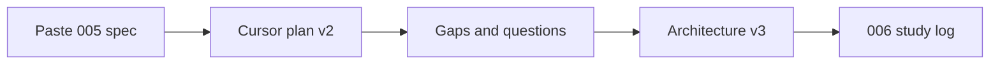

# 006 — Study log: How I work with Cursor (planning phase only)

| Field | Value |
|-------|--------|
| **Audience** | Recruiters, technical managers |
| **Scope** | Planning-stage conversation only (005 pipeline + architecture) — **not** earlier build/debug sessions |
| **Session started (UTC)** | 2026-05-23T11:20:55Z |
| **Filename** | `006_2026-05-23_11-21_study-log_cursor-planning-phase.md` |
| **Per-turn timestamps** | Not recorded retroactively in this file; **future** logs use UTC per turn (see planned Cursor command below) |
| **Repo** | Legal prompt engineering / modular monolith starter |

## About this document

This log shows **how the author collaborates with Cursor** during **plan review** — not during implementation.  

- **Your messages** are kept **verbatim** (raw), except the first message is a long pasted spec: the full text lives in [005 handoff](../handoffs/005_2026-05-23_10-49_handoff-original_parsed-cache-rule-authority.md); we show the opening and constraints here to avoid duplicating 400+ lines.  
- **Assistant messages** are **short summaries** so a reader can scan the thread quickly.  
- **Content policy:** This log avoids discussing document contents, party names, or other material that could be sensitive. Planning refers only to **synthetic fixtures**, **folder layout**, **APIs**, and **architecture** — not to underlying filing text.

---

## Table of contents

1. [Working patterns (what a reviewer should notice)](#1-working-patterns-what-a-reviewer-should-notice)
2. [Program planning — pipeline & features (005 v2)](#2-program-planning--pipeline--features-005-v2)
3. [Architecture planning — filing structure & audit (005 v3)](#3-architecture-planning--filing-structure--audit-005-v3)
4. [Artifacts produced from this phase](#4-artifacts-produced-from-this-phase)
5. [Conversation index](#5-conversation-index)
6. [Work-log layout, release phases, patch trail](#6-work-log-layout-release-phases-patch-trail)
7. [Study log automation (planned)](#7-study-log-automation-planned)

---

## 1. Working patterns (what a reviewer should notice)

| Pattern | Example from this phase |
|---------|-------------------------|
| **Spec-first** | Pasted a full markdown handoff as the implementation brief, then asked Cursor to plan before coding |
| **Plan-before-build** | Stayed in plan mode; iterated on gaps (audit, file layout, contracts) before saying “implement” |
| **Challenge & refine** | Asked whether delete API exists, whether multi-run tests have audit trails, whether layout is repeatable across projects |
| **Split concerns** | Separated **program** work (parsed cache, rules, prompts) from **architecture** work (repo layout, exchange folders, contract changelog) |
| **Product thinking** | Proposed dated `imports/{timestamp}/` and `exports/{timestamp}/` for human↔agent file exchange |
| **Portfolio intent** | Requested this study log for hiring visibility — meta, but shows intentionality |
| **Work-log hygiene** | Split handoffs vs study-docs vs dev-logs under `work-log/`; human-readable dated filenames |
| **Release thinking** | Treat v3/v2 phases as traceable slices (patch id + git + versions), not only markdown plans |

---

## 2. Program planning — pipeline & features (005 v2)

*Parsed document cache, rule authority, version contracts, golden parsed evals, eval extensions.*

### Turn 1 — Paste the program spec

**You (raw):**

> Implement the next Case Filing AI pipeline update.
>
> This update has 3 goals:
>
> 1. Add parsed document cache / text vault  
> 2. Add rule-source authority handling  
> 3. Add lightweight version contracts for prompts, snapshots, rules, parser, OCR, and golden datasets  
>
> Do not add a database.  
> Do not add auth.  
> Do not add unrelated features.  
> Do not overbuild a full prompt-management system yet.
>
> *(Followed by sections 1–13: parsed-document folder layout, review-status + audit-log.jsonl, pipelineVersions.js, court-rules services, rule authority contract, task/deadline fields, rule matching before prompt, v001 prompts, master output shape, eval report fields, parsed-document API endpoints, acceptance criteria, and explicit non-goals.)*
>
> **Full text:** [005 case_filing_ai_parsed_cache_rule_authority_handoff.md](../handoffs/005_2026-05-23_10-49_handoff-original_parsed-cache-rule-authority.md)

**Assistant (summary):** Explored the codebase (batch pipeline, eval runner, court-rules stub). Produced a **Cursor plan** (“Case Filing Pipeline v2”) with phases for contracts, parsed cache, court-rules layer, v001 prompts, eval authority checks, and API routes. Did not implement yet (plan mode).

---

### Turn 2 — Cleanup before rebuilding

**You (raw):**

> before we do all this i wanna actually remove the case files we already have as well as the evals
>
> do we have api call to do this?

**Assistant (summary):** Explained existing `DELETE /api/case-filing-ai/cases/:goldenCaseId` (batch folders + per-batch eval reports). Noted eval-bundles at repo root and golden fixtures are separate; API was never run so old batches still on disk. Gave curl examples with explicit `batchIds` for outlier batches without eval tags.

---

### Turn 3 — Multi-run testing and audit

**You (raw):**

> also let's say we have have the same files done twice or three four times to run and test the pipelines for improvement, does it have audit log too, is it planned?

**Assistant (summary):** Clarified today vs planned: each `process-batch` creates a new batch folder; no cross-run audit yet. Planned per-doc `audit-log.jsonl` + `pipelineVersions` on outputs/evals; cache is per-batch, not global across reruns.

---

### Turn 4 — Parsed-doc audit + module/prompt versions

**You (raw):**

> what about audit log for parsed document too? and which module and prompt version of that module was used for that is it in our plan?

**Assistant (summary):** Confirmed planned `audit-log.jsonl` events and `pipelineVersions` on outputs/evals; updated plan with `document_processed` audit event carrying full version snapshot. Distinguished parse/OCR versions vs LLM prompt versions.

---

### Turn 5 — Golden parsed fixtures

**You (raw):**

> i think we should also use golden data for parsed document too, which i will send you soon

**Assistant (summary):** Added plan section for `evals/golden/case_001/parsed/` + `runParsedDocumentChecks()`; marked golden files as pending user supply; bumped `goldenDatasetVersion` when parsed golden changes.

---

## 3. Architecture planning — filing structure & audit (005 v3)

*Repo layout, contracts, file-exchange, starter repeatability, contract changelog, backlog.*

### Turn 6 — File management

**You (raw):**

> with all of this do you have proper planning for file management to make sure each file goes into their proper place?

**Assistant (summary):** Admitted paths were implicit; added **Phase 0** to plan: `storageLayout.contract.js`, `storagePaths.js`, `STORAGE.md`, write-policy table, `doc-001` vs `doc_001` bridge.

---

### Turn 7 — Filing contract & starter

**You (raw):**

> should we make this appended to our filing contract?, i think it would make our filing structure a lot better in our long run, you tell me? maybe even improve our modular monolith and npm starter package right?
>
> or no? can you use a strong llm to think about this before you tell me?

**Assistant (summary):** Recommended **two tiers**: repo-level (`file-exchange`, `REPO_ARTIFACT_LAYOUT`, contract manifest/changelog) vs module-level (`storageLayout`, `pipelineVersions`). Said starter already repeats module MVC+prompts+evals; disk layout should be documented in STARTER_PACK. Suggested contract audit log separate from runtime audit.

---

### Turn 8 — Dated import/export folders

**You (raw):**

> i think even better would be dated and time stammped import such as import/date-time/the files
>
> same for export, right?

**Assistant (summary):** Agreed: `file-exchange/imports/2026-05-23T143022Z/` and `exports/{timestamp}/`. Updated v2 handoff and Cursor plan Phase −1. You chose `file-exchange` with `imports` + `exports` subfolders via plan-mode question.

---

### Turn 9 — Current state check

**You (raw):**

> check all our files, has everything of our old files been wiped off yet?

**Assistant (summary):** Listed disk: four batch folders, eval-bundle copy, golden fixtures, duplicate JSON at repo root still present; nothing deleted yet. Explained outlier batches without eval folders skipped by default delete API.

---

### Turn 10 — Architecture doc + backlog

**You (raw):**

> maybe everything related to filing and filing contract put it in 005 v3 filing structure audit plan for architecture?
>
> i think ones not implemented yet an dno plan , should we keep that in our plan too?

**Assistant (summary):** Created [005 v3 filing structure audit plan for architecture](../handoffs/005_2026-05-23_11-20_handoff-v3_filing-structure-architecture.md) consolidating layout, contracts, dual audit model, eval structure, v3-A–E phases, and **backlog B1–B13** (filing-text-vault, shared parse vault, eval-bundle delete API, etc.). Linked from v2 and Cursor plan.

---

### Turn 11 — This study log (meta)

**You (raw):**

> and lastly can we also make one more thing, can you make it so the way im talking to you is saved in another file called 006 study log of how i work with cursor while going through all these plans? keep table of content and sections them which one was for architecture, which one for the program itself,
>
> keep my responses raw while keeps yours summerized so they are easy to read and short
>
> i wanna show our back and forth so a recruiter/technical manager can easily look at it and actually see how i work with ai/cursor
>
> also be sure to not mention anything regarding potential pii data that might be in our conversation even if they look synthetic
>
> note that its to be done only about things in our planning stage conversation not before that

**Assistant (summary):** Creating this document (006) in `work-log/study-docs/` with TOC, program vs architecture sections, raw/summary format, planning-scope-only, no sensitive-content discussion.

---

## 4. Artifacts produced from this phase

| Artifact | Type | Role |
|----------|------|------|
| Cursor plan `case_filing_pipeline_v2` | Program | Implementation phases for pipeline update |
| [005 v2 planned review in Cursor](../handoffs/005_2026-05-23_11-14_handoff-v2_planned-review-in-cursor.md) | Program | Review copy + gap matrix + file-exchange notes |
| [005 v3 filing structure audit plan](../handoffs/005_2026-05-23_11-20_handoff-v3_filing-structure-architecture.md) | Architecture | Layout, contracts, audit, backlog |
| **006 (this file)** | Meta / portfolio | How author works with Cursor in planning |
| [work-log/](../README.md) | Meta / repo layout | `handoffs/`, `study-docs/`, `dev-logs/` at repo root |
| [work-log/INDEX.md](../INDEX.md) | Meta | Master index for all work-log artifacts |

**Not yet executed:** v3-A file-exchange folders, v3-D storage contracts, v2 parsed cache implementation — planning only unless author explicitly says “implement.”

---

## 5. Conversation index

| # | Topic | Section |
|---|--------|---------|
| 1 | Paste 005 pipeline spec | Program |
| 2 | Delete old batches/evals via API? | Program (ops) |
| 3 | Multi-run audit for same files | Program |
| 4 | Parsed-doc audit + prompt versions | Program |
| 5 | Golden parsed data (incoming) | Program |
| 6 | File management / proper folders | Architecture |
| 7 | Filing contract + starter repeatability | Architecture |
| 8 | Dated imports/exports | Architecture |
| 9 | Were old files wiped? | Architecture (ops) |
| 10 | 005 v3 doc + backlog | Architecture |
| 11 | 006 study log request | Meta |
| 12 | Dated filenames + human-readable times | Meta |
| 13 | `work-log/` — handoffs vs study-docs vs dev-logs | Meta / Architecture |
| 14 | Whole plan as phased releases / rollback | Architecture |
| 15 | Where patch logs live; patch trail in contracts? | Architecture |
| 16 | Auto study log + split when file grows | Meta |

---

## 6. Work-log layout, release phases, patch trail

### Turn 12 — Naming and cleanup

> can you date and timestamp them… put it in the name? … same for older study docs… cleanup messy handoffs?

**Assistant (summary):** Renamed 005/006 artifacts to `{NNN}_{YYYY-MM-DD}_{HH-MM}_{kind}_{slug}.md`; removed redirect stubs; added `handoffs/INDEX.md` then evolved layout.

### Turn 13 — `work-log/` at repo root

> keep study-docs out of handoffs… both under something like work log folder?

**Assistant (summary):** Moved to `work-log/handoffs/` and `work-log/study-docs/`; updated cross-links and model-condenser paths. Added `work-log/dev-logs/` for GitHub-safe shipped-work diary.

### Turn 14 — Whole program as phased, traceable releases

> our whole plan and phases… rollback-able patches… know where problems came from?

**Assistant (summary):** Yes — **v3-A→E then v2 phases** already are a release train. Handoffs = spec; **dev-log per completed phase** = human patch log; **`pipelineVersions` + audit JSONL** = runtime fingerprint. Rollback = revert git + pin prompt/env + **new batch**, not undo old `data/` trees. Four anchors per slice: **phase id, git SHA, contract versions, data scope**.

### Turn 15 — Patch trail / audit vs filing contract; timing

> patch trail and patch audit log in architecture? filing contract sectioning? defer until program grows?

**Assistant (summary):** **Phased — don’t build full patch platform at day one.**

| Layer | Do now (v3/v2 start) | Defer until growth |
|--------|----------------------|---------------------|
| **Runtime audit** | `processing-log.jsonl`, per-doc `audit-log.jsonl`, `pipelineVersions` on outputs (v2) | Validated event schema (v3-E / B12), shared audit bus (B5) |
| **Contract audit** | `changelog.jsonl` + `manifest.json` skeleton (v3-C) | Full filing-contract **sectioning** (layout / storage / audit / exchange as named sections) |
| **Release / patch trail** | Dev-log entry per finished phase (`005-v3-A`, etc.) with git + rollback notes | `work-log/patches/` index matrix; optional `releases.jsonl` |
| **Debug question** | “Which phase + commit + versions + batchId produced this output?” | Cross-batch experiment registry (B4) |

**Decision:** Filing contract **sectioning** and **enterprise patch trail** belong in **v3 backlog** (after v3-D + v2 cache land), not blocking first implementation. Minimum contract sections now: **storage layout + parsed artifacts + pipelineVersions** (v2 Phase 0–1).

**Where patch logs live:** primary = **`work-log/dev-logs/`** (same filename convention, header includes `Patch id`, `Requires`, `Git`, `Rollback`); machine trail = **`changelog.jsonl`** + artifact metadata; optional later = **`work-log/patches/005-PHASES.md`** index only (no duplicate narratives).

---

## 7. Study log automation (planned)

### Turn 16 — Auto log and file split

> update planning conversation log… automatically… new file once it grows beyond a certain line?

**Assistant (summary):** **Yes, automate via `/planning-study-log`**, but **don’t split mid-session** unless huge.

| Rule | Recommendation |
|------|----------------|
| **Trigger** | End of planning session, or user runs `/planning-study-log` |
| **Append vs new file** | **Append** to current `006_…` while same program (005) and file &lt; **~400 lines** |
| **New file** | New `{NNN}_{date}_{time}_study-log_{slug}.md` when: new program id, new topic slug, or previous file ≥ **400 lines** (~12–15 indexed turns) |
| **Continuity** | New file links `Continues from: [006_…](./006_…)`; bump conversation index |
| **Not automatic on every message** | Avoid noise; batch turns per session |

This file (~280 lines after this update) stays **006** until next major planning arc or line limit.

---

## Repeatable Cursor command (planned)

Use slash command **`/planning-study-log`** (file: [`.cursor/commands/planning-study-log.md`](../../.cursor/commands/planning-study-log.md) — added 2026-05-23).

| What it does | Detail |
|--------------|--------|
| **Trigger** | You type `/planning-study-log` or say “log this planning session” |
| **Output** | Chat-style markdown under `work-log/study-docs/` — filename `{NNN}_{YYYY-MM-DD}_{HH-MM}_study-log_{slug}.md` |
| **Split** | Append to latest same-`NNN` log if &lt; ~400 lines; else new file + “Continues from” link |
| **Format** | **Chat thread:** each turn has **UTC timestamp** + speaker; **you = raw blockquote**; **Cursor = short bullets**; optional tag **Program** / **Architecture** on your turns |
| **Example** | `### 2026-05-23T18:42:00Z · You` then `> your exact words`; then `### 2026-05-23T18:44:00Z · Cursor` then summary bullets |
| **Safety** | No filing text, party names, or sensitive content — fixtures/APIs/layout only |
| **Scope flag** | Optional: “planning only” (default) vs “include implementation” |

After the command exists, you do not need to re-paste these instructions each time.

---

## Related handoffs

- [005 original spec](../handoffs/005_2026-05-23_10-49_handoff-original_parsed-cache-rule-authority.md)
- [005 study log (design rationale)](./005_2026-05-23_10-50_study-log_parsed-cache-rule-authority.md) — *why* the design changed (broader than this Cursor thread)
- [005 v2 program plan](../handoffs/005_2026-05-23_11-14_handoff-v2_planned-review-in-cursor.md)
- [005 v3 architecture plan](../handoffs/005_2026-05-23_11-20_handoff-v3_filing-structure-architecture.md)
