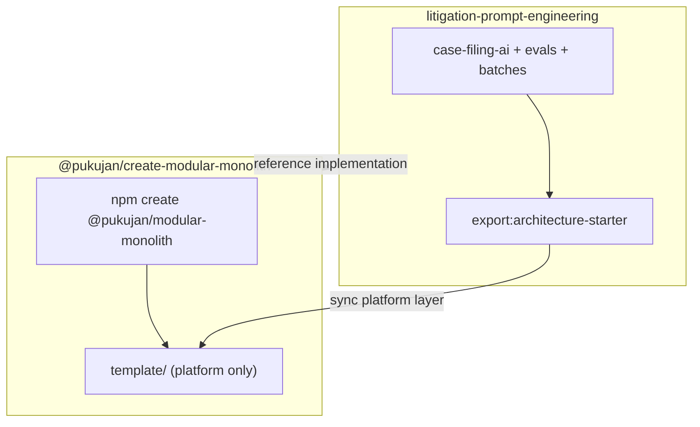
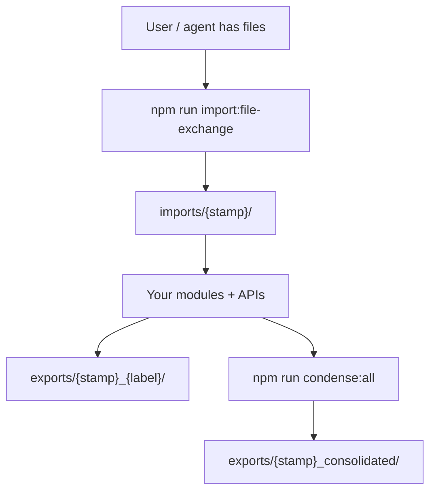

# I shipped an architecture package for agent-scale modular monoliths (and stopped fighting my own repo)

**Topic:** `@pukujan/create-modular-monolith` — an npm scaffold + GitHub template for building Express/React apps that humans *and* Cursor agents can actually work in.

---

## Table of contents

1. [What I built](#what-i-built)
2. [Why I needed it](#why-i-needed-it)
3. [The messy version before](#the-messy-version-before)
4. [The feature](#the-feature)
5. [How it works](#how-it-works)
6. [Before vs after](#before-vs-after)
7. [Problems I ran into](#problems-i-ran-into)
8. [How you can use it](#how-you-can-use-it)
9. [Why this matters](#why-this-matters)
10. [Open-ended takeaway](#open-ended-takeaway)

---

## What I built

I split my work into two repos on purpose:

| Repo | What it is |
|------|------------|
| [**create-modular-monolith**](https://github.com/Pukujan/create-modular-monolith) | The **npm package**. Architecture only. `npm create` copies a clean template into your folder. |
| [**litigation-prompt-engineering**](https://github.com/Pukujan/litigation-prompt-engineering) | The **full product**. Case Filing AI, prompts, golden evals, batches, all the domain stuff. |

The npm package is the reusable platform layer. The litigation repo is the reference implementation that stress-tests it.

Let's go.

---

## Why I needed it

I was building a real litigation prompt pipeline: batches of PDFs, versioned master prompts, case snapshots, golden JSON, eval reports. Cursor agents were in the loop constantly.

The friction was not "I need another Express starter." The friction was:

- Agents would read from `Downloads/` or random repo roots instead of a canonical inbox
- Nobody (human or agent) had a shared map of where files belong
- Prompt and API changes would drift with no merge gate
- Context died between sessions because there was no standard "what changed before push" artifact
- I could not cleanly **reuse** the platform in a new project without copy-pasting half a legal domain by accident

This is where it clicked: I needed a **platform contract** first, then domain modules on top.

---

## The messy version before

The early version looked like a normal monolith with extra folders bolted on.

- Consolidated snapshots (`models.json`, prompts, file tree) lived as **flat files** in `file-exchange/exports/`, overwritten every run. No audit trail.
- The file structure export was a **giant nested JSON tree** (thousands of lines). Not a readable `tree`. Painful to skim.
- The npm template once accidentally shipped **litigation-specific** `consolidated-models.json` and a case-filing model inventory. Wrong package, wrong audience.
- CI failed on Linux because `node --test '**/*.test.js'` does not expand globs the same way as macOS. Tiny win when we figured that out.
- "Golden evals" were easy to misunderstand as "truth for every case" when they are really a **regression slice** for one fixture.

The messy part was not the domain logic. It was the **handoff layer** between human, agent, git, and CI.

---

## The feature

`@pukujan/create-modular-monolith` scaffolds a modular monolith with:

- **Module contract** — backend `register(app)` + frontend route modules
- **Architecture contracts** — versioned manifest under `docs/architecture/contracts/`
- **File exchange** — dated `imports/` and `exports/` folders (human ↔ agent handoff)
- **Pre-push dev logs** — paired human markdown + agent JSON audit
- **Consolidated snapshots** — models, prompts, ASCII file tree into dated export folders
- **CI quality gate** — same checks locally (`npm run test:ci`) and on GitHub Actions
- **Cursor-native** — `AGENTS.md`, `.cursor/rules`, `.cursor/commands`

Domain logic is intentionally **not** included. You get `_reference` and `model-condenser` as examples. You add features with `npm run new:module`.

Now this feels reusable.

---

## How it works

### Two-repo split



Product repo proves the platform. Export script pushes **architecture-only** files into the npm template without dragging domain modules along.

### File exchange (the agent inbox)

Every inbound bundle gets a **UTC stamp folder**, not a cute slug:

```text
file-exchange/imports/2026-05-23_15-59-43Z/
file-exchange/exports/2026-05-23_17-49-08Z_consolidated/
```

Agents are instructed: import first, process from the stamp, export deliverables to a stamped folder. No more "just read my Desktop."



### CI quality gate

On every push/PR to `main`, GitHub runs one job: **`quality-gate`**.

| Step | What it checks |
|------|----------------|
| `lint:contracts` | Manifest paths exist |
| `lint:repo-artifacts` | Required platform folders/files |
| `lint:architecture` | Boundaries, layers, API registry |
| `npm test` | Backend + frontend tests |
| `test:evals` | Offline eval runners (golden slice in the product repo) |

Locally:

```bash
npm run test:ci
```

Same gate. No surprises on merge.

### Pre-push dev logs

Before push:

```bash
npm run dev-log:pre-push -- --slug architecture-ci-npm-readme
```

You get:

- **Human** markdown: summary, mermaid, tables, full tree (or condensed in Part I)
- **Agent** JSON: git snapshot, test results, API inventory, tree metadata

Builder brain moment: the agent reads JSON first, human reads the narrative. Same event, two formats.

---

## Before vs after

| Area | Before | After |
|------|--------|-------|
| Starting a new project | Copy litigation repo, delete modules, hope nothing breaks | `npm create @pukujan/modular-monolith@2.2.3 my-app` |
| Agent file handoff | Ad hoc paths, Downloads, repo root clutter | `file-exchange/imports/{stamp}/` only |
| Consolidated exports | Flat `consolidated-*.json`, overwritten | Dated `{stamp}_consolidated/` + `manifest.json` + latest copies |
| File structure export | 7k-line nested JSON | ASCII `treeText` + stats (skimmable) |
| npm template contents | Sometimes leaked domain models/prompts | Platform-only export + starter patches |
| CI on Linux | Glob in `node --test` failed | `node --test` (recursive discovery) |
| Merge confidence | "tests passed on my machine I guess" | `quality-gate` job with named checks |

---

## Problems I ran into

**1. Product vs package confusion**

Easy to export the whole litigation repo into the npm template. Fix: `export-architecture-starter` with allowlists (modules, scripts, docs) and starter-specific files for prompts, model condenser, and API inventory.

**2. Consolidated file structure bloat**

I thought node_modules was the problem. It was already excluded. The real issue was dumping `tree`, `flatPaths`, and **local batch PDFs** into one JSON file. Fix: `treeText` only, skip `data/case-filing-ai/batches` in the product tree.

**3. Golden evals semantics**

`case_001` in CI is a **regression harness**, not "the law for all future cases." Documented in `EVAL_AND_CI.md` so future-me does not misread a red CI run.

**4. License**

Started MIT, moved to proprietary + attribution for the platform package and product. Not legal advice, just what I wanted for ownership and credit.

**5. Still not perfect**

Architecture docs in the template still mention some domain concepts in places. I am still tightening generic vs product language. Not perfect yet, but much cleaner than v2.0.

---

## How you can use it

### Scaffold a new platform app

```bash
npm create @pukujan/modular-monolith@2.2.3 my-platform
cd my-platform
npm install --prefix backend && npm install --prefix frontend
npm run test:ci
```

### Daily platform commands

```bash
# Inbound files for agents
npm run import:file-exchange -- "/path/to/bundle"

# Refresh consolidated snapshots (dated audit folder)
npm run condense:all

# Before git push
npm run dev-log:pre-push -- --slug my-feature
npm run test:ci
```

### Add a feature module

```bash
npm run new:module -- billing --label "Billing"
```

### Study the full product

Clone [litigation-prompt-engineering](https://github.com/Pukujan/litigation-prompt-engineering) if you want to see domain modules, master prompts, golden evals, and batch pipelines wired into the same platform.

---

## Why this matters

Most starters optimize for "hello world in 5 minutes."

This one optimizes for **repeatable collaboration**:

- Humans know where files go
- Agents have a mandatory inbox and export convention
- CI enforces contracts before merge
- Platform code can ship in npm without your domain glued to it

This is why I like this pattern for prompt-heavy systems: the **pipeline changes fast**, but the **repo shape** should not.

If you are building with Cursor (or any agent), the file-exchange + dev-log + contract lint trio is the fun part. It turns vibe coding into something you can still audit next week.

---

## Open-ended takeaway

The package is on npm (`@pukujan/create-modular-monolith`). The litigation repo is the stress test. I am still improving:

- Generic docs in the template (less domain vocabulary leakage)
- Whether to also emit `consolidated-file-structure.txt` beside JSON
- More eval slices without pretending they are universal truth
- Publishing **2.2.3** after the template cleanup (check npm for latest)

If you try the scaffold, start with `AGENTS.md` and `docs/architecture/PLATFORM_ARCHITECTURE.md`. Run `test:ci` once so the quality gate feels real.

Still learning. Still tightening. But the platform layer finally feels like something I would actually reuse, not a one-off legal repo with the serial numbers filed off.

---

## Links

- npm / GitHub package: https://github.com/Pukujan/create-modular-monolith
- Reference product: https://github.com/Pukujan/litigation-prompt-engineering
