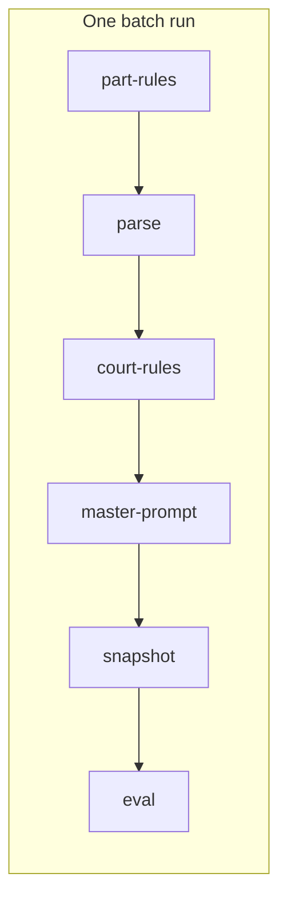
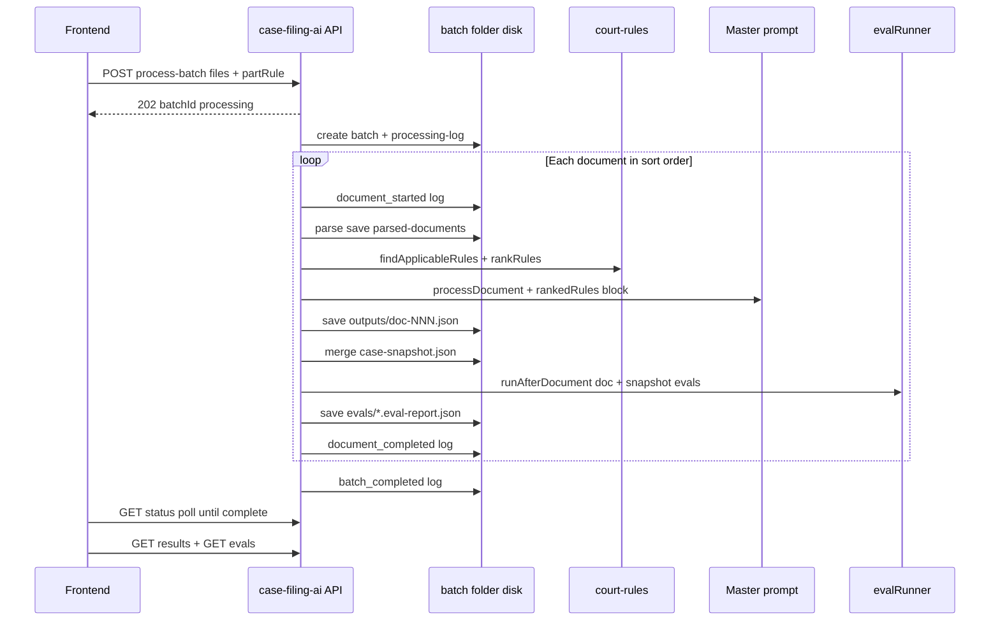
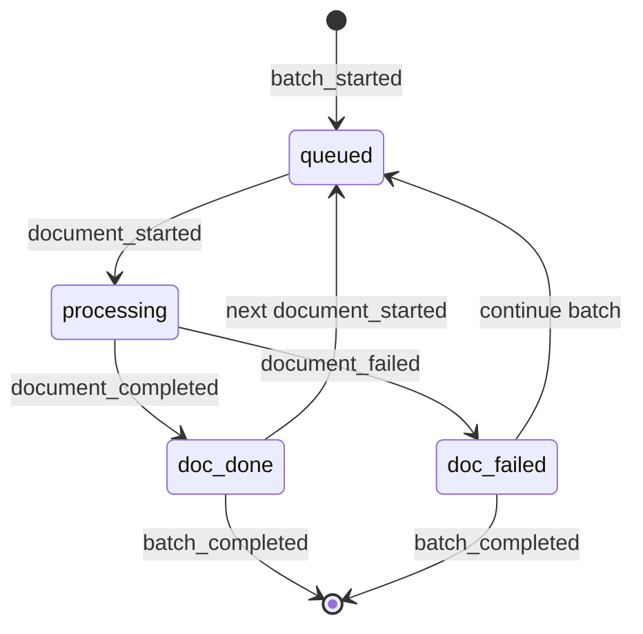
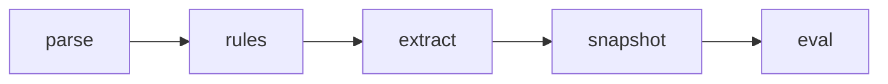
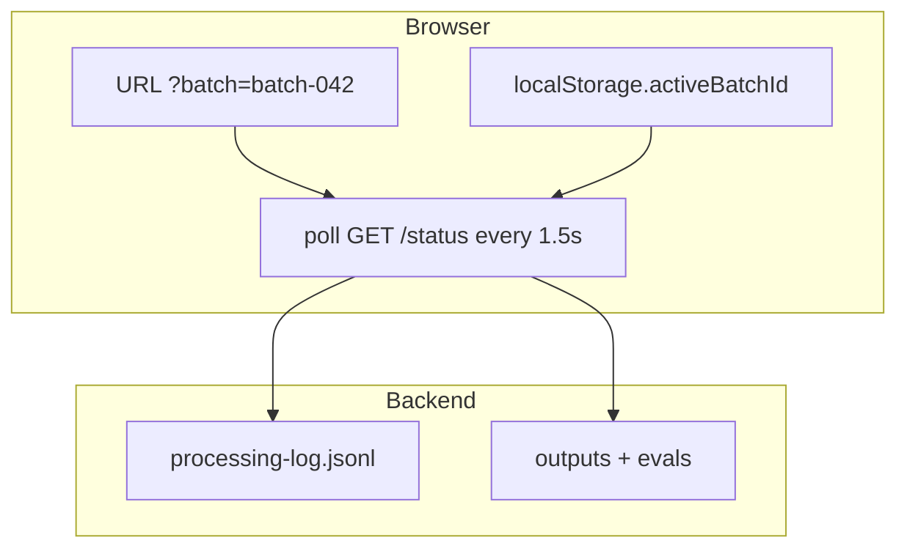
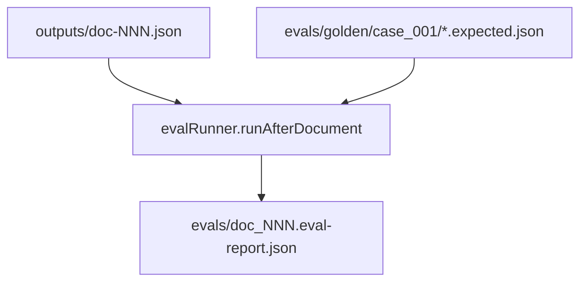
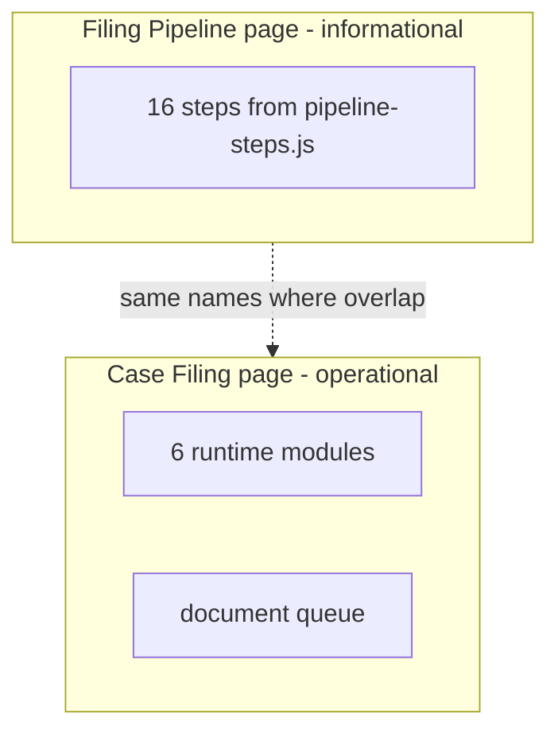

# Case Filing Pipeline UI & Onboarding — Design Document

**Product:** legal-prmpt-eng  
**Status:** Planning (not implemented)  
**Date:** 2026-05-24  
**Plan slug:** `pipeline-ui-onboarding`

---

## 1. Goals

1. Show a **visual pipeline** of agent modules (icon + name + status) while a batch runs.
2. Show a **document queue** (scrollable list) with per-doc progress through the pipeline.
3. **Survive page navigation and browser refresh** — queue state is server-backed; client only remembers `batchId`.
4. Provide **onboarding documentation** explaining modules, batches, evals, and document flow — served via API and viewable/downloadable in the UI.

---

## 2. What exists today (gap)

| Area | Today | Gap |
|------|-------|-----|
| Case Filing UI | Upload → spinner → raw JSON | No module rail, no doc queue |
| Filing Pipeline page | Static 16-step catalog (`GET /api/filing-pipeline/steps`) | Not connected to live runs |
| `process-batch` | Synchronous HTTP — blocks until done | Browser cannot poll during run |
| `GET /batches/:id/status` | Exists; coarse (`currentStep`, counts) | No `moduleStates`, no per-doc queue |
| `processing-log.jsonl` | Written per doc on disk | No dedicated read API for UI |
| Onboarding | Scattered READMEs | No single guide API |

**Court rules:** Loaded by backend `court-rules` module from fixtures (`data/court-rules/fixtures/case_001/`), not from the frontend upload panel. Part rules are optional from the UI.

---

## 3. Runtime module pipeline (what the UI should show)

The UI shows **6 runtime modules** actually used in `uploadBatch.processBatch` — not all 16 catalog steps from `filing-pipeline/domain/pipeline-steps.js` (those include future `task-docketing`, `human-review`, etc.).



| Module ID | Display name | Icon (suggested) | Owner package | What it does in a live run |
|-----------|--------------|------------------|---------------|----------------------------|
| `part-rules` | Part rules | clipboard | case-filing-ai | Bootstrap paste/upload; optional inference from early filings |
| `parse` | Parse & text | document | case-filing-ai + parsed-doc cache | PDF text extract / OCR; writes `parsed-documents/` |
| `court-rules` | Court rules | scale | court-rules | Match fixtures → rank → inject into master prompt |
| `master-prompt` | Extraction | sparkles/robot | case-filing-ai | LLM extracts metadata, tasks, deadlines, parties |
| `snapshot` | Case snapshot | layers | case-filing-ai (caseSnapshot) | Merge doc result into rolling `case-snapshot.json` |
| `eval` | Golden eval | badge-check | case-filing-ai (evalRunner) | Compare output vs `evals/golden/{caseId}/` |

**Catalog-only modules** (show in onboarding + Filing Pipeline page, dimmed in live rail until wired): `case-workflow`, `filing-text-vault`, `task-docketing`, `human-review`, `filing-pipeline` orchestrator.

---

## 4. End-to-end batch flow



### Batch folder layout (source of truth for refresh)

```text
data/case-filing-ai/batches/{batchId}/
  uploads/                     original files
  parsed-documents/doc-NNN/  parse cache
  outputs/doc-NNN.json       LLM + rankedRules
  evals/doc_NNN.eval-report.json
  rule/                        part-rule artifacts
  case-snapshot.json           rolling case state
  processing-log.jsonl         append-only timeline
```

---

## 5. Document queue — how docs move through the pipeline

Documents are processed **sequentially** in sorted filename order (not parallel). Each doc passes through all modules before the next doc starts.



**Per-document mini-pipeline** (shown on each queue row):



While doc 3 is on `rules`, module rail shows `court-rules` as **active** globally; queue row 3 highlights `rules`; rows 1–2 show all steps done; rows 4+ show **queued**.

---

## 6. Persistence across page change & refresh



**Rules:**

1. On `202` from `process-batch`, set `batchId` in URL and `localStorage`.
2. On any Case Filing mount, if `batchId` present → poll status until terminal.
3. Refresh mid-run: same `batchId` → resume polling; UI reconstructs queue from log + output file list.
4. **Batch History** drawer: last N `batchId`s from `localStorage` (metadata only); click to re-open results.

---

## 7. UI components (rough design)

### 7.1 PipelineModuleRail

- Horizontal flex; 6 nodes; connector lines.
- Each node: SVG icon, label, status dot (gray / blue pulse / green / red).
- Tooltip: module description from `GET /api/platform/modules`.

### 7.2 DocumentQueuePanel

- Vertical scroll; max height ~40vh; auto-scroll to `status === "processing"`.
- Row: index, truncated filename, 5-step micro-bar, eval badge (after doc done).
- Pagination optional if >20 docs.

### 7.3 BatchRunHeader

- `batchId`, progress `3/14`, elapsed time, link **Onboarding**, **Download guide**.

### 7.4 OnboardingDrawer / `/onboarding`

- Fetches `GET /api/platform/onboarding/pipeline-guide?format=json`.
- Renders sections + Mermaid blocks (use `mermaid` npm in frontend).
- Button: **Download .md** → same endpoint `?format=md`.

### ASCII wireframe

```text
┌─────────────────────────────────────────────────────────────────────────┐
│ Case Filing                                    [? Onboarding] [History] │
├─────────────────────────────────────────────────────────────────────────┤
│  MODULE PIPELINE (horizontal, icons + labels)                           │
│  [Part] → [Parse] → [Rules●] → [LLM] → [Snap] → [Eval]                  │
├─────────────────────────────────────────────────────────────────────────┤
│  DOCUMENT QUEUE (scroll)                         Batch: batch-042  3/14 │
│  ✓ 01  Notice of Motion                                                 │
│  ✓ 02  Affirmation                                                      │
│  ▶ 03  Exhibit A                 rules ████░░ extract                   │
│  ○ 04  Exhibit B                 queued                                 │
└─────────────────────────────────────────────────────────────────────────┘
```

---

## 8. How golden eval works today

After each document completes:

1. **Document eval** — `evalRunner` loads `evals/golden/{goldenCaseId}/doc_NNN.expected.json`, compares fields (identity, metadata, parties, tasks, deadlines, human review, rule authority, rule sources, extraction quality, pipeline versions, parsed golden).
2. **Snapshot eval** (when applicable) — compares `case-snapshot.json` to `snapshot_NNN.expected.json`.
3. Reports saved to `batches/{batchId}/evals/` with scores, `criticalFailures`, `fieldResults`.



**Statuses:** `pass` | `partial` | `fail` (from score thresholds + critical failures).

**v002 dataset:** `case_001_rule_authority_v002` — same runner, stricter rule-authority checks.

---

## 9. API additions (implementation checklist)

| Method | Path | Purpose |
|--------|------|---------|
| `POST` | `/api/case-filing-ai/process-batch` | **Change:** `202` + `batchId`, async worker |
| `GET` | `/api/case-filing-ai/batches/:batchId/status` | **Extend:** `moduleStates`, `documentQueue`, `activeModule` |
| `GET` | `/api/case-filing-ai/batches/:batchId/processing-log` | Full parsed log for timeline |
| `GET` | `/api/platform/modules` | Icon id, displayName, description, `liveBatch` flag |
| `GET` | `/api/platform/onboarding/pipeline-guide` | `?format=md` or `?format=json` |

### Example status response (target)

```json
{
  "batchId": "batch-042",
  "status": "processing",
  "activeModule": "court-rules",
  "moduleStates": [
    { "id": "part-rules", "status": "done" },
    { "id": "court-rules", "status": "active" },
    { "id": "master-prompt", "status": "pending" }
  ],
  "documentQueue": [
    {
      "docIndex": 3,
      "docKey": "doc-003",
      "name": "03_Exhibit_A.pdf",
      "status": "processing",
      "steps": {
        "parse": "done",
        "rules": "active",
        "extract": "pending",
        "snapshot": "pending",
        "eval": "pending"
      }
    }
  ],
  "processedCount": 2,
  "totalCount": 14
}
```

### Processing log extensions (write during batch)

```json
{ "step": "module_started", "module": "court-rules", "docIndex": 3 }
{ "step": "module_completed", "module": "court-rules", "docIndex": 3 }
```

---

## 10. Implementation phases

| Phase | Deliverable | Enables |
|-------|-------------|---------|
| **A** | Onboarding MD in repo + guide API + static page | Documentation download |
| **B** | Async `process-batch` + extended status + processing-log GET | Live polling |
| **C** | `PipelineModuleRail` + `DocumentQueuePanel` + batch persistence | Visual pipeline + refresh survival |
| **D** | Batch results cards + eval score expansion + zip download | Post-run detail + export |

Phase A can ship without B. Phase C requires B for **live** animation; without B, C can only replay from completed batches.

---

## 11. Filing Pipeline catalog vs live runner



Link from live runner: “View full 16-step catalog →” opens Filing Pipeline page.

---

## 12. Download packages (related track)

| Endpoint | Purpose |
|----------|---------|
| `POST /batches/:id/package` | Build manifest |
| `GET /batches/:id/package/download` | Zip batch folder + rules-applied summary |
| `GET /cases/:goldenCaseId/export/:id/download` | Case zip |

---

## 13. Open decisions

1. **Polling interval:** 1.5s default; backoff when complete.
2. **Failed doc:** continue batch (today) vs stop — UI should show partial batch clearly.
3. **Golden case selector** in UI for eval display (`case_001` vs v002).
4. **Auth:** batch IDs are guessable — local dev OK; prod needs session scoping.

---

## 14. Files to create (when implementing)

| File | Role |
|------|------|
| `docs/onboarding/pipeline-guide.md` | Canonical in-app guide |
| `backend/src/modules/platform/routes/onboarding.routes.js` | Serve guide |
| `backend/src/modules/platform/domain/modules.registry.js` | Module metadata |
| `frontend/.../components/PipelineModuleRail.jsx` | Icon rail |
| `frontend/.../components/DocumentQueuePanel.jsx` | Scroll queue |
| `frontend/.../hooks/useBatchSession.js` | URL + localStorage + poll |
| `frontend/.../pages/OnboardingPage.jsx` | Guide viewer |

---

*End of design document*
