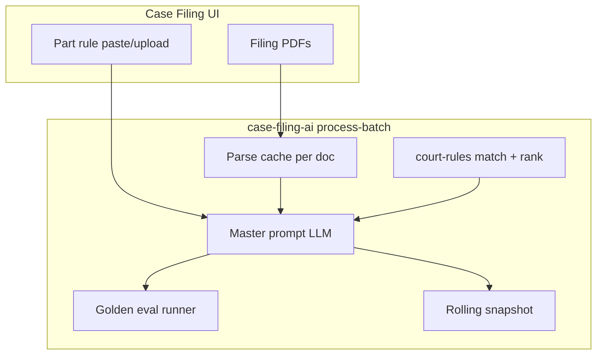

# Plan package: Pipeline UI, persistent queue & onboarding

| Field | Value |
|-------|--------|
| **Plan slug** | `pipeline-ui-onboarding` |
| **Status** | `implemented` (branch `plan/007-pipeline-ui-onboarding`) |
| **Created (UTC)** | 2026-05-24 |
| **Study log** | [007_2026-05-24_study-log_pipeline-ui-onboarding.md](./007_2026-05-24_study-log_pipeline-ui-onboarding.md) (You raw + Cursor summary) |
| **Related design doc** | [007_2026-05-24_design_pipeline-ui-onboarding.md](./007_2026-05-24_design_pipeline-ui-onboarding.md) |
| **Planning manifest** | [../planning/007-pipeline-ui-onboarding.json](../planning/007-pipeline-ui-onboarding.json) |
| **Cursor plan** | `batch_download_package` (`.cursor/plans/`) |
| **Work log index** | [../INDEX.md](../INDEX.md) |
| **Audit note** | Study log + manifest added retroactively after implementation (2026-05-24) |

---

## Executive summary

Build a **live pipeline runner** on Case Filing: module icons with status, a scrollable **document queue**, and state that **survives refresh** via server-backed `batchId` + polling. Add **onboarding** (MD + API) explaining modules, batches, evals, and document flow. Requires **async `process-batch`** for live updates; optional replay-only mode without async. Also includes **batch/case zip download** and a proposed **`planningPhase` contract** for audited planning artifacts before implementation.

---

## 1. Program goals

| # | Goal |
|---|------|
| 1 | Visual module pipeline (icon + name + status) during batch runs |
| 2 | Document queue with per-doc progress; auto-scroll to active doc |
| 3 | Persist across navigation and refresh |
| 4 | Onboarding guide (MD + API + in-app viewer) |
| 5 | Downloadable batch/case zip packages |
| 6 | Planning-phase audit export (contract + API — proposed) |

---

## 2. Rules: frontend vs backend

| Rule source | Where it comes from | Frontend role |
|-------------|---------------------|---------------|
| **Part rules** | Optional paste/file in `RuleInputPanel` | User can supply; else `pending_inference` / inference from filings |
| **Court rules** | `court-rules` module — fixtures `data/court-rules/fixtures/case_001/` | None — injected per document in `uploadBatch.service.js` |
| **Rules on output** | Master prompt → `ruleSourcesApplied`, `rankedRules` on `documents[]` | Only visible if UI renders them |



---

## 3. Implementation phases

| Phase | ID | Deliverable |
|-------|-----|-------------|
| **A** | `onboarding-guide-api` | `docs/onboarding/pipeline-guide.md` + `GET /api/platform/onboarding/pipeline-guide` |
| **B** | `async-batch-jobs` | `POST process-batch` → `202` + background worker |
| **B+** | `pipeline-status-api` | Extended status, processing-log GET, module registry |
| **C** | `pipeline-runner-ui` | `PipelineModuleRail`, `DocumentQueuePanel`, polling |
| **C+** | `batch-persistence` | URL `?batch=` + localStorage + Batch History |
| **D** | `pipeline-results-ui` | Post-run cards, full eval scores |
| **D+** | `batch-package-service` | Zip download batch + case |
| **E** | `planning-phase-contract` | `planningPhase` contract + planning export API |

**Dependency:** Live animation needs Phase B. Phase A and E can ship independently.

---

## 4. Backend todos (from Cursor plan)

- `batchPackage.service.js` — copy batch folder, rules-applied summary, manifest
- Zip routes — `POST/GET .../package`, case export download
- Async `processBatch` — non-blocking HTTP
- `GET /batches/:id/processing-log`
- `GET /api/platform/modules`
- `GET /api/platform/onboarding/pipeline-guide`
- `planningPhase.contract` + `GET /api/platform/planning/:planId/download`

---

## 5. Frontend todos

- `PipelineModuleRail.jsx` — 6 runtime modules, status dots
- `DocumentQueuePanel.jsx` — scroll queue, per-doc step bar
- `useBatchSession.js` — URL + localStorage + poll
- `OnboardingPage.jsx` — render guide, download MD button
- `EvalPanel` — add `ruleAuthority`, `ruleSources`, `extractionQuality`, `pipelineVersions`, `parsedGolden`
- Download buttons on EvalPanel / ResultsPanel

---

## 6. Planning-phase audit (proposal)

### What exists today

| Mechanism | Location | API? |
|-----------|----------|------|
| `/planning-study-log` Cursor command | `work-log/study-docs/{NNN}_{date}_{time}_study-log_{slug}.md` | No |
| Example | `006_2026-05-23_11-21_study-log_cursor-planning-phase.md` | No |
| Cursor Plan files | `.cursor/plans/*.plan.md` | No |
| Agent transcripts | `.cursor/projects/.../agent-transcripts/*.jsonl` | No public Cursor API |
| `prePushDevLog` | `work-log/dev-logs/human` + `agent/*.json` | npm script only (post-ship) |

**Format you want (already in study-log command):**

- Executive summary at top
- Per turn: UTC timestamp
- **You** — verbatim blockquote (raw)
- **Cursor** — short bullet summary (audited)
- Filename: `{NNN}_{YYYY-MM-DD}_{HH-MM}_study-log_{slug}.md`

### Proposed `planningPhase` v001

**Paths:**

```text
work-log/planning/{NNN}_{YYYY-MM-DD}_{HH-MM}_plan_{plan-slug}.md
work-log/planning/{NNN}_{YYYY-MM-DD}_{HH-MM}_plan_{plan-slug}.json
```

**Markdown sections:**

1. Front matter (plan name, status `draft|approved|executing|done`, links)
2. Executive summary
3. Conversation audit (raw you + summarized assistant per turn)
4. Plan body (link to Cursor plan + design MD)
5. Pre-execution checklist

**API:**

| Method | Path |
|--------|------|
| `GET` | `/api/platform/planning/:planId` |
| `GET` | `/api/platform/planning/:planId/download?format=md` |
| `POST` | `/api/platform/planning/:planId/finalize` |
| `GET` | `/api/platform/planning` |

**CLI:** `npm run plan:export -- --slug pipeline-ui-onboarding`

**Cursor product:** No official REST API for IDE plan-mode audit export. Use repo conventions + optional transcript ingest.

---

## 7. Verification checklist (when implemented)

- [x] Upload batch → module rail animates (or replays after complete) — automated via async integration test + UI components
- [x] Refresh mid-run → queue resumes from `batchId` — `useBatchSession` URL + localStorage
- [x] Onboarding page loads guide from API
- [x] Download guide `.md` from UI — API supports `?format=md&download=true`
- [x] Download batch zip contains uploads, parsed, outputs, evals, rules-applied — `batch-package.routes.test.js`
- [x] Eval panel shows extended score dimensions — `EvalPanel.jsx` rule authority fields
- [x] `npm run test:ci` green

---

## 8. Related repo paths

| Path | Purpose |
|------|---------|
| `frontend/src/modules/case-filing-ai/` | Upload UI today |
| `backend/src/modules/case-filing-ai/services/uploadBatch.service.js` | Batch orchestration |
| `backend/src/modules/filing-pipeline/domain/pipeline-steps.js` | 16-step catalog |
| `data/case-filing-ai/batches/` | Runtime batch storage |
| `evals/golden/` | Golden expected files |
| `.cursor/commands/planning-study-log.md` | Manual planning log command |

---

*End of plan package*
