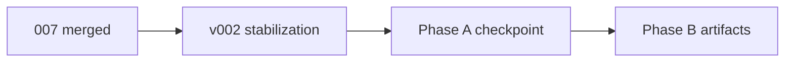

# Plan package: Repo roadmap — v002 runtime checkpoint + external artifacts

| Field | Value |
|-------|--------|
| **Plan slug** | `repo-roadmap-v002-and-artifacts` |
| **Program** | 008 |
| **Status** | `implemented` (`main` @ `6ea2100`) |
| **Created (UTC)** | 2026-05-24 |
| **Study log** | [008_2026-05-24_study-log_external-artifact-and-v002-checkpoint.md](./008_2026-05-24_study-log_external-artifact-and-v002-checkpoint.md) |
| **Phase B detail** | [008 external artifact plan](./008_2026-05-24_plan_external-artifact-root-package.md) |

---

## Executive summary

Two-phase roadmap: **(A)** land rule-authority v002 stabilization, record `batch-002` checkpoint, open GitHub milestone and six follow-up issues; **(B)** implement external artifact root. Executed after user confirmed sequencing (007 first, then artifacts, then v002 fix).

---

## Phase A — Rule Authority v002 Runtime Checkpoint

| Step | Status | Output |
|------|--------|--------|
| Merge 007 + v002 stabilization to `main` | Done | `83cabca` |
| Milestone | Done | [Milestone 3](https://github.com/Pukujan/litigation-prompt-engineering/milestone/3) |
| Issues #7–#12 | Done | pipelineVersions, ruleSourcesApplied, UI label, snapshot, metadata, batch export |
| Checkpoint log | Done | [checkpoints/008](../checkpoints/008_2026-05-24_rule-authority-v002_runtime-checkpoint.md) |

### batch-002 proof criteria

- `promptVersion` / `masterPrompt`: **v001**
- `rankedRules` / `ruleSourcesChecked`: non-empty on early docs
- Case orders: absent until doc 12; present docs 12–14
- Evals: document remaining gaps (not full golden parity)

---

## Phase B — External artifact root

See [008_2026-05-24_plan_external-artifact-root-package.md](./008_2026-05-24_plan_external-artifact-root-package.md).

---

## Timeline

---

*Committed from Cursor Plan `external_artifact_root` (combined roadmap) for planningPhase audit.*
