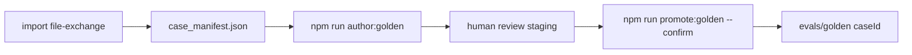

# Plan package: Case Filing Demo + Golden authoring pipeline

| Field | Value |
|-------|--------|
| **Plan slug** | `case-filing-demo-golden-authoring` |
| **Program** | 009 |
| **Status** | `implemented` (retroactive finalize) |
| **Created (UTC)** | 2026-05-24 |
| **Study log** | [009_2026-05-24_17-38_study-log_case-filing-demo-golden-authoring.md](./009_2026-05-24_17-38_study-log_case-filing-demo-golden-authoring.md) |

---

## Executive summary

Two related deliverables for legal-professional demos and eval maintainability:

1. **Case Filing Demo** — isolated module and frontend for Vercel/Railway: case dropdown, PDF viewing, interactive orchestration playback, insights tabs (evals, audit, governance). Uses committed golden v002 + fixtures; no DB; no LLM on demo path.

2. **Golden authoring** — parallel pipeline (parse → rules → master prompt → snapshot) using `MODEL_GOLDEN_AUTHORING`, writes versioned ground truth to `evals/golden-staging/`, human promote to `evals/golden/`, with eval versioning contracts and CLIs.

Continues program **008** (v002 golden, external artifacts) but is a distinct product surface and authoring workflow.

---

## Phase A — Case Filing Demo

| Step | Status | Output |
|------|--------|--------|
| Backend `case-filing-demo` module | Done | `/api/case-filing-demo/cases`, `/bundle`, `/documents/:docKey/source` |
| Frontend route `/case-filing-demo` | Done | Case picker, PDF panel, bundle load |
| Interactive orchestration | Done | `InteractiveOrchestrationDemo`, playback hook |
| Insights tabs | Done | `DemoInsightsTabs` — Dashboard, Outputs, Evals, Audit, Governance |
| Shared eval UI | Done | `EvalReportCard` extracted for demo + operational panel |
| Docs | Done | `docs/case-filing-demo/API.md` |

### Demo data pins

- Golden: `evals/golden/case_001_rule_authority_v002/`
- Fixtures: `backend/src/modules/case-filing-ai/tests/fixtures/rule-authority-v002/`
- PDFs: `file-exchange/imports/{stamp}/synthetic_case_001_pdf_files/` when imported

### Deferred

- Cases 002–004 in dropdown (Coming soon)
- Live `process-batch` from demo UI
- Railway/Vercel env wiring (user deploy)

---

## Phase B — Golden authoring + eval versioning

| Step | Status | Output |
|------|--------|--------|
| `documentPipelineRunner` (shared) | Done | Extracted from `uploadBatch`; eval hook for runtime |
| `golden-authoring` module | Done | `authoringBatch`, `goldenExporter`, `stagingStore`, `goldenVersion` |
| Staging layout | Done | `evals/golden-staging/{caseId}/{version}/` (gitignored payloads) |
| CLIs | Done | `npm run author:golden`, `npm run promote:golden --confirm` |
| Admin API | Done | `/api/golden-authoring/*` (gated by env) |
| Versioning | Done | `VERSION_HISTORY.jsonl`, `goldenDataset.contract.md`, changelog entry |
| Tests | Done | Exporter + version unit tests; staging export integration |

### Authoring workflow

### Environment

| Variable | Purpose |
|----------|---------|
| `MODEL_GOLDEN_AUTHORING` | Stronger model for ground-truth extraction |
| `GOLDEN_AUTHORING_STAGING_ROOT` | Staging root override |
| `GOLDEN_AUTHORING_API_ENABLED` | Enable admin API |

Runtime eval continues using `MODEL_TEXT_REASONING` vs committed golden.

---

## Relationship to other programs

| Program | Link |
|---------|------|
| 007 | Operational pipeline UI; demo reuses eval report shapes |
| 008 | v002 golden + batch checkpoint; demo Case 001 source |
| 009 | Demo surface + golden authoring (this package) |

---

*Retroactive plan package for planningPhase audit. Cursor plans: demo insights tabs, golden authoring pipeline.*
